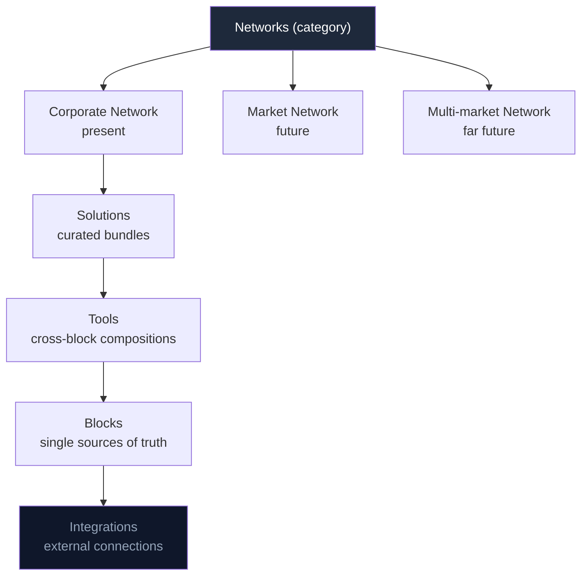
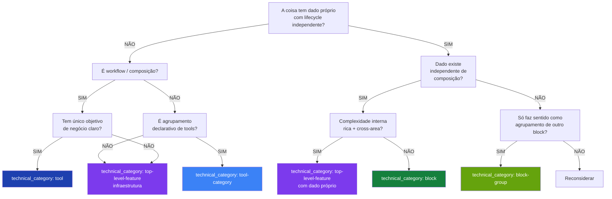

> **For AI agents:** This Markdown file is the canonical form of this entry. Use `Accept: text/markdown` or append `.md` to the URL to avoid HTML rendering.

# Handbook

The Handbook is HERD's documentation system. Every feature in the platform — block, tool, top-level-feature, integration, or solution — is described here using a consistent template, so that humans, internal AI agents (Claude Code), and external AI agents (ChatGPT, Claude Desktop via MCP) can all build a correct mental model of HERD without reading source code.

This entry documents the Handbook itself: what each commercial level means, what the canonical technical categories are, how `feature.yml` works, how to read or write a Handbook entry, and how the system stays consistent under change.

## Business

The Handbook exists because HERD's product surface is large and growing. As blocks, tools, top-level features, and integrations multiply, knowing what each one is, why it exists, who it serves, and how it relates to the others becomes the central onboarding bottleneck — both for humans joining the team and for agents asked to do work in the codebase.

The cost of bad documentation in an AI-collaborated codebase is materially higher than in a traditional one. When an agent doesn't know what a feature is, it doesn't ask — it guesses. Guesses produce code that compiles, runs, and quietly does the wrong thing. The Handbook eliminates the conditions under which an agent guesses by providing a single, canonical, machine-readable description of every feature it might touch.

For HERD's clients, the Handbook is invisible — but its effects are not. Faster, more consistent feature delivery; fewer regressions caused by misunderstood semantics; agent-driven workflows (via MCP) that work because the agent has access to the same documentation a senior engineer would consult.

The Handbook is also the substrate for HERD's positioning as a Market Network Platform. When the platform federates across corporate networks, the Handbook is the contract that lets agents in one network discover and reason about capabilities in another without bespoke integration work.

## Product

The Handbook surfaces in three places.

For humans on the team, it lives at `/admin/handbook` inside HERD itself, with a left sidebar grouping entries by layer (Networks, Solutions, Tools, Blocks, Integrations) and a sticky table of contents on each entry showing the six perspectives.

For Claude Code working in the repo, it lives at `docs/handbook/{layer}/{category}/{feature-id}/{pt-BR,en-US}.md` — read directly from the filesystem, paired with the relevant `SKILL.md` packages in `.agents/skills/`.

For external agents (ChatGPT, Claude Desktop) connecting via MCP, it surfaces through two tools: `search(query)` returns matching feature UIDs; `fetch(id)` returns the full Markdown content of an entry plus its metadata graph (consumes, consumed_by, related).

A user reading the Handbook in HERD's admin sees: an entry's title, status badge (active / draft / deprecated / archived / deferred), version, last-updated date, and the six perspectives as collapsible sections. Cross-references render as clickable links to other entries.

## Architecture

### The commercial hierarchy — 5 plural levels

The system is organized into 5 independently monetizable levels. Each level is a product category that can be sold on its own.

#### Networks (top-of-pyramid category)

Category grouping the types of networks sold. Not an entity — a collective name for the subtypes:

- **Corporate Network** (present): an entire company. The tier that unlocks all top-level features and potentially all solutions. Audience: large organizations with multi-unit, multi-country, or multi-company holding complexity.
- **Market Network** (future): networks of companies within a market.
- **Multi-market Network** (far future): networks of interconnected markets.

Networks contain Solutions, Tools, Blocks, and Integrations.

#### Solutions

Curated bundle of tools for a macro purpose (support, sales, marketing). A Solution is a collection of related tools that together solve a broad business problem.

Monetization example: a package sold per complete solution. $19.90/month for "Complete Support" with 7 related tools.

#### Tools

Cross-block composition for a specific business objective. Not data; workflow / orchestration. Combines references to multiple blocks (and/or top-level features). Has a clear business objective.

Monetization example: a composite product sold by business value. $4.90/month for a contract generator that combines products+services+pricing.

Canonical examples: subscription-offering (sell recurring access), campaigns (run marketing campaigns), marketplace (sell on a public surface).

#### Blocks

Single source of truth for a data type. Owns its own Prisma models, has CRUD, has a lifecycle. The data exists independent of any composition.

Monetization example: a structured database sold as a service. $2.50/month to organize your contacts in a single source of truth.

#### Integrations

Connection to an external system (Google Calendar, OpenAI, Slack, Microsoft Teams, Stripe). No data of its own; it feeds data into blocks.

Monetization example: centralized API with a small intermediation fee. Audience: developers.

#### Diagram

### The 5 technical categories

Cut across the commercial hierarchy. Defined in the `technical_category` field of `feature.yml`. The 5 are canonical; the field also accepts thematic dimensions (`foundation`, `financial`, `infrastructure`, `sales`, `marketing`, `support`, `commerce`) when applicable to a feature.

#### Block

**Definition**: single source of truth for a data type.

**Decisive criterion**: the system answers unambiguously "what data is this?" and the data has its own CRUD with an independent lifecycle.

**Characteristics**:
- Owns its own Prisma models (e.g., Product, Contact, Meeting).
- Data lifecycle: create, read, update, archive.
- Exists independent of any composition.
- Can be referenced by other blocks, tools, top-level features.

**Path layout**: `src/components/{name}/`, `src/app/admin/blocks/{name}/`, manifest at `src/lib/blocks/blocks/{name}.block.ts`.

**Canonical examples** (post-refactor): contacts, companies, deals, partners, products, services, perks, experiences, locations, events, tasks, meetings, messages, notes, feedbacks.

**Anti-examples**: packages → block-group; subscriptions (offering) → tool; campaigns → tool.

#### Block Group

**Definition**: intra-block grouping. Same data type, organized into a curated collection with light metadata.

**Decisive criterion**: the grouping only makes sense in reference to a host block, and the extra metadata is just identification/pricing/exposure.

**Characteristics**:
- Doesn't create a new data type — references IDs from the host block.
- Light metadata of its own (bundle name, bundled price, description).
- No independent CRUD. Delete the host block, the group disappears.

**Path layout**: `src/components/{parent}/groups/{name}/`, declared inside `{parent}.block.ts` (`groups` field).

**Examples**: packages as a group of products.

#### Tool

**Definition**: cross-block composition for a specific business objective.

**Decisive criterion**: combines data from multiple blocks with a clear purpose of generating business value (sell, engage, automate).

**Characteristics**:
- Combines references to multiple blocks (and/or top-level features).
- Clear business objective.
- May generate light data of its own (execution record), but content is composition.

**Path layout**: `src/components/tools/{name}/`, `src/app/admin/tools/{name}/`, manifest at `src/lib/tools/tools/{name}.tool.ts`.

**Examples**: subscription-offering, campaigns, marketplace.

**Subtle distinction — tool vs block-with-relations**: relations don't make a block a tool. The criterion is business objective. A real subscription (record of who subscribed) is a block; a subscription offering (sellable composition) is a tool.

#### Tool Category

**Definition**: grouping of tools by business area.

**Decisive criterion**: tool-category has no data of its own — it is a declarative container that groups semantically related tools. Unlike Solutions (commercial bundles for specific outcomes), Categories are structural taxonomy.

**Characteristics**:
- Owns a `ToolCategoryManifest` with embedded tools as an array.
- Metadata: name, displayName, description, icon, color, capabilities, sortOrder.
- No own CRUD — declarative.
- Surfaces at `/admin/tools/{category}` as a landing page.

**Path layout**: `src/lib/tools/categories/{category}.category.ts`.

**Canonical examples** (5 implemented): Finances, Legal, Marketing, Sales, Operations.

**Subtle distinction — Category vs Solution**:
- **Category** (exists): structural grouping by business area. Permanent.
- **Solution** (deferred): curated tool bundle for a specific outcome (e.g., "Complete Support"). Commercial, sellable.

#### Top-Level Feature

**Definition**: shared infrastructure with rich depth that multiple tools/blocks consume.

**Decisive criterion**: consumed cross-area, internal complexity that justifies its own sub-world (sub-routes, sub-features, configurations).

**Characteristics**:
- Has its own sidebar item.
- Consumes blocks, tools, solutions, integrations, other features.
- May have its own Prisma models.

**Path layout**: `src/components/{name}/`, `src/app/admin/{name}/` (no prefix), manifest at `src/lib/features/{name}.feature.ts`.

**Canonical examples** (post-refactor):
- Knowledge (implemented, meta-feature composing blocks)
- Organization (to create — split of current Network)
- Directory (to create — split of current Network)
- Blocks (implemented, meta-feature)
- Routines (to promote — deferred this phase)
- Agents (to promote)
- Handbook (implemented)
- Surface (future)
- Flows (future)

#### Additional notes

`category` (Finances, Legal, Marketing, Sales, Operations) is **not** a level and **not** a technical category. Categories are runtime groupings the orchestrator uses to route tool calls. They have agents in `.agents/tools/{category}/AGENT.md` but no Handbook entries of their own — the commercial role they would play is subsumed by Solution.

### Decision tree: classifying a new feature

When introducing a new feature into HERD, walk the tree below to classify it.

### Classification implications in code

| Category | Components | Pages | Manifest |
|---|---|---|---|
| Block | `src/components/{name}/` | `src/app/admin/blocks/{name}/` | `src/lib/blocks/blocks/{name}.block.ts` |
| Block group | `src/components/{parent}/groups/{name}/` | `src/app/admin/blocks/{parent}/groups/{name}/` | inside `{parent}.block.ts` (`groups` field) |
| Tool | (generic chrome at `src/components/tools/`) | `src/app/admin/tools/{category}/{tool}/` | embedded in `{category}.category.ts` |
| Tool category | (landing via `category-landing.tsx`) | `src/app/admin/tools/{category}/` | `src/lib/tools/categories/{category}.category.ts` |
| Top-level feature | `src/components/{name}/` | `src/app/admin/{name}/` | `src/lib/features/{name}.feature.ts` |

### Planned re-classifications (refactor R2.5-R8)

Confirmed after detailed investigation of the actual code state during R1.5.

| Item | Actual state | Decision | Stage |
|---|---|---|---|
| Current Network | Top-level feature with rich sub-features | Split into Organization + Directory | R2.5 |
| packages | Active tool in sales/packages | Stays tool; investigate block-group of products inside | R3 |
| campaigns | Active block + coming-soon placeholder | Promote block to tool in marketing; delete placeholder | R4 |
| subscriptions | Block + divergent paths (tiers/, api/tiers/) | Stays block; paths consolidated; subscription-offering tool created | R5 |
| subscription-offering | Does not exist | Create new tool in sales | R5 |
| routines | Block with no top-level surface | Top-level feature; create /admin/routines/ + sidebar item | R6 |
| agents | Block + dual surface (admin/agents already exists) | Top-level feature; consolidate; drop admin/blocks/agents/ | R7 |
| marketplace | Standalone UI | Top-level feature | R8 |

Each re-classification has its own entry at `docs/handbook/refactor/r{X}-{name}/`.

### level vs technical_category

These are two orthogonal dimensions in every `feature.yml` frontmatter.

**`level`** defines **where the entry lives in the Handbook navigation structure**. Values: `layer` (top of menu — networks, blocks, tools, solutions, integrations), `category` (sub-organization within a layer), `meta` (meta-organizational entries — handbook, glossary), `block` (block leaf entry), `tool` (tool leaf entry). Reflects the docs tree, not the technical classification.

**`technical_category`** defines **what the thing is architecturally**, independent of where it lives in navigation. Values: `block`, `block-group`, `tool`, `top-level-feature` (4 canonical architectural categories) + additional thematic dimensions when applicable (`foundation`, `financial`, `infrastructure`, `sales`, `marketing`, `support`, `commerce`).

The dimensions can coincide (a block feature lives at `level: block` in the docs structure and has `technical_category: block` architecturally) or diverge (a meta-organizational handbook entry might have `level: meta` and describe a `technical_category: tool`).

Example: `domain-events` has `level: tool` (tool leaf entry in navigation) + `technical_category: foundation` (thematic area). Ledger has `level: tool` + `technical_category: financial` (tool, financial area).

### The 4 artifacts per feature

Every feature in HERD is described by up to four artifacts, joined by the `id` and `uid`:

1. **Handbook entry** at `docs/handbook/{layer}/{category}/{id}/{pt-BR.md, en-US.md}` — bilingual prose for humans.
2. **`feature.yml`** at the same directory — canonical metadata, the join key.
3. **`SKILL.md`** at `.agents/skills/feature-{level}-{id}/SKILL.md` — agent-facing operational guide. Optional; required when `artifacts.skill: true` in `feature.yml`.
4. **MCP tool** registered in `mcp/generated/manifest.json` — exposed to external agents. Optional; required when `artifacts.mcp: true`.

Day-1 the MCP layer ships only `search` and `fetch` tools that index the Handbook itself. Per-feature MCP tools (e.g., `herd_create_contact`) are deferred to a later phase.

### Schema as source of truth

The `feature.yml` schema is defined in TypeScript Zod 4 at `schemas/feature.zod.ts`, imported via the `zod/v4` subpath. JSON Schema is generated from it via `npm run gen:schemas` and committed to `schemas/feature.schema.json` — this gives IDEs autocomplete and CI a stable validator. Drift between the two is caught by CI: `git diff --exit-code schemas/` after running `gen:schemas` must be clean.

### CI gates

Three hard-fail gates block PR merges:

- **Schema + path consistency.** `feature.yml` parses against the Zod schema; `level` matches directory; `uid` matches `herd.<level>.<id>`.
- **Cross-reference resolution.** All `consumes`, `consumed_by`, `parent`, `children`, `related` IDs resolve to existing `feature.yml` files. Known dangling refs (during backfill) are explicitly listed in `docs/handbook/_meta/.legacy-allowlist.txt`, which Danger.js prevents from growing.
- **Generated artifacts freshness.** Running `npm run gen:all` produces no diff; if a Handbook change wasn't accompanied by the regenerated artifacts, CI fails.

Three soft warnings (Danger.js comments, don't block merges):

- Bilingual co-change: `pt-BR.md` edited without `en-US.md` (or vice versa).
- Doc-first nudge: source under `src/components/`, `src/lib/`, `src/app/admin/` changed without any `docs/handbook/` change.
- Perspective coverage: `feature.yml.perspectives` lists perspectives whose H2 headers don't all appear in both locale files.

## Operations

This entry is **operational** — agents should treat it as authoritative.

### 5 doc-discipline instructions

1. **Before writing code that creates, modifies, or deprecates a feature, locate its `feature.yml`.** If none exists and you are creating something new, run `npm run gen:feature` (the `/new-feature` meta-skill) first. Do not improvise the four artifacts by hand.

2. **The `level` field is canonical for navigation.** When in doubt about where an entry lives in the structure, walk the decision tree in this entry's Architecture perspective. If still unclear, ask the user before classifying.

3. **Cross-references use UIDs (`herd.<level>.<id>`), not file paths.** UIDs survive renames; file paths break. The xrefmap at `docs/handbook/_meta/xrefmap.yml` is the canonical UID → path translation table.

4. **Do not edit `mcp/generated/`, `schemas/feature.schema.json`, `docs/handbook/_meta/xrefmap.yml`, or `public/llms.txt` by hand.** They are generated. Run the corresponding `npm run gen:*` script, or `npm run gen:all` to regenerate everything at once.

5. **The bilingual contract is symmetric.** When you change `pt-BR.md`, change `en-US.md` in the same PR (and vice versa). If a translation is pending, commit a `<!-- TRANSLATION_PENDING -->` block in the locale that lags and tag the PR `i18n-followup`.

### 5 classification-discipline instructions

1. **Classify before proposing.** For each part touched, identify the current `technical_category`. If it is wrongly classified, **pause and report** before touching. Do not improvise re-classification during other work.

2. **When creating something new, justify the `technical_category` with reference to the decision tree.** It is not enough to say "it's a block" — say "it's a block because it has a Prisma model with an independent lifecycle, the data exists without composition, and there is no rich cross-area complexity that would justify top-level-feature."

3. **When re-classifying something existing, document the why in the commit message and update the manifest.** A classification change has cost (paths, manifests, references) — only worthwhile with clear justification.

4. **When in doubt, bring it to the dialogue.** Architectural decisions are not made solo. The agent identifies and proposes; the human validates or adjusts.

5. **Do not invent a new category without real need.** If something doesn't fit the 4 canonical categories (block / block-group / tool / top-level-feature), first try to force-fit into the 4. If it really doesn't, **pause and report** — it may be a new need, but it's a lasting architectural decision.

### Pattern: SKILL → Handbook migration

SKILLs in the project split into two functional categories:

#### Product-infrastructure SKILLs

Document invariants/practices of product parts. Examples:
- `ledger` (double-entry bookkeeping invariants)
- `domain-events` (outbox pattern, idempotency)

**Migration pattern**: these migrate to the Handbook as an entry with `technical_category: tool` + an appropriate thematic dimension (`foundation`, `financial`, etc.). The SKILL file becomes a **shim** with:
- Frontmatter pointing to the canonical Handbook path (`metadata.herd.target_path`)
- Content preserved intact (backward-compat for existing callers)
- Top-of-file note marking the Handbook as the canonical source

When all callers point to the Handbook, the SKILL file can be removed.

#### Dev-workflow meta-tooling SKILLs

Document working protocols, not product features. Examples:
- `chat-code-handoff` (Claude.ai ↔ Claude Code protocol)
- `new-feature` (template for creating a feature in the Handbook)

**Pattern**: remain pure SKILLs. They do not migrate to the Handbook — they are not features documentable under the Handbook schema (Business / Product / Architecture / Operations / Glossary / Changelog don't make sense for a working protocol).

#### Category decision

Question: **does this document a part of the product, or a working protocol?**

- Part of the product → Handbook (with SKILL shim for backward-compat).
- Working protocol → pure SKILL.

### Print mode

Handbook entries are printable. The `@media print` rule in `src/app/admin/handbook/handbook-print.css` forces every Collapsible section open and hides interactive chrome (toolbar, breadcrumbs, chevrons). Use Cmd+P / Ctrl+P from any entry — all H2 sections appear expanded regardless of UI state.

Limitation: Mermaid diagrams are lazy-rendered on section open. Diagrams in sections that were never opened in the current page lifetime will not appear in print. Workaround: open the section once (or use "Expand all" if available) before triggering print.

## Glossary

| Term (en-US) | Termo (pt-BR) | Meaning |
|---|---|---|
| block | bloco | Single source of truth for a data type. Owns Prisma models. Canonical technical_category. |
| block-group | grupo de bloco | Intra-block curated collection (e.g., packages in products). Canonical technical_category; no independent CRUD. |
| corporate-network | rede corporativa | Network subtype — an entire company as a HERD tenant. |
| feature.yml | feature.yml | Canonical metadata file per feature. The join key across the four artifacts. |
| foundation | fundação | Thematic dimension of `technical_category` for shared infrastructure (i18n, auth, ledger). |
| Handbook | Handbook | HERD's documentation system. This entry documents it. |
| integration | integração | Connection to an external system. No own data. Navigation layer. |
| level | nível | Structural position in Handbook navigation. Values: `layer`, `category`, `meta`, `block`, `tool` (today). |
| market-network | rede de mercado | Future Network subtype — networks of companies within a market. |
| MCP | MCP | Model Context Protocol. How external agents (ChatGPT, Claude Desktop) consume HERD docs. |
| multi-market-network | rede multi-mercado | Far-future Network subtype — networks of interconnected markets. |
| network | rede | Top-of-pyramid category grouping the sold subtypes (Corporate, Market, Multi-market). |
| perspective | perspectiva | One of the six sections of a Handbook entry: Business, Product, Architecture, Operations, Glossary, Changelog. |
| SKILL.md | SKILL.md | Agent-facing operational guide. Format defined by agentskills.io. |
| solution | solução | Curated bundle of tools for a macro purpose. Currently deferred. |
| technical_category | categoria técnica | Architectural classification. 5 canonical (block, block-group, tool, tool-category, top-level-feature) + thematic dimensions (foundation, financial, infrastructure, sales, marketing, support, commerce). |
| tool | ferramenta | Cross-block composition with a business objective. Canonical technical_category. |
| tool-category | categoria de tool | Grouping of tools by business area (Finances, Legal, Marketing, Sales, Operations). Canonical technical_category; declarative, no own CRUD. |
| top-level-feature | top-level feature | Canonical technical_category for rich infrastructure consumed cross-area (Knowledge, Organization, Directory, Blocks, Handbook). |
| uid | uid | Stable identifier in the form `herd.<level>.<id>`. |
| xrefmap | xrefmap | Generated UID → path translation table. Canonical lookup for cross-references. |

## Changelog

- **2026-05-02 (R1)** — Tools foundation reconciliation. Tool gained kind discriminator. ToolCategoryManifest established as the 5th canonical architectural category. Schema enum bumped from 11 → 12 values. Provisional ToolManifest + FeatureManifest deleted (dead code).
- **2026-05-02** — R0.1 Handbook content reform. Replaces 6-level singular pyramid with plural commercial hierarchy (Networks/Solutions/Tools/Blocks/Integrations) with Networks as a category with sub-types. Adds `block-group` and `top-level-feature` as canonical `technical_category` values (was 3 values, becomes 11: 4 architectural + 7 thematic). Adds path-mapping, planned re-classifications, classification-discipline guide, and `level` vs `technical_category` distinction. Zod schema bumped.
- **2026-05-01** — Initial publication. Etapa Handbook foundation + first entries. Establishes commercial levels, technical categories, 4 artifacts per feature, Zod 4 (via `zod/v4` subpath) as schema source-of-truth, doc-first as workflow, and CI gates (3 hard-fail + 3 soft warning).
