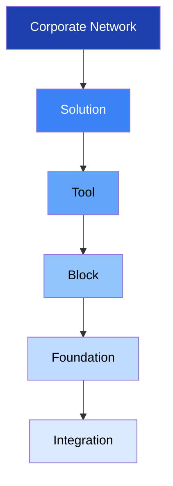
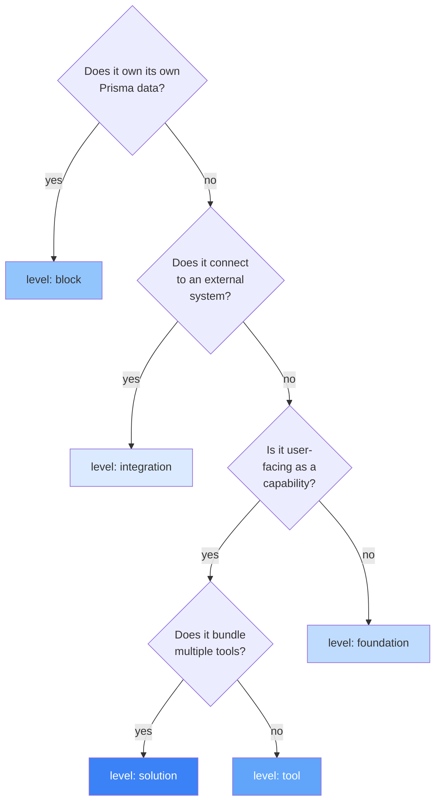

> **For AI agents:** This Markdown file is the canonical form of this entry. Use `Accept: text/markdown` or append `.md` to the URL to avoid HTML rendering.

# Handbook

The Handbook is HERD's documentation system. Every feature in the platform — block, tool, foundation, or integration — is described here using a consistent template, so that humans, internal AI agents (Claude Code), and external AI agents (ChatGPT, Claude Desktop via MCP) can all build a correct mental model of HERD without reading source code.

This entry documents the Handbook itself: what the levels mean, how `feature.yml` works, how to read or write a Handbook entry, and how the system stays consistent under change.

## Business

The Handbook exists because HERD's product surface is large and growing. As blocks, tools, foundations, and integrations multiply, knowing what each one is, why it exists, who it serves, and how it relates to the others becomes the central onboarding bottleneck — both for humans joining the team and for agents asked to do work in the codebase.

The cost of bad documentation in an AI-collaborated codebase is materially higher than in a traditional one. When an agent doesn't know what a feature is, it doesn't ask — it guesses. Guesses produce code that compiles, runs, and quietly does the wrong thing. The Handbook eliminates the conditions under which an agent guesses by providing a single, canonical, machine-readable description of every feature it might touch.

For HERD's clients, the Handbook is invisible — but its effects are not. Faster, more consistent feature delivery; fewer regressions caused by misunderstood semantics; agent-driven workflows (via MCP) that work because the agent has access to the same documentation a senior engineer would consult.

The Handbook is also the substrate for HERD's positioning as a Market Network Platform. When the platform federates across corporate networks, the Handbook is the contract that lets agents in one network discover and reason about capabilities in another without bespoke integration work.

## Product

The Handbook surfaces in three places.

For humans on the team, it lives at `/admin/handbook` inside HERD itself, with a left sidebar grouping entries by level (Foundations, Blocks, Tools, Solutions, Integrations, Corporate Network), and a sticky table of contents on each entry showing the six perspectives. UI-side rendering is delivered in a later etapa; the filesystem source is what exists today.

For Claude Code working in the repo, it lives at `docs/handbook/{level}/{feature-id}/{pt-BR,en-US}.md` — read directly from the filesystem, paired with the relevant `SKILL.md` packages in `.agents/skills/`.

For external agents (ChatGPT, Claude Desktop) connecting via MCP, it surfaces through two tools: `search(query)` returns matching feature UIDs; `fetch(id)` returns the full Markdown content of an entry plus its metadata graph (consumes, consumed_by, related).

A user reading the Handbook in HERD's admin sees: an entry's title, status badge (active / draft / deprecated / archived / deferred), version, last-updated date, and the six perspectives as collapsible sections. Cross-references render as clickable links to other entries.

## Architecture

### The 6 commercial levels

HERD's product is organized as a pyramid of six commercial levels. Every documentable feature in HERD belongs to exactly one level. The levels, from top to bottom, are:

- **Corporate Network** — the entire HERD platform as it appears to a single client company. The top tier. (When the Market Network layer lands, it will sit above this.)
- **Solution** — a curated bundle of tools sold or framed for a specific business outcome. Examples: Support, Pre-sales, Sales, Marketing. *Currently deferred — the schema accepts the level but no entries exist day-1; returns when the Solution layer is designed.*
- **Tool** — a cross-block composition with a specific business objective. A tool reads from and writes to multiple blocks, applies business logic, and exposes a focused user-facing or agent-facing capability. Example: `subscription-offering` (consumes contacts + deals + products to manage recurring revenue).
- **Block** — a single source of truth for a data type. A block has its own Prisma models, CRUD endpoints, lifecycle, RLS policies, and (usually) a manifest in `src/lib/blocks/blocks/{name}.block.ts`. Examples: `contacts`, `meetings`, `deals`, `products`.
- **Foundation** — shared infrastructure that supports the levels above. Foundations have no commercial unit on their own; they are necessary preconditions for blocks, tools, and solutions to function. Examples: `i18n`, `domain-events`, `auth`, `permissions`, `audit`, `ledger`, `handbook` (this entry), `knowledge`, `agents`, `routines`.
- **Integration** — a connection to an external system. Integrations have no own data; they are bridges. Examples: `google-calendar`, `slack`, `stripe`.

### The 3 technical categories

Cutting across the commercial levels, HERD code falls into three technical categories used in the `feature.yml.technical_category` field:

- `block` — owns its own data (Prisma models, CRUD).
- `tool` — composes data owned by blocks.
- `foundation` — shared infrastructure consumed by everyone.

Note: `block-group` is **not** a level and **not** a technical category. Block-groups are intra-block agrupamentos — for example, "packages" as a curated group of products inside the products block, or a curated set of meetings filtered by some criterion. They are documented inside the parent block's Architecture perspective (in the `block_groups` field of the parent's `feature.yml`), not as separate entries.

Note: `category` (Finances, Legal, Marketing, Sales, Operations) is **not** a level. Categories are runtime agrupamentos that the orchestrator uses to route tool calls. They have agents in `.agents/tools/{category}/AGENT.md` but no Handbook entries — the commercial role they would play is subsumed by Solution.

### Decision tree: classifying a new feature

When introducing a new feature into HERD, walk the tree below to classify it. The level determines the directory path, the artifacts required, and the audience that will consume the entry.

### Examples and anti-examples

- **`contacts`** is a `block`. It owns its `Contact` Prisma model, has CRUD, and is consumed by tools like `subscription-offering` and `lead-qualification`.
- **`subscription-offering`** is a `tool`. It composes contacts + deals + products to manage recurring revenue. No own data.
- **`packages`** is **not** an entry. It is a block-group inside `products` (a curated collection of products with shared pricing or marketing). Documented in `products/feature.yml` under `block_groups`.
- **`i18n`** is a `foundation`. Used by every UI surface but has no commercial unit on its own.
- **`google-calendar`** is an `integration`. No own data, only a bridge to Google's calendar API.
- **`finances`** (the category in `.agents/tools/finances/AGENT.md`) is **not** an entry. It is a runtime agrupamento. The commercial role lives at `solution` level when designed.
- **`Support Solution`** would be a `solution` (when the layer is active) — bundling support-oriented tools for a coherent customer experience. Today it would only exist as a future `feature.yml` with `status: deferred`.

### The 4 artifacts per feature

Every feature in HERD is described by up to four artifacts, joined by the `id` and `uid`:

1. **Handbook entry** at `docs/handbook/{level}/{id}/{pt-BR.md, en-US.md}` — bilingual prose for humans.
2. **`feature.yml`** at the same directory — canonical metadata, the join key.
3. **`SKILL.md`** at `.agents/skills/feature-{level}-{id}/SKILL.md` — agent-facing operational guide. Optional; required when `artifacts.skill: true` in `feature.yml`.
4. **MCP tool** registered in `mcp/generated/manifest.json` — exposed to external agents. Optional; required when `artifacts.mcp: true`.

Day-1 the MCP layer ships only `search` and `fetch` tools that index the Handbook itself. Per-feature MCP tools (e.g., `herd_create_contact`) are deferred to a later phase.

### Schema as source of truth

The `feature.yml` schema is defined in TypeScript Zod 4 at `schemas/feature.zod.ts`, imported via the `zod/v4` subpath. JSON Schema is generated from it via `npm run gen:schemas` and committed to `schemas/feature.schema.json` — this gives IDEs autocomplete and CI a stable validator. Drift between the two is caught by CI: `git diff --exit-code schemas/` after running `gen:schemas` must be clean.

### CI gates

Three hard-fail gates block PR merges (introduced progressively across this etapa, with full enforcement in Sub-etapa 6):

- **Schema + path consistency.** `feature.yml` parses against the Zod schema; `level` matches directory; `uid` matches `herd.<level>.<id>`.
- **Cross-reference resolution.** All `consumes`, `consumed_by`, `parent`, `children`, `related` IDs resolve to existing `feature.yml` files. Known dangling refs (during backfill) are explicitly listed in `docs/handbook/_meta/.legacy-allowlist.txt`, which Danger.js prevents from growing.
- **Generated artifacts freshness.** Running `npm run gen:all` produces no diff; if a Handbook change wasn't accompanied by the regenerated artifacts, CI fails.

Three soft warnings (Danger.js comments, don't block merges):

- Bilingual co-change: `pt-BR.md` edited without `en-US.md` (or vice versa).
- Doc-first nudge: source under `src/components/`, `src/lib/`, `src/app/admin/` changed without any `docs/handbook/` change.
- Perspective coverage: `feature.yml.perspectives` lists perspectives whose H2 headers don't all appear in both locale files.

## Operations

This entry is **operational** — agents should treat it as authoritative. Five instructions for any agent (Claude Code, ChatGPT via MCP, Claude Desktop via MCP) using HERD documentation:

1. **Before writing code that creates, modifies, or deprecates a feature, locate its `feature.yml`.** If none exists and you are creating something new, run `npm run gen:feature` (the `/new-feature` meta-skill, introduced in Sub-etapa 3) first. Do not improvise the four artifacts by hand.

2. **The `level` field is canonical.** When in doubt about whether something is a tool or a foundation, walk the decision tree in this entry's Architecture perspective. If still unclear, ask the user before classifying.

3. **Cross-references use UIDs (`herd.<level>.<id>`), not file paths.** UIDs survive renames; file paths break. The xrefmap at `docs/handbook/_meta/xrefmap.yml` is the canonical UID → path translation table.

4. **Do not edit `mcp/generated/`, `schemas/feature.schema.json`, `docs/handbook/_meta/xrefmap.yml`, or `public/llms.txt` by hand.** They are generated. Run the corresponding `npm run gen:*` script, or `npm run gen:all` to regenerate everything at once.

5. **The bilingual contract is symmetric.** When you change `pt-BR.md`, change `en-US.md` in the same PR (and vice versa). If a translation is pending, commit a `<!-- TRANSLATION_PENDING -->` block in the locale that lags and tag the PR `i18n-followup`.

## Glossary

| Term (en-US) | Termo (pt-BR) | Meaning |
|---|---|---|
| block | bloco | Single source of truth for a data type. Owns Prisma models. |
| block-group | grupo de bloco | Intra-block curated collection (e.g., packages in products). Not its own entry. |
| corporate-network | rede corporativa | The entire HERD platform per client. Top of the pyramid. |
| feature.yml | feature.yml | Canonical metadata file per feature. The join key across the four artifacts. |
| foundation | fundação | Shared infrastructure consumed by other levels (i18n, auth, ledger, etc.). |
| Handbook | Handbook | HERD's documentation system. This entry documents it. |
| integration | integração | Connection to an external system. No own data. |
| level | nível | One of the six values: corporate-network, solution, tool, block, foundation, integration. |
| MCP | MCP | Model Context Protocol. How external agents (ChatGPT, Claude Desktop) consume HERD docs. |
| perspective | perspectiva | One of the six sections of a Handbook entry: Business, Product, Architecture, Operations, Glossary, Changelog. |
| SKILL.md | SKILL.md | Agent-facing operational guide. Format defined by agentskills.io. |
| solution | solução | Curated bundle of tools for a business outcome. Currently deferred. |
| technical_category | categoria técnica | One of three: block, tool, foundation. Cuts across commercial levels. |
| tool | ferramenta | Cross-block composition with a business objective. |
| uid | uid | Stable identifier in the form `herd.<level>.<id>`. |
| xrefmap | xrefmap | Generated UID → path translation table. Canonical lookup for cross-references. |

## Changelog

- **2026-05-01** — Initial publication. Etapa Handbook foundation + first entries. Establishes 6 commercial levels (corporate-network, solution, tool, block, foundation, integration), 3 technical categories (block, tool, foundation), 4 artifacts per feature (Handbook, feature.yml, SKILL.md, MCP), Zod 4 (via `zod/v4` subpath) as schema source-of-truth, doc-first as workflow, and CI gates (3 hard-fail + 3 soft warning).
