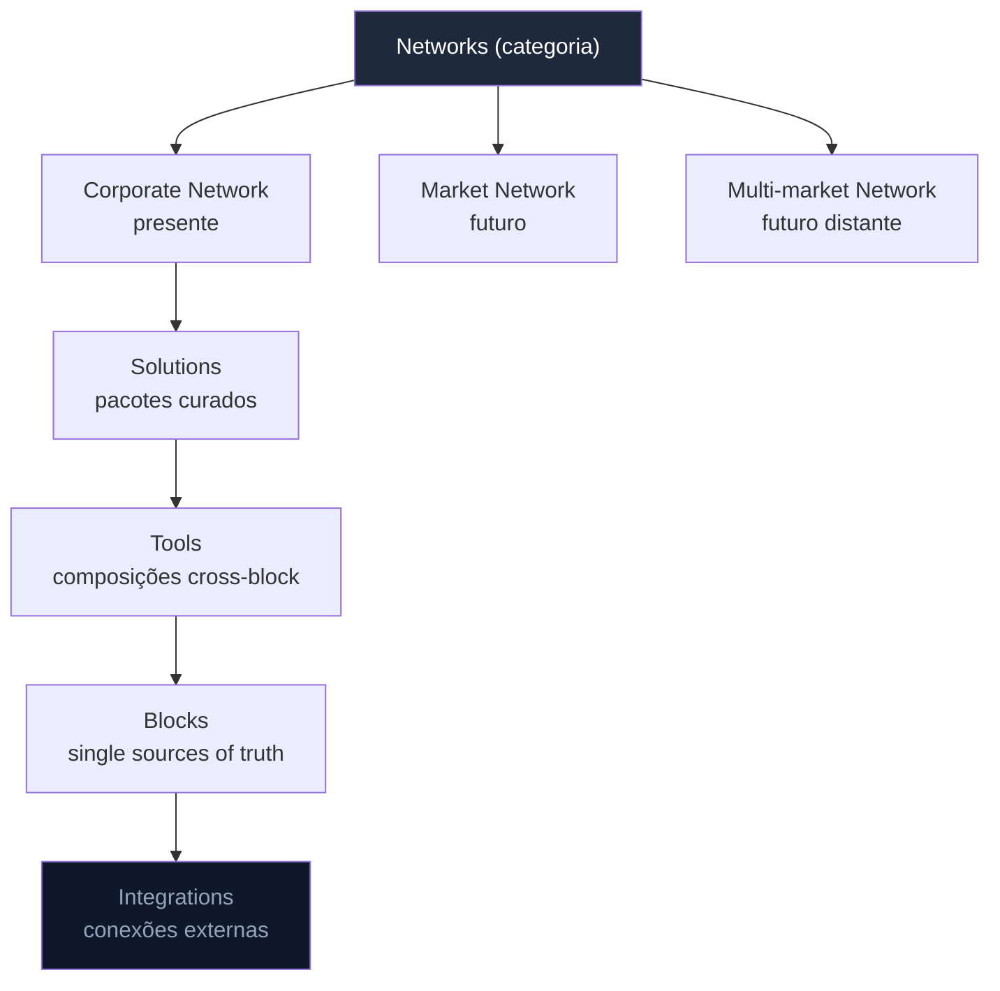
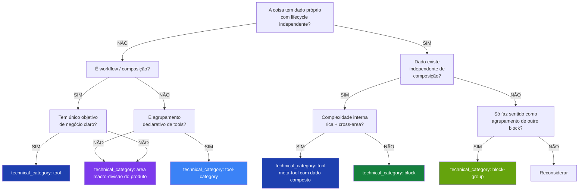

> **Para agentes de IA:** Este arquivo Markdown é a forma canônica desta entry. Use `Accept: text/markdown` ou adicione `.md` à URL para evitar renderização HTML.

# Handbook

O Handbook é o sistema de documentação do HERD. Toda feature da plataforma — block, tool, area, integration ou solution — é descrita aqui usando um template consistente, para que humanos, agentes de IA internos (Claude Code) e agentes de IA externos (ChatGPT, Claude Desktop via MCP) consigam construir um modelo mental correto do HERD sem precisar ler código-fonte.

Esta entry documenta o próprio Handbook: o que cada nível comercial significa, quais são as categorias técnicas canônicas, como o `feature.yml` funciona, como ler ou escrever uma entry do Handbook, e como o sistema se mantém consistente sob mudança.

## Business

O Handbook existe porque a superfície de produto do HERD é grande e está em crescimento. Conforme blocks, tools, top-level features e integrations se multiplicam, saber o que cada um é, por que existe, a quem serve, e como se relaciona com os outros vira o gargalo central de onboarding — tanto para humanos entrando no time quanto para agentes pedidos a fazer trabalho no codebase.

O custo de documentação ruim em um codebase colaborado por IA é materialmente mais alto que em um tradicional. Quando um agente não sabe o que uma feature é, ele não pergunta — ele chuta. Chutes produzem código que compila, roda, e silenciosamente faz a coisa errada. O Handbook elimina as condições sob as quais um agente chuta, fornecendo uma descrição única, canônica, e legível por máquina de toda feature que ele possa tocar.

Para os clientes do HERD, o Handbook é invisível — mas seus efeitos não são. Entrega de features mais rápida e consistente; menos regressões causadas por semântica mal entendida; workflows guiados por agentes (via MCP) que funcionam porque o agente tem acesso à mesma documentação que um engenheiro sênior consultaria.

O Handbook também é o substrato para o posicionamento do HERD como Market Network Platform. Quando a plataforma federar entre corporate networks, o Handbook é o contrato que permite agentes em uma network descobrirem e raciocinarem sobre capacidades em outra sem trabalho de integração ad-hoc.

## Product

O Handbook aparece em três lugares.

Para humanos no time, vive em `/admin/handbook` dentro do próprio HERD, com uma sidebar à esquerda agrupando entries por layer (Networks, Solutions, Tools, Blocks, Integrations) e um sumário pegajoso em cada entry mostrando as seis perspectives.

Para o Claude Code trabalhando no repo, vive em `docs/handbook/{layer}/{category}/{feature-id}/{pt-BR,en-US}.md` — lido diretamente do filesystem, pareado com os pacotes `SKILL.md` relevantes em `.agents/skills/`.

Para agentes externos (ChatGPT, Claude Desktop) conectando via MCP, aparece através de duas tools: `search(query)` retorna UIDs de features que casam; `fetch(id)` retorna o conteúdo Markdown completo de uma entry junto com seu graph de metadata (consumes, consumed_by, related).

Um usuário lendo o Handbook no admin do HERD vê: o título da entry, badge de status (active / draft / deprecated / archived / deferred), versão, data da última atualização, e as seis perspectives como seções colapsáveis. Cross-references renderizam como links clicáveis para outras entries.

## Architecture

### A hierarquia comercial — 5 níveis plural

O sistema é organizado em 5 níveis monetizáveis independentemente. Cada nível é uma categoria de produto que pode ser vendida por si só.

#### Networks (categoria top-of-pyramid)

Categoria que agrupa os tipos de redes vendidas. Não é entidade — é um nome coletivo para os subtipos:

- **Corporate Network** (presente): uma empresa inteira. O tier que destrava todos os top-level features e potencialmente todas as solutions. Audiência: organizações grandes com complexidade multi-unidade, multi-país, ou holding com várias empresas.
- **Market Network** (futuro): redes de empresas dentro de um mercado.
- **Multi-market Network** (futuro distante): redes de mercados interconectadas.

Networks contêm Solutions, Tools, Blocks, e Integrations.

#### Solutions

Pacote curado de tools para um propósito macro (suporte, vendas, marketing). Solution é coleção de tools relacionadas que resolvem juntas um problema de negócio amplo.

Exemplo de monetização: pacote vendido por solução completa. R$99,90/mês para "Suporte Completo" com 7 tools relacionadas.

#### Tools

Composição cross-block para objetivo de negócio específico. Não é dado; é workflow / orchestração. Combina referências a múltiplos blocks (e/ou top-level features). Tem objetivo de negócio claro.

Exemplo de monetização: produto composto vendido por valor de negócio. R$19,90/mês para gerador de contratos que combina products+services+pricing.

Exemplos canônicos: subscription-offering (vender acesso recorrente), campaigns (executar campanhas de marketing), marketplace (vender em superfície pública).

#### Blocks

Single source of truth de um tipo de dado. Possui models Prisma próprios, tem CRUD, tem lifecycle. O dado existe independente de qualquer composição.

Exemplo de monetização: banco de dados estruturado vendido como serviço. R$9,90/mês para organizar suas ligações em um single source of truth.

#### Integrations

Conexão com sistema externo (Google Calendar, OpenAI, Slack, Microsoft Teams, Stripe). Não tem dado próprio; alimenta dado em blocks.

Exemplo de monetização: API centralizada com taxinha de intermediação. Audiência: desenvolvedores.

#### Diagrama

### As 5 categorias técnicas

Atravessam a hierarquia comercial. Definidas no campo `technical_category` do `feature.yml`. As 5 são canônicas; o campo aceita também dimensões temáticas (`foundation`, `financial`, `infrastructure`, `sales`, `marketing`, `support`, `commerce`) quando aplicável a uma feature.

#### Block

**Definição**: single source of truth de um tipo de dado.

**Critério decisivo**: o sistema responde univocamente "que dado é este?" e o dado tem CRUD próprio com lifecycle independente.

**Características**:
- Possui models Prisma próprios (e.g., Product, Contact, Meeting).
- Ciclo de vida do dado: criar, ler, atualizar, arquivar.
- Existe independente de qualquer composição.
- Pode ser referenciado por outros blocks, tools, top-level features.

**Path layout**: `src/components/{name}/`, `src/app/admin/blocks/{name}/`, manifest em `src/lib/blocks/blocks/{name}.block.ts`.

**Exemplos canônicos** (pós-refactor): contacts, companies, deals, partners, products, services, perks, experiences, locations, events, tasks, meetings, messages, notes, feedbacks.

**Anti-exemplos**: packages → block-group; subscriptions (oferta) → tool; campaigns → tool.

#### Block Group

**Definição**: agrupamento intra-block. Mesmo tipo de dado, organizado em coleção curada com metadata leve.

**Critério decisivo**: o agrupamento só faz sentido com referência a um block hospedeiro, e a metadata extra é só identificação/preço/exposição.

**Características**:
- Não cria tipo novo de dado — referência a IDs do block hospedeiro.
- Metadata leve própria (nome do bundle, preço bundled, descrição).
- Não tem CRUD independente. Exclui o block hospedeiro, o group some.

**Path layout**: `src/components/{parent}/groups/{name}/`, declarado dentro do `{parent}.block.ts` (campo `groups`).

**Exemplos**: packages como group de products.

#### Tool

**Definição**: composição cross-block para objetivo de negócio específico.

**Critério decisivo**: combina dados de múltiplos blocks com propósito claro de gerar valor de negócio (vender, engajar, automatizar).

**Características**:
- Combina referências a múltiplos blocks (e/ou top-level features).
- Objetivo de negócio claro.
- Pode gerar dado próprio leve (registro da execução), mas conteúdo é composição.

**Path layout**: `src/components/tools/{name}/`, `src/app/admin/tools/{name}/`, manifest em `src/lib/tools/tools/{name}.tool.ts`.

**Exemplos**: subscription-offering, campaigns, marketplace.

**Distinção sutil — tool vs block-with-relations**: relations não fazem block virar tool. Critério é objetivo de negócio. Subscription real (registro de quem assinou) é block; subscription offering (composição vendável) é tool.

#### Tool Category

**Definição**: agrupamento de tools por área de negócio.

**Critério decisivo**: tool-category não tem dado próprio — é container declarativo que agrupa tools relacionadas semanticamente. Diferente de Solutions (bundles comerciais para outcomes específicos), Categories são taxonomia estrutural.

**Características**:
- Possui `ToolCategoryManifest` com tools embedded como array.
- Metadata: name, displayName, description, icon, color, capabilities, sortOrder.
- Não tem CRUD próprio — é declarativa.
- Aparece em `/admin/tools/{category}` como landing page.

**Path layout**: `src/lib/tools/categories/{category}.category.ts`.

**Exemplos canônicos** (5 implementadas): Finances, Legal, Marketing, Sales, Operations.

**Distinção sutil — Category vs Solution**:
- **Category** (existe): agrupamento estrutural por área de negócio. Permanente.
- **Solution** (deferida): bundle curado de tools para outcome específico (ex: "Suporte Completo"). Comercial, ofertável.

#### Top-Level Feature

**Definição**: infraestrutura compartilhada com profundidade rica que múltiplas tools/blocks consomem.

**Critério decisivo**: consumida cross-area, complexidade interna que justifica sub-mundo próprio (sub-routes, sub-features, configurações).

**Características**:
- Sidebar item próprio.
- Consome blocks, tools, solutions, integrations, outras features.
- Pode ter models Prisma próprios.

**Path layout**: `src/components/{name}/`, `src/app/admin/{name}/` (sem prefixo), manifest em `src/lib/features/{name}.feature.ts`.

**Exemplos canônicos** (pós-refactor):
- Knowledge (implementado, meta-feature compõe blocks)
- Organization (a criar — split do Network atual)
- Directory (a criar — split do Network atual)
- Blocks (implementado, meta-feature)
- Routines (a promover — deferido nesta fase)
- Agents (a promover)
- Handbook (implementado)
- Surface (futuro)
- Flows (futuro)

#### Notas adicionais

`category` (Finances, Legal, Marketing, Sales, Operations) **não** é um nível e **não** é uma technical category. Categories são agrupamentos de runtime que o orchestrator usa para rotear chamadas de tool. Têm agentes em `.agents/tools/{category}/AGENT.md` mas não têm entries de Handbook próprias — o papel comercial que elas teriam é assumido por Solution.

### Decision tree: classificando uma nova feature

Ao introduzir uma nova feature no HERD, percorra a árvore abaixo para classificá-la.

### Implicações de classificação no código

| Categoria | Components | Pages | Manifest |
|---|---|---|---|
| Block | `src/components/{name}/` | `src/app/admin/blocks/{name}/` | `src/lib/blocks/blocks/{name}.block.ts` |
| Block group | `src/components/{parent}/groups/{name}/` | `src/app/admin/blocks/{parent}/groups/{name}/` | dentro do `{parent}.block.ts` (campo `groups`) |
| Tool | (chrome genérico em `src/components/tools/`) | `src/app/admin/tools/{category}/{tool}/` | embedded em `{category}.category.ts` |
| Tool category | (landing via `category-landing.tsx`) | `src/app/admin/tools/{category}/` | `src/lib/tools/categories/{category}.category.ts` |
| Area | (composição apenas) | `src/app/admin/areas/{name}/` | `src/lib/core/areas/{name}.area.ts` |

### Re-classifications planejadas (refator R2.5-R8)

Confirmadas após investigação detalhada do estado real do código durante R1.5.

| Item | Estado real | Decisão | Etapa |
|---|---|---|---|
| Network atual | Tool unificada com sub-features ricas | Split em Organization + Directory | R2.5 |
| packages | Tool active em sales/packages | Permanece tool; investigar block-group de products dentro | R3 |
| campaigns | Block ativo + placeholder coming-soon | Promover block para tool em marketing; deletar placeholder | R4 |
| subscriptions | Block + paths divergentes (tiers/, api/tiers/) | Permanece bloco; paths consolidados; subscription-offering tool criada | R5 |
| subscription-offering | Não existe | Criar nova tool em sales | R5 |
| routines | Block sem top-level surface | Promover para tool; criar /admin/routines/ + sidebar item | R6 |
| agents | Block + dual surface (admin/agents existe) | Promover para tool; consolidar; dropar admin/blocks/agents/ | R7 |
| marketplace | UI standalone | Cravado como tool em transaction area (R2) | R2 |

Cada re-classification tem entry própria em `docs/handbook/refactor/r{X}-{name}/`.

### level vs technical_category

São duas dimensões ortogonais cravadas no frontmatter de cada `feature.yml`.

**`level`** define **onde a entry vive na estrutura de navegação do Handbook**. Valores: `layer` (top do menu — networks, blocks, tools, solutions, integrations), `category` (sub-organização dentro de um layer), `meta` (entries meta-organizacionais — handbook, glossary), `block` (entry-folha de bloco), `tool` (entry-folha de tool). Refletem a árvore de docs, não a classificação técnica.

**`technical_category`** define **o que a coisa é arquiteturalmente**, independente de onde mora na navegação. Valores: `block`, `block-group`, `tool`, `tool-category`, `area` (5 categorias arquiteturais canônicas — `area` substitui o especulativo `top-level-feature` removido em R2) + dimensions temáticas adicionais quando aplicável (`foundation`, `financial`, `infrastructure`, `sales`, `marketing`, `support`, `commerce`).

As dimensões podem coincidir (uma feature de bloco vive em `level: block` na estrutura de docs e tem `technical_category: block` arquiteturalmente) ou divergir (handbook entry meta-organizacional pode ter `level: meta` e descrever um `technical_category: tool`).

Exemplo: `domain-events` tem `level: tool` (entry-folha de tool na navegação) + `technical_category: foundation` (área temática). Ledger tem `level: tool` + `technical_category: financial` (tool, área financial).

### The 4 artifacts per feature

Toda feature no HERD é descrita por até quatro artifacts, ligados pelo `id` e pelo `uid`:

1. **Handbook entry** em `docs/handbook/{layer}/{category}/{id}/{pt-BR.md, en-US.md}` — prosa bilíngue para humanos.
2. **`feature.yml`** no mesmo diretório — metadata canônico, a join key.
3. **`SKILL.md`** em `.agents/skills/feature-{level}-{id}/SKILL.md` — guia operacional voltado para agentes. Opcional; obrigatório quando `artifacts.skill: true` no `feature.yml`.
4. **MCP tool** registrada em `mcp/generated/manifest.json` — exposta a agentes externos. Opcional; obrigatória quando `artifacts.mcp: true`.

No day-1 a camada MCP entrega apenas as tools `search` e `fetch` que indexam o próprio Handbook. Tools MCP por feature (ex: `herd_create_contact`) ficam para uma fase posterior.

### Schema as source of truth

O schema do `feature.yml` é definido em TypeScript Zod 4 em `schemas/feature.zod.ts`, importado via o subpath `zod/v4`. O JSON Schema é gerado a partir dele via `npm run gen:schemas` e commitado em `schemas/feature.schema.json` — isso dá autocomplete em IDEs e um validator estável para CI. Drift entre os dois é pego pelo CI: `git diff --exit-code schemas/` depois de rodar `gen:schemas` precisa estar limpo.

### CI gates

Três gates hard-fail bloqueiam merges de PR:

- **Schema + path consistency.** O `feature.yml` parseia contra o schema Zod; o `level` casa com o diretório; o `uid` casa com `herd.<level>.<id>`.
- **Cross-reference resolution.** Todos os IDs em `consumes`, `consumed_by`, `parent`, `children`, `related` resolvem para `feature.yml` existentes. Refs danglings conhecidas (durante backfill) são listadas explicitamente em `docs/handbook/_meta/.legacy-allowlist.txt`, que o Danger.js impede de crescer.
- **Generated artifacts freshness.** Rodar `npm run gen:all` produz zero diff; se uma mudança no Handbook não foi acompanhada da regeneração dos artifacts, o CI falha.

Três warnings soft (comentários do Danger.js, não bloqueiam merge):

- Co-mudança bilíngue: `pt-BR.md` editado sem `en-US.md` (ou vice-versa).
- Empurrão doc-first: código sob `src/components/`, `src/lib/`, `src/app/admin/` mudou sem nenhuma mudança em `docs/handbook/`.
- Cobertura de perspectives: `feature.yml.perspectives` lista perspectives cujos H2 headers não aparecem em ambos os arquivos de locale.

## Operations

Esta entry é **operacional** — agentes devem tratá-la como autoritativa.

### 5 instruções de doc-discipline

1. **Antes de escrever código que cria, modifica, ou deprecia uma feature, localize seu `feature.yml`.** Se nenhum existe e você está criando algo novo, rode `npm run gen:feature` (a meta-skill `/new-feature`) primeiro. Não improvise os quatro artifacts à mão.

2. **O campo `level` é canônico para navegação.** Quando em dúvida sobre onde uma entry vive na estrutura, percorra a decision tree na Architecture perspective desta entry. Se ainda estiver incerto, pergunte ao usuário antes de classificar.

3. **Cross-references usam UIDs (`herd.<level>.<id>`), não paths.** UIDs sobrevivem a renomeações; paths quebram. O xrefmap em `docs/handbook/_meta/xrefmap.yml` é a tabela canônica de tradução UID → path.

4. **Não edite `mcp/generated/`, `schemas/feature.schema.json`, `docs/handbook/_meta/xrefmap.yml`, ou `public/llms.txt` à mão.** São gerados. Rode o script `npm run gen:*` correspondente, ou `npm run gen:all` para regenerar tudo de uma vez.

5. **O contrato bilíngue é simétrico.** Quando você muda `pt-BR.md`, mude `en-US.md` no mesmo PR (e vice-versa). Se uma tradução está pendente, commite um bloco `<!-- TRANSLATION_PENDING -->` no locale que está atrasado e marque o PR com a tag `i18n-followup`.

### 5 instruções de classification-discipline

1. **Classifique antes de propor**. Para cada parte tocada, identifique a technical_category atual. Se está classificada erroneamente, **pause e reporte** antes de tocar. Não improvisar re-classificação durante outro trabalho.

2. **Ao criar coisa nova, justifique a technical_category com referência à árvore de decisão**. Não basta dizer "é um block" — diga "é block porque tem model Prisma com lifecycle independente, dado existe sem composição, e não tem complexidade rica cross-area que justificaria meta-tool."

3. **Ao re-classificar coisa existente, documente o porquê no commit message e atualize manifest**. Mudança de classificação tem custo (paths, manifests, references) — só vale com justificativa clara.

4. **Quando estiver na dúvida, traga ao diálogo**. Decisão arquitetural não é tomada solo. Agente identifica e propõe; humano valida ou ajusta.

5. **Não invente nova categoria sem necessidade real**. Se uma coisa não cabe nas 5 categorias canônicas (block / block-group / tool / tool-category / area), primeiro tente forçar nas 5. Se não der, **pause e reporte** — pode ser necessidade nova, mas é decisão arquitetural duradoura.

### Pattern: SKILL → Handbook migration

SKILLs no projeto se dividem em duas categorias funcionais:

#### SKILLs de infrastructure de produto

Documentam invariantes/práticas de partes do produto. Exemplos:
- `ledger` (invariantes do double-entry bookkeeping)
- `domain-events` (outbox pattern, idempotency)

**Pattern de migração**: estes migram para Handbook como entry com `technical_category: tool` + dimension temática apropriada (`foundation`, `financial`, etc.). SKILL file vira **shim** com:
- Frontmatter aponta para path canônico no Handbook (`metadata.herd.target_path`)
- Conteúdo preservado intacto (backward-compat para callers existentes)
- Nota top-of-file indicando Handbook como fonte canônica

Quando todos callers apontarem para Handbook, SKILL file pode ser removido.

#### SKILLs de meta-tooling do dev workflow

Documentam protocolos de trabalho, não features de produto. Exemplos:
- `chat-code-handoff` (protocolo Claude.ai ↔ Claude Code)
- `new-feature` (template de criação de feature no Handbook)

**Pattern**: permanecem como SKILLs puras. Não migram para Handbook — não são features documentáveis no schema do Handbook (Business / Product / Architecture / Operations / Glossary / Changelog não fazem sentido para um protocolo de trabalho).

#### Decisão de categoria

Pergunta: **isto documenta uma parte do produto, ou um protocolo de trabalho?**

- Parte do produto → Handbook (com SKILL shim para backward-compat).
- Protocolo de trabalho → SKILL puro.

### Print mode

Entries do Handbook são imprimíveis. A regra `@media print` em `src/app/admin/handbook/handbook-print.css` força toda seção Collapsible aberta e esconde chrome interativo (toolbar, breadcrumbs, chevrons). Use Cmd+P / Ctrl+P em qualquer entry — todas as seções H2 aparecem expandidas, independentemente do estado da UI.

Limitação: diagramas Mermaid são lazy-rendered na abertura da seção. Diagramas em seções que nunca foram abertas no ciclo de vida da página atual não aparecerão na impressão. Workaround: abra a seção uma vez antes de disparar o print.

## Glossary

| Term (en-US) | Termo (pt-BR) | Significado |
|---|---|---|
| block | bloco | Single source of truth para um tipo de dado. Possui Prisma models. technical_category canônica. |
| block-group | grupo de bloco | Coleção curada intra-block (ex: packages dentro de products). technical_category canônica; sem CRUD independente. |
| corporate-network | rede corporativa | Subtipo de Network — uma empresa inteira como tenant do HERD. |
| feature.yml | feature.yml | Arquivo de metadata canônico por feature. A join key entre os quatro artifacts. |
| foundation | fundação | Dimensão temática do `technical_category` para infraestrutura compartilhada (i18n, auth, ledger). |
| Handbook | Handbook | Sistema de documentação do HERD. Esta entry documenta ele. |
| integration | integração | Conexão com um sistema externo. Sem dado próprio. Camada de navegação. |
| level | nível | Posição estrutural na navegação do Handbook. Valores: `layer`, `category`, `meta`, `block`, `tool` (hoje). |
| market-network | rede de mercado | Subtipo de Network futuro — redes de empresas dentro de um mercado. |
| MCP | MCP | Model Context Protocol. Como agentes externos (ChatGPT, Claude Desktop) consomem docs do HERD. |
| multi-market-network | rede multi-mercado | Subtipo de Network futuro distante — redes de mercados interconectadas. |
| network | rede | Categoria top-of-pyramid agrupando os subtipos vendidos (Corporate, Market, Multi-market). |
| perspective | perspectiva | Uma das seis seções de uma entry de Handbook: Business, Product, Architecture, Operations, Glossary, Changelog. |
| SKILL.md | SKILL.md | Guia operacional voltado para agentes. Formato definido por agentskills.io. |
| solution | solução | Pacote curado de tools para um propósito macro. Atualmente deferred. |
| technical_category | categoria técnica | Classificação arquitetural. 5 canônicas (block, block-group, tool, tool-category, area) + dimensions temáticas (foundation, financial, infrastructure, sales, marketing, support, commerce). |
| tool | ferramenta | Composição cross-block com um objetivo de negócio. technical_category canônica. |
| tool-category | categoria de tool | Agrupamento de tools por área de negócio (Finances, Legal, Marketing, Sales, Operations). technical_category canônica; declarativa, sem CRUD próprio. |
| area | área | technical_category canônica para macro-divisões do produto (Communication, Transaction, Workflow, Notification, Identity, Infrastructure). Substitui `top-level-feature` (deprecated R2). |
| uid | uid | Identificador estável no formato `herd.<level>.<id>`. |
| xrefmap | xrefmap | Tabela gerada de tradução UID → path. Lookup canônico para cross-references. |

## Changelog

- **2026-05-02 (R1)** — Reconciliação tools foundation. Tool ganhou kind discriminator. ToolCategoryManifest cravado como 5ª categoria arquitetural canônica. Schema enum bumpado 11 → 12 valores. ToolManifest + FeatureManifest provisórios deletados (dead code).
- **2026-05-03 (R2)** — Areas foundation. `top-level-feature` removido em favor de `area` (5ª categoria arquitetural canônica — macro-divisões do produto: Communication, Transaction, Workflow, Notification, Identity, Infrastructure). Areas adicionada como Handbook layer com 6 categories. Hierarquia simplificada para 5 níveis: Networks → Areas → Tools → Blocks → Integrations.
- **2026-05-02** — R0.1 Handbook content reform. Substitui pyramid de 6 níveis singular por hierarquia plural (Networks/Solutions/Tools/Blocks/Integrations) com Networks como categoria com sub-tipos. Adiciona `block-group` e `top-level-feature` como `technical_category` canônicos (era 3 valores, vira 11: 4 arquiteturais + 7 temáticos). Adiciona path-mapping, re-classifications planejadas, classification-discipline guide, e distinção `level` vs `technical_category`. Schema Zod bumpado.
- **2026-05-01** — Publicação inicial. Etapa Handbook foundation + first entries. Estabelece níveis comerciais, technical categories, 4 artifacts por feature, Zod 4 (via subpath `zod/v4`) como schema source-of-truth, doc-first como workflow, e CI gates (3 hard-fail + 3 soft warning).
