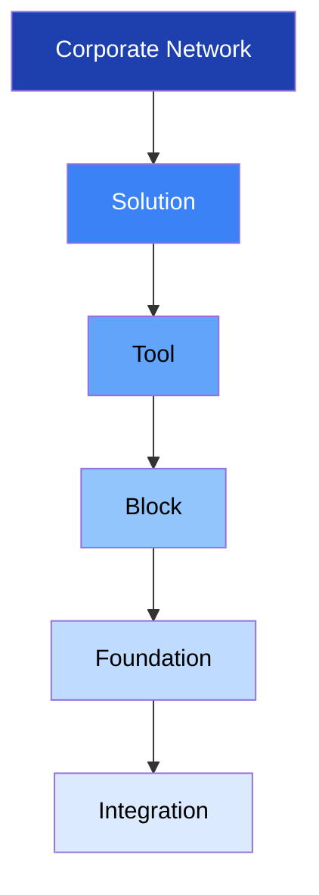
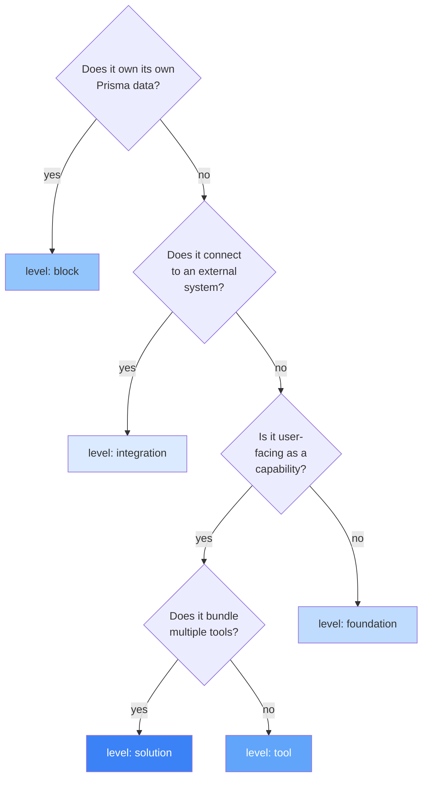

> **Para agentes de IA:** Este arquivo Markdown é a forma canônica desta entry. Use `Accept: text/markdown` ou adicione `.md` à URL para evitar renderização HTML.

# Handbook

O Handbook é o sistema de documentação do HERD. Toda feature da plataforma — block, tool, foundation ou integration — é descrita aqui usando um template consistente, para que humanos, agentes de IA internos (Claude Code) e agentes de IA externos (ChatGPT, Claude Desktop via MCP) consigam construir um modelo mental correto do HERD sem precisar ler código-fonte.

Esta entry documenta o próprio Handbook: o que cada level significa, como o `feature.yml` funciona, como ler ou escrever uma entry do Handbook, e como o sistema se mantém consistente sob mudança.

## Business

O Handbook existe porque a superfície de produto do HERD é grande e está em crescimento. Conforme blocks, tools, foundations e integrations se multiplicam, saber o que cada um é, por que existe, a quem serve, e como se relaciona com os outros vira o gargalo central de onboarding — tanto para humanos entrando no time quanto para agentes pedidos a fazer trabalho no codebase.

O custo de documentação ruim em um codebase colaborado por IA é materialmente mais alto que em um tradicional. Quando um agente não sabe o que uma feature é, ele não pergunta — ele chuta. Chutes produzem código que compila, roda, e silenciosamente faz a coisa errada. O Handbook elimina as condições sob as quais um agente chuta, fornecendo uma descrição única, canônica, e legível por máquina de toda feature que ele possa tocar.

Para os clientes do HERD, o Handbook é invisível — mas seus efeitos não são. Entrega de features mais rápida e consistente; menos regressões causadas por semântica mal entendida; workflows guiados por agentes (via MCP) que funcionam porque o agente tem acesso à mesma documentação que um engenheiro sênior consultaria.

O Handbook também é o substrato para o posicionamento do HERD como Market Network Platform. Quando a plataforma federar entre corporate networks, o Handbook é o contrato que permite agentes em uma network descobrirem e raciocinarem sobre capacidades em outra sem trabalho de integração ad-hoc.

## Product

O Handbook aparece em três lugares.

Para humanos no time, vive em `/admin/handbook` dentro do próprio HERD, com uma sidebar à esquerda agrupando entries por level (Foundations, Blocks, Tools, Solutions, Integrations, Corporate Network), e um sumário pegajoso em cada entry mostrando as seis perspectives. A renderização da UI é entregue em uma etapa posterior; o que existe hoje é a fonte no filesystem.

Para o Claude Code trabalhando no repo, vive em `docs/handbook/{level}/{feature-id}/{pt-BR,en-US}.md` — lido diretamente do filesystem, pareado com os pacotes `SKILL.md` relevantes em `.agents/skills/`.

Para agentes externos (ChatGPT, Claude Desktop) conectando via MCP, aparece através de duas tools: `search(query)` retorna UIDs de features que casam; `fetch(id)` retorna o conteúdo Markdown completo de uma entry junto com seu graph de metadata (consumes, consumed_by, related).

Um usuário lendo o Handbook no admin do HERD vê: o título da entry, badge de status (active / draft / deprecated / archived / deferred), versão, data da última atualização, e as seis perspectives como seções colapsáveis. Cross-references renderizam como links clicáveis para outras entries.

## Architecture

### The 6 commercial levels

O produto do HERD é organizado como uma pirâmide de seis commercial levels. Toda feature documentável no HERD pertence a exatamente um level. Os levels, do topo para a base, são:

- **Corporate Network** — a plataforma HERD inteira como aparece para uma única empresa cliente. O topo. (Quando a camada Market Network chegar, ela vai sentar acima deste.)
- **Solution** — um bundle curado de tools vendido ou enquadrado para um resultado de negócio específico. Exemplos: Support, Pre-sales, Sales, Marketing. *Atualmente deferred — o schema aceita o level mas nenhuma entry existe no day-1; volta quando a camada Solution for desenhada.*
- **Tool** — uma composição cross-block com um objetivo de negócio específico. Uma tool lê e escreve em múltiplos blocks, aplica lógica de negócio, e expõe uma capacidade focada para usuário ou agente. Exemplo: `subscription-offering` (consome contacts + deals + products para gerenciar receita recorrente).
- **Block** — uma fonte única da verdade para um tipo de dado. Um block tem seus próprios Prisma models, endpoints CRUD, ciclo de vida, políticas de RLS, e (geralmente) um manifest em `src/lib/blocks/blocks/{name}.block.ts`. Exemplos: `contacts`, `meetings`, `deals`, `products`.
- **Foundation** — infraestrutura compartilhada que dá suporte aos levels acima. Foundations não têm unidade comercial por si só; são pré-condições necessárias para blocks, tools, e solutions funcionarem. Exemplos: `i18n`, `domain-events`, `auth`, `permissions`, `audit`, `ledger`, `handbook` (esta entry), `knowledge`, `agents`, `routines`.
- **Integration** — uma conexão a um sistema externo. Integrations não têm dado próprio; são pontes. Exemplos: `google-calendar`, `slack`, `stripe`.

### The 3 technical categories

Cortando os commercial levels, o código do HERD se divide em três technical categories usadas no campo `feature.yml.technical_category`:

- `block` — possui seu próprio dado (Prisma models, CRUD).
- `tool` — compõe dado possuído por blocks.
- `foundation` — infraestrutura compartilhada consumida por todos.

Nota: `block-group` **não** é um level e **não** é uma technical category. Block-groups são agrupamentos intra-block — por exemplo, "packages" como um grupo curado de products dentro do block products, ou um conjunto curado de meetings filtrado por algum critério. São documentados dentro da Architecture perspective do block pai (no campo `block_groups` do `feature.yml` do pai), não como entries separadas.

Nota: `category` (Finances, Legal, Marketing, Sales, Operations) **não** é um level. Categories são agrupamentos de runtime que o orchestrator usa para rotear chamadas de tool. Têm agentes em `.agents/tools/{category}/AGENT.md` mas não têm entries de Handbook — o papel comercial que elas teriam é assumido por Solution.

### Decision tree: classifying a new feature

Ao introduzir uma nova feature no HERD, percorra a árvore abaixo para classificá-la. O level determina o caminho do diretório, os artifacts requeridos, e a audiência que vai consumir a entry.

### Examples and anti-examples

- **`contacts`** é um `block`. Possui seu Prisma model `Contact`, tem CRUD, e é consumido por tools como `subscription-offering` e `lead-qualification`.
- **`subscription-offering`** é uma `tool`. Compõe contacts + deals + products para gerenciar receita recorrente. Sem dado próprio.
- **`packages`** **não** é uma entry. É um block-group dentro de `products` (uma coleção curada de products com pricing ou marketing compartilhado). Documentado em `products/feature.yml` sob `block_groups`.
- **`i18n`** é uma `foundation`. Usada por toda surface de UI mas sem unidade comercial por si só.
- **`google-calendar`** é uma `integration`. Sem dado próprio, apenas uma ponte para a API de calendário do Google.
- **`finances`** (a category em `.agents/tools/finances/AGENT.md`) **não** é uma entry. É um agrupamento de runtime. O papel comercial vive no level `solution` quando desenhado.
- **`Support Solution`** seria uma `solution` (quando a camada estiver ativa) — fazendo bundle de tools orientadas a suporte para uma experiência de cliente coerente. Hoje só existiria como um futuro `feature.yml` com `status: deferred`.

### The 4 artifacts per feature

Toda feature no HERD é descrita por até quatro artifacts, ligados pelo `id` e pelo `uid`:

1. **Handbook entry** em `docs/handbook/{level}/{id}/{pt-BR.md, en-US.md}` — prosa bilíngue para humanos.
2. **`feature.yml`** no mesmo diretório — metadata canônico, a join key.
3. **`SKILL.md`** em `.agents/skills/feature-{level}-{id}/SKILL.md` — guia operacional voltado para agentes. Opcional; obrigatório quando `artifacts.skill: true` no `feature.yml`.
4. **MCP tool** registrada em `mcp/generated/manifest.json` — exposta a agentes externos. Opcional; obrigatória quando `artifacts.mcp: true`.

No day-1 a camada MCP entrega apenas as tools `search` e `fetch` que indexam o próprio Handbook. Tools MCP por feature (ex: `herd_create_contact`) ficam para uma fase posterior.

### Schema as source of truth

O schema do `feature.yml` é definido em TypeScript Zod 4 em `schemas/feature.zod.ts`, importado via o subpath `zod/v4`. O JSON Schema é gerado a partir dele via `npm run gen:schemas` e commitado em `schemas/feature.schema.json` — isso dá autocomplete em IDEs e um validator estável para CI. Drift entre os dois é pego pelo CI: `git diff --exit-code schemas/` depois de rodar `gen:schemas` precisa estar limpo.

### CI gates

Três gates hard-fail bloqueiam merges de PR (introduzidos progressivamente ao longo desta etapa, com enforcement total na Sub-etapa 6):

- **Schema + path consistency.** O `feature.yml` parseia contra o schema Zod; o `level` casa com o diretório; o `uid` casa com `herd.<level>.<id>`.
- **Cross-reference resolution.** Todos os IDs em `consumes`, `consumed_by`, `parent`, `children`, `related` resolvem para `feature.yml` existentes. Refs danglings conhecidas (durante backfill) são listadas explicitamente em `docs/handbook/_meta/.legacy-allowlist.txt`, que o Danger.js impede de crescer.
- **Generated artifacts freshness.** Rodar `npm run gen:all` produz zero diff; se uma mudança no Handbook não foi acompanhada da regeneração dos artifacts, o CI falha.

Três warnings soft (comentários do Danger.js, não bloqueiam merge):

- Co-mudança bilíngue: `pt-BR.md` editado sem `en-US.md` (ou vice-versa).
- Empurrão doc-first: código sob `src/components/`, `src/lib/`, `src/app/admin/` mudou sem nenhuma mudança em `docs/handbook/`.
- Cobertura de perspectives: `feature.yml.perspectives` lista perspectives cujos H2 headers não aparecem em ambos os arquivos de locale.

## Operations

Esta entry é **operacional** — agentes devem tratá-la como autoritativa. Cinco instruções para qualquer agente (Claude Code, ChatGPT via MCP, Claude Desktop via MCP) usando documentação do HERD:

1. **Antes de escrever código que cria, modifica, ou deprecia uma feature, localize seu `feature.yml`.** Se nenhum existe e você está criando algo novo, rode `npm run gen:feature` (a meta-skill `/new-feature`, introduzida na Sub-etapa 3) primeiro. Não improvise os quatro artifacts à mão.

2. **O campo `level` é canônico.** Quando em dúvida sobre se algo é uma tool ou uma foundation, percorra a decision tree na Architecture perspective desta entry. Se ainda estiver incerto, pergunte ao usuário antes de classificar.

3. **Cross-references usam UIDs (`herd.<level>.<id>`), não paths.** UIDs sobrevivem a renomeações; paths quebram. O xrefmap em `docs/handbook/_meta/xrefmap.yml` é a tabela canônica de tradução UID → path.

4. **Não edite `mcp/generated/`, `schemas/feature.schema.json`, `docs/handbook/_meta/xrefmap.yml`, ou `public/llms.txt` à mão.** São gerados. Rode o script `npm run gen:*` correspondente, ou `npm run gen:all` para regenerar tudo de uma vez.

5. **O contrato bilíngue é simétrico.** Quando você muda `pt-BR.md`, mude `en-US.md` no mesmo PR (e vice-versa). Se uma tradução está pendente, commite um bloco `<!-- TRANSLATION_PENDING -->` no locale que está atrasado e marque o PR com a tag `i18n-followup`.

### Print mode

Entries do Handbook são imprimíveis. A regra `@media print` em `src/app/admin/handbook/handbook-print.css` força toda seção Collapsible aberta e esconde chrome interativo (toolbar, breadcrumbs, chevrons). Use Cmd+P / Ctrl+P em qualquer entry — todas as seções H2 aparecem expandidas, independentemente do estado da UI.

Limitação: diagramas Mermaid são lazy-rendered na abertura da seção. Diagramas em seções que nunca foram abertas no ciclo de vida da página atual não aparecerão na impressão. Workaround: abra a seção uma vez antes de disparar o print.

## Glossary

| Term (en-US) | Termo (pt-BR) | Significado |
|---|---|---|
| block | bloco | Fonte única da verdade para um tipo de dado. Possui Prisma models. |
| block-group | grupo de bloco | Coleção curada intra-block (ex: packages dentro de products). Não é entry própria. |
| corporate-network | rede corporativa | A plataforma HERD inteira por cliente. Topo da pirâmide. |
| feature.yml | feature.yml | Arquivo de metadata canônico por feature. A join key entre os quatro artifacts. |
| foundation | fundação | Infraestrutura compartilhada consumida por outros levels (i18n, auth, ledger, etc.). |
| Handbook | Handbook | Sistema de documentação do HERD. Esta entry documenta ele. |
| integration | integração | Conexão com um sistema externo. Sem dado próprio. |
| level | nível | Um dos seis valores: corporate-network, solution, tool, block, foundation, integration. |
| MCP | MCP | Model Context Protocol. Como agentes externos (ChatGPT, Claude Desktop) consomem docs do HERD. |
| perspective | perspectiva | Uma das seis seções de uma entry de Handbook: Business, Product, Architecture, Operations, Glossary, Changelog. |
| SKILL.md | SKILL.md | Guia operacional voltado para agentes. Formato definido por agentskills.io. |
| solution | solução | Bundle curado de tools para um resultado de negócio. Atualmente deferred. |
| technical_category | categoria técnica | Uma de três: block, tool, foundation. Corta os commercial levels. |
| tool | ferramenta | Composição cross-block com um objetivo de negócio. |
| uid | uid | Identificador estável no formato `herd.<level>.<id>`. |
| xrefmap | xrefmap | Tabela gerada de tradução UID → path. Lookup canônico para cross-references. |

## Changelog

- **2026-05-01** — Publicação inicial. Etapa Handbook foundation + first entries. Estabelece 6 commercial levels (corporate-network, solution, tool, block, foundation, integration), 3 technical categories (block, tool, foundation), 4 artifacts por feature (Handbook, feature.yml, SKILL.md, MCP), Zod 4 (via subpath `zod/v4`) como schema source-of-truth, doc-first como workflow, e CI gates (3 hard-fail + 3 soft warning).
