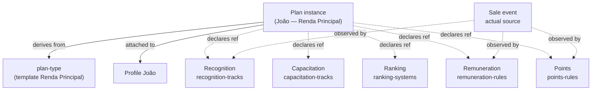

> For AI agents: this pattern is a fundamental architectural invariant. Any new capability that involves contractual relationship rules between the company and a profile (career, commission, recognition, capacitation, points, ranking) must be modeled as a **rule declared in a Plan**, not as a separate tool with its own logic. Decisions settled in the May 2026 architectural session.

# Pattern: Plan Orchestrator

Plans is an **agnostic** tool that attaches to any profile-type — internal or external — declaring how that profile is remunerated, recognized, capacitated, ranked, and pointed. The central insight: **a Plan does not store its own events**. A Plan declares rules referencing other tools that store the events.

This pattern is, alongside Three-Level Composition and Source Attribution, one of ComeçaAI's architectural pillars. Without it, every new combination of "profile type + remuneration structure" would require a dedicated tool — an approach that does not scale and that we explicitly reject.

## Business

Modern companies have varied remuneration and relationship structures: an internal collaborator has a career plan; a promoter has a commission plan; a supplier has a payment plan; an influencer has a hybrid plan (commission + recognition). Each company assembles its own combination.

The naive approach would be to create one tool per structure: "Career Plans tool", "Commission Plans tool", "Supplier Payment Plans tool". The result is non-scaling architecture: each new combination requires new code, and structures that combine dimensions (e.g., a full-time reseller with career + commission + recognition) become impossible to model without duplication.

The settled approach — agnostic Plan — fixes this: **a single tool, Plans, that attaches to any profile-type and declares rules combining references to other tools**. The company configures Plans once and gets total flexibility.

The commercial consequence is direct. ComeçaAI can serve everything from small businesses (1 profile-type, 1 simple plan-type) to large enterprises (multiple profile-types, sophisticated plans crossing multiple progression tools) with the same architecture.

## Product

### What a Plan is

A Plan is an **instance** attached to a specific profile that declares how that profile relates to the company. Each Plan derives from a **plan-type** (reusable template) — Manage Types/Sets pattern applied (see `pattern-manage-types`).

Canonical plan-type examples:

- **"Renda Pura"** — casual promoter, low effort. Simple commission, no structured career.
- **"Renda Extra"** — influencer/affiliate, mid effort. Commission + basic recognition.
- **"Renda Principal"** — full-time reseller. Commission + full career (recognition + capacitation + ranking).

Canonical plan instance examples:

- **João** with active plan "Renda Principal" since 2026-03-01.
- **Maria** with active plan "Renda Extra" since 2025-09-15.
- **Pedro** with active plan "Renda Pura" since 2026-01-10.

### What the profile sees

Profile opens their active Plan (in Identity area, future) and sees four things:

1. **Plan identity**: "You are on the Renda Principal plan since March 1st."
2. **Active rules**: which recognition-tracks they participate in, which capacitation-tracks are available, which ranking-system evaluates them, which remuneration-rule defines payment, which points-rule defines scoring.
3. **Current progress**: cross-tool aggregation — current points, current recognition level, current ranking position, pre-payout remuneration balance, completed courses.
4. **Possible upcoming progressions**: can they migrate to another plan? Which criteria?

### Inter-plan progression

A profile has **one active plan** at a time, but can migrate between plans over time:

```
Renda Pura (promoter, low effort)
   ↓
Renda Extra (influencer/affiliate, mid effort)
   ↓
Renda Principal (full-time reseller)
```

Each migration is recorded in the `plan-transitions` block with timestamp, met criterion, and previous plan + new plan. The company can define migration requirements (e.g., to move from Renda Pura to Renda Extra, the profile must reach a certain tier in capacitation-tracks).

## Architecture

### Structure of an instance

```
Plan instance "João — Renda Principal"
├── plan_type_id: "renda-principal-template"
├── profile_id: João
├── status: active
├── since: 2026-03-01
└── References (inherited from the template, override possible per instance):
    ├── active recognition-tracks       → Recognition tool
    ├── active capacitation-tracks      → Capacitation tool
    ├── active ranking-systems          → Ranking tool
    ├── active remuneration-rules       → Remuneration tool
    └── active points-rules             → Points tool
```

A Plan stores: template identity, FK to profile, status, dates, and a **set of declarative references** to definitions in other tools.

A Plan **does not** store: points events, recognition events, remuneration events. Those live in their specific blocks, with source attribution pointing to the originating business event (see `pattern-source-attribution`, Batch 3).

### Plans family — 3 blocks

The family produced by the Plans tool has exactly 3 blocks:

- **`plan-types`** — reusable templates (definitions). Managed via the "Manage types" header sub-action (Manage Types pattern, see `pattern-manage-types`).
- **`plans`** — instances attached to profiles. The tool's main listing.
- **`plan-transitions`** — log of inter-plan migrations. Append-only.

### Cross-tool references — declarative, not executive

A Plan **declares** that the profile participates in certain tracks/systems/rules; **it does not execute** the rules. Execution lives in the specific tools:

- When the profile closes a sale → the **Marketplace** tool records the event. **Points** observes the event and produces a point according to `points-rules` declared in João's active plan. **Remuneration** observes the same event and produces a commission entry per `remuneration-rules`. **Recognition** observes and updates progress on the active track.
- When the profile completes a course → **Knowledge** records it. **Capacitation** updates progress on the active track per the plan's `capacitation-tracks`.
- Period boundary → **Ranking** computes positions per active `ranking-systems`.

This is **declarative cross-tool composition**: the Plan says "this profile participates in these rules"; specific tools observe events and apply.

### Settled cross-cuts

| Plan declares reference to | Owning tool | Consumed block(s) |
|---|---|---|
| recognition-tracks | Recognition | recognition-tracks, recognition-events, recognition-progress |
| capacitation-tracks | Capacitation | capacitation-tracks, capacitation-events, capacitation-progress |
| ranking-systems | Ranking | ranking-systems, ranking-points-events, ranking-positions |
| remuneration-rules | Remuneration | remuneration-rules, remuneration-events, remuneration-balances |
| points-rules | Points | points-rules, points-events, points-balances |

These tools (Recognition, Capacitation, Ranking, Remuneration, Points) will be registered in the Handbook as individual entries in future stages (R10-R14). Until then, the reference appears in prose in this pattern and not as a UID cross-ref.

### Diagram



Plan is the "declarative skeleton"; actual events always flow through the specific tools.

## Operations

### When to create a new plan-type

A new plan-type is created when there is a **new relationship structure** that does not fit any existing template. Signals:

- A new profile-type entered Network and needs its own plan (e.g., the company creates an "ambassador" category with unique rules).
- The career/commission structure changes materially (not just a % tweak — it's a model change).

Signals that this is **not** a new plan-type:

- "I want the same plan with a different %" → tweak the existing template, or override in the instance.
- "I want the same plan for another person" → new instance derived from the existing template, not a new plan-type.

### Checklist for creating a plan-type

1. **Compatible profile-type**: which profile-type(s) does this plan-type apply to? Document explicitly.
2. **Active references**: which recognition-tracks, capacitation-tracks, ranking-systems, remuneration-rules, points-rules participate? List with specific IDs.
3. **Eligibility criteria**: conditions for a profile to enter this plan (minimum capacitation, minimum prior ranking score, etc.).
4. **Exit/migration criteria**: conditions to migrate to another plan (target or source).
5. **Override policy**: can instances override inherited references? Which ones?
6. **Validate with product before implementing**: plan-type is a sensitive commercial entity.

### Anti-patterns to avoid

- **Plan storing events**: including a `plan-points-events` or `plan-commission-events` table inside Plans. Wrong: events live in the specific tools (Points, Remuneration, etc.).
- **Plan-specific tool**: creating `commission-plans-tool` separate from `career-plans-tool`. Wrong: Plans is single and agnostic; combinations are plan-types.
- **Plan duplicating rules from a referenced tool**: copying a remuneration-rule definition locally inside the Plan. Wrong: Plan references, doesn't copy. Editing the rule in the Remuneration tool reflects in all Plans referencing it.
- **Multiple simultaneous active plans**: a profile with 2 active plans at once. Wrong: rule is one active plan at a time; transitions recorded in `plan-transitions`.

## Glossary

- **plan**: instance attached to a profile, declaring how it relates to the company via references to other tools.
- **plan-type**: reusable plan template, managed via the "Manage types" header sub-action.
- **plan-instance**: operational synonym for plan — used when emphasizing the contrast with plan-type.
- **plan-transition**: append-only record of a profile's migration between plans, with timestamp, previous plan, new plan, and met criterion.
- **orchestrator pattern**: architectural pattern where an agnostic primitive (Plan) declares rules referencing other tools without holding execution logic.
- **agnostic primitive**: entity that attaches to multiple contexts (any profile-type) without logic coupled to a specific context.
- **cross-tool reference**: declarative reference from one tool to definitions in another tool — does not duplicate data, only points.

## Changelog

- **2026-05-04 (v1.0)** — Pattern settled in the R2.5 expanded architectural session (May 2026). Establishes Plans as an agnostic primitive that declares rules referencing Recognition, Capacitation, Ranking, Remuneration, and Points. Plans family = 3 blocks. Cross-tool composition is declarative, not executive. Manage Types pattern applied to manage plan-types.
