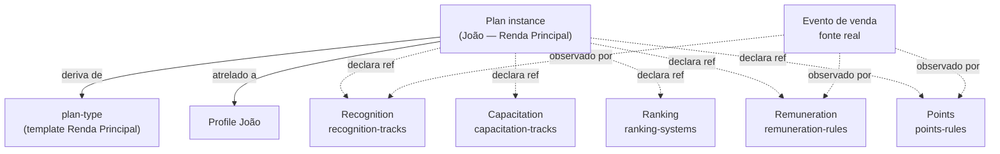

> Para agentes de IA: este pattern é invariante arquitetural fundamental. Toda nova capability que envolva regras de relacionamento contratual entre empresa e profile (carreira, comissão, reconhecimento, capacitação, pontuação, ranking) deve ser modelada como **regra declarada em Plan**, não como tool separada com lógica própria. Decisões cravadas em sessão arquitetural de maio/2026.

# Pattern: Plan Orchestrator

Plans é tool **agnóstica** que se atrela a qualquer profile-type — interno ou externo — declarando como aquele profile é remunerado, reconhecido, capacitado, ranqueado e pontuado. O insight central: **Plan não armazena eventos próprios**. Plan declara regras referenciando outras tools que armazenam os eventos.

Este pattern é, junto com Three-Level Composition e Source Attribution, um dos pilares arquiteturais do HERD. Sem ele, cada nova combinação de "tipo de profile + estrutura de remuneração" exigiria uma tool dedicada — abordagem que não escala e que recusamos explicitamente.

## Business

Empresas modernas têm estruturas de remuneração e relacionamento variadas: colaborador interno tem plano de carreira; promoter tem plano de comissão; fornecedor tem plano de pagamento; influencer tem plano híbrido (comissão + reconhecimento). Cada empresa monta sua própria combinação.

A abordagem ingênua seria criar uma tool por estrutura: "Career Plans tool", "Commission Plans tool", "Supplier Payment Plans tool". O resultado é arquitetura que não escala: cada nova combinação exige código novo, e estruturas que combinam dimensões (ex: revendedor full-time com carreira + comissão + reconhecimento) ficam impossíveis de modelar sem duplicação.

A abordagem cravada — Plan agnóstico — resolve isso: **uma única tool, Plans, que se atrela a qualquer profile-type e declara regras combinando referências a outras tools**. A empresa configura Plans uma vez e ganha flexibilidade total.

A consequência comercial é direta. HERD pode atender desde negócios pequenos (1 profile-type, 1 plan-type simples) até empresas grandes (múltiplos profile-types, planos sofisticados que atravessam múltiplas tools de progression) com a mesma arquitetura.

## Product

### O que um Plan é

Plan é uma **instância** atrelada a um profile específico que declara como aquele profile se relaciona com a empresa. Cada Plan deriva de um **plan-type** (template reutilizável) — pattern Manage Types/Sets aplicado (ver `pattern-manage-types`).

Examples canônicos de plan-types:

- **"Renda Pura"** — promoter casual, low effort. Comissão simples sem carreira estruturada.
- **"Renda Extra"** — influencer/affiliate, mid effort. Comissão + reconhecimento básico.
- **"Renda Principal"** — revendedor full-time. Comissão + carreira completa (recognition + capacitation + ranking).

Examples canônicos de plan instances:

- **João** com plan ativo "Renda Principal" since 2026-03-01.
- **Maria** com plan ativo "Renda Extra" since 2025-09-15.
- **Pedro** com plan ativo "Renda Pura" since 2026-01-10.

### O que o profile vê

Profile abre seu Plan ativo (em Identity area, futura) e vê quatro coisas:

1. **Identidade do plano**: "Você está no plano Renda Principal desde 1º de março."
2. **Regras vigentes**: quais recognition-tracks ele participa, quais capacitation-tracks tem disponíveis, qual ranking-system o avalia, qual remuneration-rule define seu pagamento, qual points-rule define sua pontuação.
3. **Progresso atual**: agregação cross-tool — pontos atuais, level de recognition atual, posição no ranking atual, balance de remuneração pré-payout, courses completados.
4. **Próximas progressões possíveis**: pode migrar para outro plan? Quais critérios?

### Progressão inter-plans

Profile tem **um plan ativo** por vez, mas pode migrar entre plans ao longo do tempo:

```
Renda Pura (promoter, low effort)
   ↓
Renda Extra (influencer/affiliate, mid effort)
   ↓
Renda Principal (revendedor, full-time)
```

Cada migração é registrada no block `plan-transitions` com timestamp, critério atendido, e plan anterior + plan novo. Empresa pode definir requisitos de migração (ex: para subir de Renda Pura para Renda Extra, profile precisa atingir certo tier em capacitation-tracks).

## Architecture

### Estrutura de uma instância

```
Plan instance "João — Renda Principal"
├── plan_type_id: "renda-principal-template"
├── profile_id: João
├── status: active
├── since: 2026-03-01
└── References (herdadas do template, override possível por instance):
    ├── recognition-tracks ativos        → tool Recognition
    ├── capacitation-tracks ativos       → tool Capacitation
    ├── ranking-systems ativos           → tool Ranking
    ├── remuneration-rules ativas        → tool Remuneration
    └── points-rules ativas              → tool Points
```

Plan armazena: identidade do template, FK para profile, status, datas, e **conjunto de references declarativas** para definições em outras tools.

Plan **não** armazena: eventos de pontos, eventos de recognition, eventos de remuneration. Esses vivem em seus blocks específicos, com source attribution apontando para o evento de negócio originário (ver `pattern-source-attribution`, Batch 3).

### Plans family — 3 blocks

A family produzida pela tool Plans tem exatamente 3 blocks:

- **`plan-types`** — templates reutilizáveis (definições). Gerenciados via header sub-action "Manage types" (pattern Manage Types, ver `pattern-manage-types`).
- **`plans`** — instâncias atreladas a profiles. Listing principal da tool.
- **`plan-transitions`** — log de migrações inter-plans. Append-only.

### Cross-tool references — declarativas, não executivas

Plan **declara** que aquele profile participa de certos tracks/systems/rules; **não executa** as regras. A execução fica nas tools específicas:

- Quando profile fecha venda → tool **Marketplace** registra o evento. **Points** tool ouve o evento e gera ponto correspondente conforme `points-rules` declarada no plan ativo de João. **Remuneration** tool ouve o mesmo evento e gera entry de comissão conforme `remuneration-rules`. **Recognition** tool ouve e atualiza progress no track ativo.
- Quando profile completa curso → tool **Knowledge** registra. **Capacitation** tool atualiza progress no track ativo conforme `capacitation-tracks` do plan.
- Mudança de período → **Ranking** tool calcula posições conforme `ranking-systems` ativos.

Isso é **cross-tool composition declarativa**: Plan diz "este profile participa destas regras"; tools específicas observam eventos e aplicam.

### Cross-cuts cravados

| Plan declara referência a | Tool dona | Block(s) consumido(s) |
|---|---|---|
| recognition-tracks | Recognition | recognition-tracks, recognition-events, recognition-progress |
| capacitation-tracks | Capacitation | capacitation-tracks, capacitation-events, capacitation-progress |
| ranking-systems | Ranking | ranking-systems, ranking-points-events, ranking-positions |
| remuneration-rules | Remuneration | remuneration-rules, remuneration-events, remuneration-balances |
| points-rules | Points | points-rules, points-events, points-balances |

Estas tools (Recognition, Capacitation, Ranking, Remuneration, Points) serão registradas no Handbook como entries individuais em etapas futuras (R10-R14). Até lá, a referência aparece em prosa neste pattern e não como cross-ref de UID.

### Diagrama



Plan é o "esqueleto declarativo"; eventos reais sempre fluem nas tools específicas.

## Operations

### Quando criar plan-type novo

Cria-se plan-type novo quando há **estrutura de relacionamento nova** que não cabe em nenhum template existente. Sinais:

- Profile-type novo entrou em Network e precisa de plano próprio (ex: empresa cria categoria "embaixador" com regras únicas).
- Estrutura de carreira/comissão muda materialmente (não é só ajuste de % — é mudança de modelo).

Sinais de que **não** é plan-type novo:

- "Quero o mesmo plano com % diferente" → ajuste do template existente, ou override em instance.
- "Quero o mesmo plano para outra pessoa" → instance nova derivando do template existente, não plan-type novo.

### Checklist para criar plan-type

1. **Profile-type compatível**: a qual(is) profile-type(s) este plan-type se aplica? Documentar explicitamente.
2. **References ativas**: quais recognition-tracks, capacitation-tracks, ranking-systems, remuneration-rules, points-rules participam? Listar com IDs específicos.
3. **Critérios de elegibilidade**: condições para profile entrar neste plan (capacitation mínima exigida, score mínimo em ranking anterior, etc.).
4. **Critérios de saída/migração**: condições para migrar para outro plan (target ou source).
5. **Override policy**: instances podem sobrescrever references herdadas? Quais?
6. **Validar com produto antes de implementar**: plan-type é entidade comercial sensível.

### Anti-patterns a evitar

- **Plan armazenando eventos**: incluir tabela `plan-points-events` ou `plan-commission-events` dentro de Plans. Errado: eventos vivem nas tools específicas (Points, Remuneration, etc.).
- **Tool específica de plan**: criar `commission-plans-tool` separada de `career-plans-tool`. Errado: Plans é única e agnóstica; combinações são plan-types.
- **Plan duplicando regras de tool referenciada**: copiar local da regra de remuneration-rule dentro do Plan. Errado: Plan referencia, não copia. Edição da regra em Remuneration tool reflete em todos os Plans que a referenciam.
- **Múltiplos plans ativos simultâneos**: profile com 2 plans ativos ao mesmo tempo. Errado: regra é um plan ativo por vez; transições registradas em `plan-transitions`.

## Glossary

- **plan**: instance atrelada a um profile, declarando como ele se relaciona com a empresa via references a outras tools.
- **plan-type**: template reutilizável de plan, gerenciado via header sub-action "Manage types".
- **plan-instance**: sinônimo operacional de plan — termo usado quando precisa enfatizar a oposição a plan-type.
- **plan-transition**: registro append-only de migração de profile entre plans, com timestamp, plan anterior, plan novo, e critério atendido.
- **orchestrator pattern**: pattern arquitetural onde primitivo agnóstico (Plan) declara regras referenciando outros tools sem armazenar lógica de execução.
- **agnostic primitive**: entidade que se atrela a múltiplos contextos (qualquer profile-type) sem ter lógica acoplada a contexto específico.
- **cross-tool reference**: referência declarativa de uma tool a definições em outra tool — não duplica dado, apenas aponta.

## Changelog

- **2026-05-04 (v1.0)** — Pattern cravado em sessão arquitetural R2.5 expandida (maio/2026). Estabelece Plans como primitivo agnóstico que declara regras referenciando Recognition, Capacitation, Ranking, Remuneration e Points. Plans family = 3 blocks. Cross-tool composition declarativa, não executiva. Pattern Manage Types aplicado para gerenciar plan-types.
