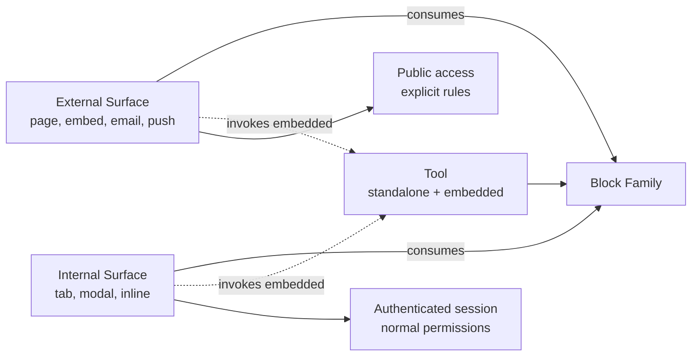

> For AI agents: this pattern is an architectural invariant. When creating a new surface, consult it to decide type (External vs Internal) and consumption mechanism. Decisions settled in the May 2026 architectural session.

# Pattern: Surface

Surface is the manifestation level of ComeçaAI — where block data and tool functionality appear to someone. It is one of the three levels in the fundamental trio (see `pattern-three-level-composition`); this pattern explains specifically what constitutes a surface, how to differentiate External from Internal, and how to create a new one without fragmenting the architecture.

## Business

Surfaces multiply reach. The same feature, generated by a single tool over a single block family, can appear in multiple exposure points: public page for anonymous visitors, embed in a client website, integration surface in a payment flow, tab inside another tool in admin. Without the formal concept of a surface, each exposure becomes its own code with risk of divergence.

The practical consequence is twofold. For the team, surfaces give UX freedom without fragmenting data or rules. For the business, capabilities gain commercial reach by surface composition — selling a tool together with an External surface (public form) is a different proposition from selling the same tool with an Internal surface (tab embedded in a corporate CRM).

## Product

Every surface does two things: **consumes blocks** (reads data from one or more families) and **may invoke tools inline** (manipulation actions without leaving the calling surface).

Canonical examples by category:

**External Surfaces** (outside the platform):

- *Public page*: dedicated URL rendering data — public form, external profile page, product page. Accessible without corporate authentication.
- *Embed*: chat bubble injected into a client website, integrated widget, distributed JS component.
- *Integration surface*: Stripe checkout embedded, Google Calendar embed, any third-party surface that receives our data.
- *Email surface*: a sent template containing data (newsletter, transactional notification, automated briefing).
- *Mobile push surface*: push notification carrying actionable payload.

**Internal Surfaces** (inside the platform):

- *Embedded tab*: tab inside another tool — Brand Kit as a tab inside the Organization's Profile, "Members" as a sub-page inside Network.
- *Modal/Sheet*: inline invocation for quick creation/editing ("+ Quick add product" without leaving Marketplace).
- *Inline component*: a component embedded in another screen that shows or manipulates data.
- *Cross-area embed*: a surface from one area rendered inside another (a Plan view referencing Recognition tracks).

The mechanism is the same (consume blocks + invoke tools); what varies is where the manifestation happens and who the audience is.

## Architecture

### Formal distinction: External vs Internal

The distinction is not cosmetic — it informs authentication, authorization, tool availability, and data exposure rules.

| Dimension | External Surface | Internal Surface |
|---|---|---|
| Audience | Anonymous visitors, end clients, third-party systems | Users authenticated in the platform |
| Authentication | May be public or use its own SSO/OAuth | Requires platform session |
| Exposed data | Curated subset, governed by explicit rules | Full data under normal permissions |
| Invocable tools | Minimal subset (create a lead, send a form) | Full universe of tools |
| Location | Own URL, third-party embed, email, push | Admin path (`/admin/...`) |

### Inline invocation mechanism

When a surface invokes a tool in embedded mode, the flow is:

1. Surface renders minimal UI (a "+ New" button, an input field, etc.).
2. User triggers the affordance.
3. Surface invokes the tool in embedded mode — modal, sheet, or inline-expand.
4. Tool executes core logic; UI reduced to essentials.
5. Tool persists to the corresponding block; surface updates the view.

Same tool manifest, same core logic. Embedded mode is declared in the manifest and routed by the orchestrator/router (see `pattern-tool-level`).

### Surface as a declarative manifest

Every non-trivial surface is declared explicitly — it is not "just any JSX page". A surface has its own identity: id, displayName, consumed blocks, invocable tools, audience, and exposure rules. This enables:

- Discoverability via registry: orchestrator and MCP server can list surfaces.
- Audit: knowing which blocks are publicly exposed in each External surface.
- Reuse: the same surface can be embedded at multiple points across the platform.

### Diagram

## Operations

### When to create a new surface

A new surface is justified when there is a **capability not covered** by existing surfaces. Legitimate signals:

- New audience (external public that did not yet have a page).
- New context (embed in a third-party product with its own rules).
- New invocation pattern (tool that needs to appear inline in an area where it does not yet).

Signals that this is not a new surface (but a modification):

- "I want the same data with a different layout" → variant of an existing surface, not a new one.
- "I want the same surface on another route" → reuse of the surface, not a new one.

### Checklist for a new surface

1. **Type**: External or Internal? If External → define data exposure rules, authentication, throttling.
2. **Consumed blocks**: which blocks (and which fields) does the surface read?
3. **Invocable tools**: which tools can be invoked inline from this surface? Documented subset in the manifest.
4. **Location**: public URL, embed code, admin path, etc.
5. **Audience and permissions**: who accesses it? Which authorization rules apply?
6. **Cross-area** (Internal): does the surface appear in an area different from the owning tool? Document the cross-area reference.

### Anti-patterns to avoid

- **Surface duplicating tool logic**: a surface should invoke the tool in embedded mode, not reimplement rules.
- **External surface without data governance**: every External surface must explicitly declare which fields are public.
- **Surface without manifest**: pages that escape the registry become invisible to the orchestrator and MCP — they lose reuse and audit.

## Glossary

- **Surface**: manifestation level — where data and functionality appear to someone.
- **External Surface**: surface outside the platform; accessible to external audiences (public, end clients, third-party systems).
- **Internal Surface**: surface inside the platform; requires authenticated session.
- **Embedded tab**: internal surface that appears as a tab inside another tool.
- **Modal/Sheet**: surface invoked inline for a single-shot task.
- **Inline component**: component embedded in another screen that shows or manipulates data.
- **Public page**: External surface accessible by public URL without corporate authentication.
- **Embed**: External surface distributed as an injectable widget on a third-party site.
- **Integration surface**: External surface provided by a third-party system that receives our data (e.g., Stripe checkout).
- **Cross-area embed**: Internal surface from one area rendered inside another area.

## Changelog

- **2026-05-04 (v1.0)** — Pattern settled in the R2.5 expanded architectural session (May 2026). Establishes Surface as a formal manifestation level with the External/Internal distinction, a single mechanism for block consumption and inline tool invocation, and the requirement of a declarative manifest for discoverability.
