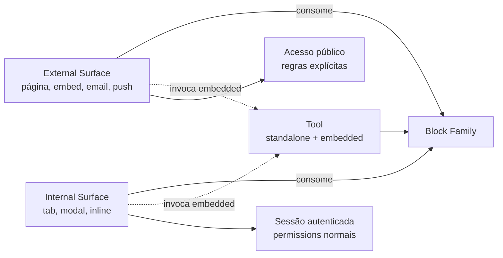

> Para agentes de IA: este pattern é invariante arquitetural. Quando criar superfície nova, consulte este pattern para decidir tipo (External vs Internal) e mecanismo de consumo. Decisões cravadas em sessão arquitetural de maio/2026.

# Pattern: Surface

Surface é o nível de manifestação do HERD — onde dados de blocks e funcionalidade de tools aparecem para alguém. É um dos três níveis do trio fundamental (ver `pattern-three-level-composition`); este pattern explica especificamente o que constitui uma surface, como diferenciar External de Internal, e como criar uma nova sem fragmentar a arquitetura.

## Business

Surfaces multiplicam alcance. A mesma feature, gerada por uma única tool sobre uma única block family, pode aparecer em múltiplos pontos de exposição: página pública para anônimos, embed em site cliente, integration surface no fluxo de pagamento, tab dentro de outra tool no admin. Sem o conceito formal de surface, cada exposição vira código próprio com risco de divergência.

A consequência prática é dupla. Para o time, surfaces dão liberdade de UX sem fragmentar dados ou regras. Para o negócio, capabilities ganham alcance comercial por composição de surfaces — vender uma tool junto com surface External (formulário público) é proposta diferente de vender a mesma tool com surface Internal (tab embedded em CRM corporativo).

## Product

Toda surface faz duas coisas: **consome blocks** (lê dados de uma ou mais families) e **pode invocar tools inline** (ações de manipulação sem sair da surface chamadora).

Exemplos canônicos por categoria:

**External Surfaces** (fora da plataforma):

- *Página pública*: URL dedicada que renderiza dados — formulário público, página de profile externo, página de produto. Acessível sem autenticação corporativa.
- *Embed*: chat bubble injetado em site cliente, widget integrado, componente JS distribuído.
- *Integration surface*: Stripe checkout embedded, Google Calendar embed, qualquer surface terceira que recebe nossos dados.
- *Email surface*: template enviado contendo dados (newsletter, notificação transacional, briefing automatizado).
- *Mobile push surface*: notificação push contendo payload acionável.

**Internal Surfaces** (dentro da plataforma):

- *Tab embedded*: aba dentro de outra tool — Brand Kit como tab dentro do Profile da Organization, "Members" como sub-page dentro de Network.
- *Modal/Sheet*: invocação inline para criação/edição rápida ("+ Quick add product" sem sair de Marketplace).
- *Inline component*: componente embutido em outra tela que mostra ou manipula dados.
- *Cross-area embed*: surface de uma área renderizada dentro de outra (Plan view referenciando Recognition tracks).

O mecanismo é o mesmo (consumir blocks + invocar tools); o que varia é onde a manifestação acontece e qual é a audiência.

## Architecture

### Distinção formal: External vs Internal

A distinção não é cosmética — informa autenticação, autorização, disponibilidade de tools, e regras de exposição de dados.

| Dimensão | External Surface | Internal Surface |
|---|---|---|
| Audiência | Anônimos, clientes finais, sistemas terceiros | Usuários autenticados na plataforma |
| Autenticação | Pode ser pública ou usar SSO/OAuth próprio | Requer sessão da plataforma |
| Dados expostos | Subset curado, governado por regras explícitas | Dados completos sob permissions normais |
| Tools invocáveis | Subset minimal (criar lead, enviar formulário) | Universo completo de tools |
| Localização | URL própria, embed em terceiro, email, push | Path admin (`/admin/...`) |

### Mecanismo de invocação inline

Quando uma surface invoca uma tool em modo embedded, o fluxo é:

1. Surface renderiza UI mínima (botão "+ New", input field, etc.).
2. User aciona affordance.
3. Surface invoca tool em modo embedded — modal, sheet, ou inline-expand.
4. Tool executa lógica core; UI reduzida ao essencial.
5. Tool persiste no block correspondente; surface atualiza vista.

Mesmo manifest da tool, mesma lógica core. O modo embedded é declarado no manifest e roteado pelo orchestrator/router (ver `pattern-tool-level`).

### Surface como manifest declarativo

Toda surface não-trivial é declarada explicitamente — não é só "uma página JSX qualquer". Surface tem identidade própria: id, displayName, blocks consumidos, tools invocáveis, audiência, e regras de exposição. Isso permite:

- Discoverability via registry: orchestrator e MCP server podem listar surfaces.
- Auditoria: saber quais blocks são expostos publicamente em cada External surface.
- Reuso: a mesma surface pode ser embeddada em múltiplos pontos da plataforma.

### Diagrama

## Operations

### Quando criar surface nova

Surface nova justifica-se quando há **capability não coberta** pelas surfaces existentes. Sinais legítimos:

- Audiência nova (público externo que ainda não tinha página).
- Contexto novo (embed em produto de terceiro com regras próprias).
- Padrão de invocação novo (tool que precisa aparecer inline em area onde ainda não aparece).

Sinais de que não é surface nova (mas sim modificação):

- "Quero o mesmo dado mas com layout diferente" → variant da surface existente, não surface nova.
- "Quero a mesma surface em outra rota" → reuso da surface, não surface nova.

### Checklist para criar surface nova

1. **Tipo**: External ou Internal? Se External → definir regras de exposição de dados, autenticação, throttling.
2. **Blocks consumidos**: quais blocks (e quais campos) a surface lê?
3. **Tools invocáveis**: quais tools podem ser invocadas inline a partir desta surface? Subset documentado no manifest.
4. **Localização**: URL pública, embed code, path admin, etc.
5. **Audiência e permissions**: quem acessa? Que regras de autorização aplicam?
6. **Cross-area** (Internal): a surface aparece em área diferente da tool dona? Documentar a referência cross-area.

### Anti-patterns a evitar

- **Surface duplicando lógica de tool**: surface deveria invocar a tool em modo embedded, não reimplementar regras.
- **External surface sem governança de dados**: toda External surface precisa declarar explicitamente quais campos são públicos.
- **Surface sem manifest**: páginas que escapam do registry ficam invisíveis ao orchestrator e MCP — perdem reuso e auditoria.

## Glossary

- **Surface**: nível de manifestação — onde dados e funcionalidade aparecem para alguém.
- **External Surface**: surface fora da plataforma; acessível por audiências externas (público, clientes finais, sistemas terceiros).
- **Internal Surface**: surface dentro da plataforma; requer sessão autenticada.
- **Tab embedded**: surface interna que aparece como aba dentro de outra tool.
- **Modal/Sheet**: surface invocada inline para tarefa pontual.
- **Inline component**: componente embutido em outra tela que mostra ou manipula dados.
- **Public page**: External surface acessível por URL pública sem autenticação corporativa.
- **Embed**: External surface distribuída como widget injetável em site terceiro.
- **Integration surface**: External surface fornecida por sistema terceiro que recebe dados nossos (ex: Stripe checkout).
- **Cross-area embed**: Internal surface de uma área renderizada dentro de outra área.

## Changelog

- **2026-05-04 (v1.0)** — Pattern cravado em sessão arquitetural R2.5 expandida (maio/2026). Estabelece Surface como nível formal de manifestação com distinção External/Internal, mecanismo único de consumo de blocks e invocação inline de tools, e exigência de manifest declarativo para discoverability.
