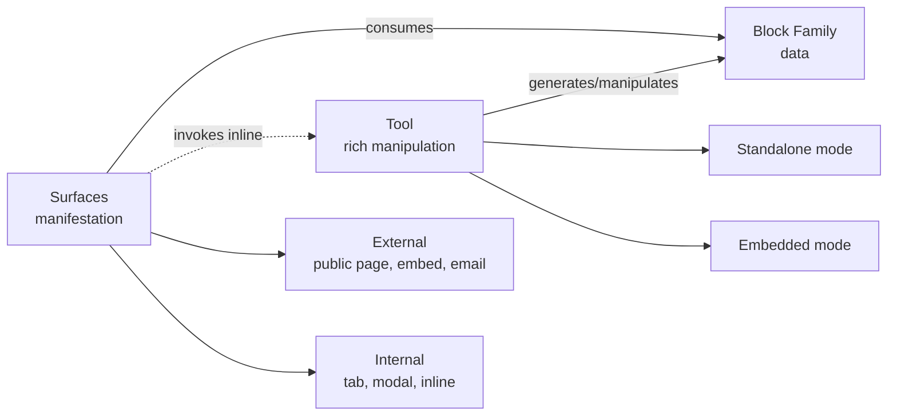

> For AI agents: this pattern is an architectural invariant of ComeçaAI. When creating new tools, blocks, or surfaces, consult it to keep the system consistent. The decisions here were settled in an extensive architectural session in May 2026 and reference the "ComeçaAI — Final Architecture" document.

# Pattern: Three-Level Composition

The whole ComeçaAI product is organized in three composition levels: **Tool** (where manipulation happens), **Block Family** (where data lives), and **Surface** (where it appears). Every new capability is born as a trio. There are no features outside this pattern — when something does not fit the trio, it signals that the feature definition is not yet mature.

## Business

The reason we think in trios rather than "isolated features" is direct: each trio is a conceptually sellable unit. Tool is the commercial unit; Block Family is the asset (data) it produces; Surface is where the asset is exposed to whoever pays, consumes, or interacts.

Treating a feature as a trio forces clarity on three questions that would otherwise stay implicit:

- **Where is this feature manipulated?** (Tool — rich UI, rules, authoring.)
- **Where does the data live?** (Block Family — single source of truth.)
- **Where does it appear to the end user?** (Surfaces — internal and external.)

Without all three answers, the feature is incomplete. Commercial bundles combine tools across areas (Marketing + Sales, Identity + Workflow), and each tool enters as a whole trio — not as "just the block" or "just the surface". This lets the commercial catalog grow without fragmenting the internal architecture.

## Product

The mental model we present to stakeholders is simple: **users interact with surfaces, surfaces consume blocks, tools manipulate blocks**.

Canonical example — Products family:

- **Tool**: `Products` at `/admin/products` is where the admin creates new products, edits existing ones, organizes them in categories, defines pricing.
- **Block Family**: `products` (main records like "Moon Milk"), `products-categories` (optional groupings like Beverages), and correlated blocks as the tool grows.
- **Surfaces**: `Marketplace` (External Surface — public page) consumes `products` to render the catalog. A "Quick add product" modal in the context of a quote is an Internal Surface that invokes the Products tool inline.

The same pattern repeats in Plans, Recognition, Remuneration, Knowledge, Network — every central ComeçaAI capability is a trio.

## Architecture

### The three formal levels

**1. Tool** — rich manipulation system. UI, rules, business logic, registry, manifest. Operates in two modes:

- *Standalone*: user in canonical path (`/admin/products`, `/admin/plans`), full workflow.
- *Embedded*: tool invoked inline from another context (create a product without leaving Marketplace).

Naming is decided by natural language — singular if the tool is a unique system (`Chat`, `Marketplace`), plural if it manages a collection (`Products`, `Plans`). Full detail in `pattern-tool-level`.

**2. Block Family** — set of correlated blocks that a tool produces. A tool does not generate a single block; it generates a family.

Internal hierarchy:

```
Block Family (e.g., Products family)
└── Block (e.g., products — one data category)
    └── Block Group (e.g., Beverages — optional grouping)
        └── Record (e.g., "Moon Milk" — concrete instance)
```

Block Group is optional — it only appears when internal organization helps (a Products family with 5,000 SKUs benefits from groups; a Locations family with 10 addresses does not). Full detail in `pattern-block-level`.

**3. Surface** — where data + tool functionality manifest for someone. A surface consumes blocks and can invoke tools inline. It splits into two formal categories:

- *External Surfaces*: public pages, embeds in client websites, integration surfaces (Stripe checkout), email surfaces, mobile push.
- *Internal Surfaces*: embedded tabs, modals/sheets, inline components, cross-area embeds.

The mechanism is the same (consume blocks + invoke tools); only the place of manifestation changes.

### Diagram



## Operations

### Checklist for a new capability

Every new feature starts by answering the three trio questions. If any answer is "I don't know", the feature is not yet ready for implementation.

1. **Tool**: what is the manipulation system? Where is its standalone path? What actions does it offer in embedded mode?
2. **Block Family**: which blocks compose the family? Does any need a Block Group? Which canonical suffixes apply (`-events`, `-snapshots`, `-progress`, etc.)?
3. **Surfaces**: where does the data appear? Is there an External surface (public page, embed)? An Internal surface (tab in another tool, modal)?

### When something doesn't fit the trio

Signs of immaturity:

- "It's just an endpoint, no UI." → Probably part of another tool, not a capability of its own.
- "It has UI but no data of its own." → Probably a surface of another tool.
- "It has data but no place to appear." → Surface is missing; go back to design.

In any of these cases, **pause-and-report**. Do not invent a missing level to make it fit.

## Glossary

- **Tool**: rich manipulation level — UI, rules, registry, manifest. The commercial and operational unit of ComeçaAI.
- **Block Family**: set of correlated blocks generated by a tool.
- **Block**: data category within a family — single source of truth for that record type.
- **Block Group**: optional intra-block grouping for internal organization.
- **Record**: concrete instance within a block — what the user sees on screen.
- **Surface**: manifestation level — where data and functionality appear to someone.
- **External Surface**: surface outside the platform (public page, embed, email, push, external integration).
- **Internal Surface**: surface inside the platform (embedded tab, modal, inline component, cross-area embed).
- **Standalone Mode**: tool accessed at its canonical path with full workflow.
- **Embedded Mode**: tool invoked inline from another surface, without leaving it.
- **Trio**: the Tool + Block Family + Surface composition that defines every ComeçaAI capability.

## Changelog

- **2026-05-04 (v1.0)** — Pattern settled in the R2.5 expanded architectural session (May 2026). Established as fundamental invariant: every new capability is born as a Tool + Block Family + Surface trio.
