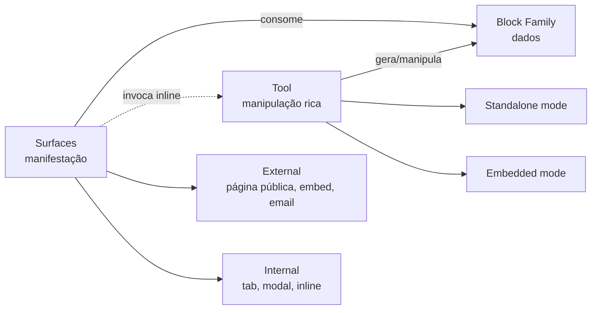

> Para agentes de IA: este pattern é uma invariante arquitetural do HERD. Quando criar tools, blocks ou surfaces novos, consulte este pattern para garantir consistência. Decisões aqui foram cravadas em sessão arquitetural extensa de maio/2026 e referenciam o documento "HERD — Arquitetura Final".

# Pattern: Composição em Três Níveis

Todo o produto HERD se organiza em três níveis composicionais: **Tool** (onde se manipula), **Block Family** (onde dados moram) e **Surface** (onde aparece). Cada capability nova nasce como trio. Não há features fora desse padrão — quando algo não cabe no trio, é sinal de que a definição da feature ainda não está madura.

## Business

A razão para pensarmos em trios em vez de "features isoladas" é direta: cada trio é uma unidade conceitualmente vendável. Tool é a unidade comercial; Block Family é o ativo (dado) que ela produz; Surface é onde o ativo é exposto a quem paga, consome ou interage.

Tratar a feature como trio força clareza sobre três perguntas que costumam ficar implícitas:

- **Onde se manipula esta feature?** (Tool — UI rica, regras, autoria.)
- **Onde os dados moram?** (Block Family — single source of truth.)
- **Onde aparece para o usuário final?** (Surfaces — internas e externas.)

Sem responder às três, a feature está incompleta. Pacotes comerciais combinam tools de áreas diferentes (Marketing + Sales, Identity + Workflow), e cada tool entra como trio inteiro — não como "apenas o block" ou "apenas a surface". Isso permite que o catálogo comercial cresça sem fragmentar a arquitetura interna.

## Product

O mental model que apresentamos a stakeholders é simples: **usuário interage com surfaces, surfaces consomem blocks, tools manipulam blocks**.

Exemplo canônico — Products family:

- **Tool**: `Products` em `/admin/products` é onde o admin cria produtos novos, edita existentes, organiza em categorias, define pricing.
- **Block Family**: `products` (registros principais como "Moon Milk"), `products-categories` (agrupamentos opcionais como Beverages), e blocks correlacionados conforme a tool cresce.
- **Surfaces**: o `Marketplace` (External Surface — página pública) consome `products` para montar o catálogo. Um modal "Quick add product" no contexto de uma cotação é uma Internal Surface que invoca a Products tool inline.

Mesmo padrão se repete em Plans, Recognition, Remuneration, Knowledge, Network — toda capability central do HERD é trio.

## Architecture

### Os três níveis formais

**1. Tool** — sistema rico de manipulação. UI, regras, lógica de negócio, registry, manifest. Tem dois modos de operação:

- *Standalone*: usuário em path canônico (`/admin/products`, `/admin/plans`), workflow completo.
- *Embedded*: tool invocada inline em outro contexto (criar produto sem sair de Marketplace).

Naming é decidido por linguagem natural — singular se a tool é sistema único (`Chat`, `Marketplace`), plural se gerencia coleção (`Products`, `Plans`). Detalhe completo em `pattern-tool-level`.

**2. Block Family** — agrupamento de blocks correlacionados que uma tool produz. Tool não gera um único block; gera família.

Hierarquia interna:

```
Block Family (ex: Products family)
└── Block (ex: products — uma categoria de dado)
    └── Block Group (ex: Beverages — agrupamento opcional)
        └── Record (ex: "Moon Milk" — instância concreta)
```

Block Group é opcional — só aparece quando organização interna ajuda (Products com 5.000 SKUs precisa de groups; Locations com 10 endereços não precisa). Detalhe completo em `pattern-block-level`.

**3. Surface** — onde dados + funcionalidade da tool se manifestam para alguém. Surface consome blocks e pode invocar tools inline. Divide-se em duas categorias formais:

- *External Surfaces*: páginas públicas, embeds em sites de clientes, integration surfaces (Stripe checkout), email surfaces, mobile push.
- *Internal Surfaces*: tabs embedded, modais/sheets, inline components, cross-area embeds.

O mecanismo é o mesmo (consumir blocks + invocar tools); o que varia é onde se manifesta.

### Diagrama



## Operations

### Checklist para criar capability nova

Toda funcionalidade nova começa respondendo às três perguntas do trio. Se alguma resposta for "não sei", a feature ainda não está pronta para implementação.

1. **Tool**: qual é o sistema de manipulação? Onde mora seu standalone (path canônico)? Que ações oferece em modo embedded?
2. **Block Family**: que blocks compõem a família? Algum precisa de Block Group? Quais sufixos canônicos se aplicam (`-events`, `-snapshots`, `-progress`, etc.)?
3. **Surfaces**: onde os dados aparecem? Há External surface (página pública, embed)? Há Internal surface (tab em outra tool, modal)?

### Quando algo não cabe no trio

Sinais de imaturidade:

- "É só um endpoint, não tem UI." → Provavelmente é parte de outra tool, não capability própria.
- "Tem UI mas não tem dado próprio." → Provavelmente é uma surface de outra tool.
- "Tem dado mas não tem onde aparecer." → Falta surface; volte ao desenho.

Em qualquer dos casos, **pause-and-report**. Não invente nível ausente para fazer caber.

## Glossary

- **Tool**: nível de manipulação rica — UI, regras, registry, manifest. Unidade comercial e operacional do HERD.
- **Block Family**: agrupamento de blocks correlacionados gerados por uma tool.
- **Block**: categoria de dado dentro de uma family — single source of truth daquele tipo de registro.
- **Block Group**: agrupamento opcional intra-block, para organização interna.
- **Record**: instância concreta dentro de um block — o registro que o usuário vê em tela.
- **Surface**: nível de manifestação — onde dados e funcionalidade aparecem para alguém.
- **External Surface**: surface fora da plataforma (página pública, embed, email, push, integração externa).
- **Internal Surface**: surface dentro da plataforma (tab embedded, modal, inline component, cross-area embed).
- **Standalone Mode**: tool acessada em seu path canônico, com workflow completo.
- **Embedded Mode**: tool invocada inline em outro contexto, sem sair da surface chamadora.
- **Trio**: a composição Tool + Block Family + Surface que define toda capability do HERD.

## Changelog

- **2026-05-04 (v1.0)** — Pattern cravado em sessão arquitetural R2.5 expandida (maio/2026). Estabelecido como invariante fundamental: toda capability nova nasce como trio Tool + Block Family + Surface.
