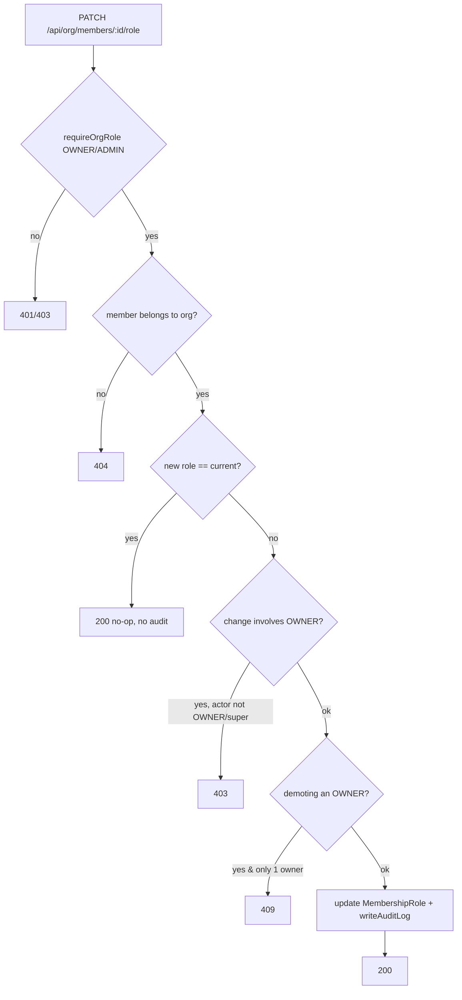
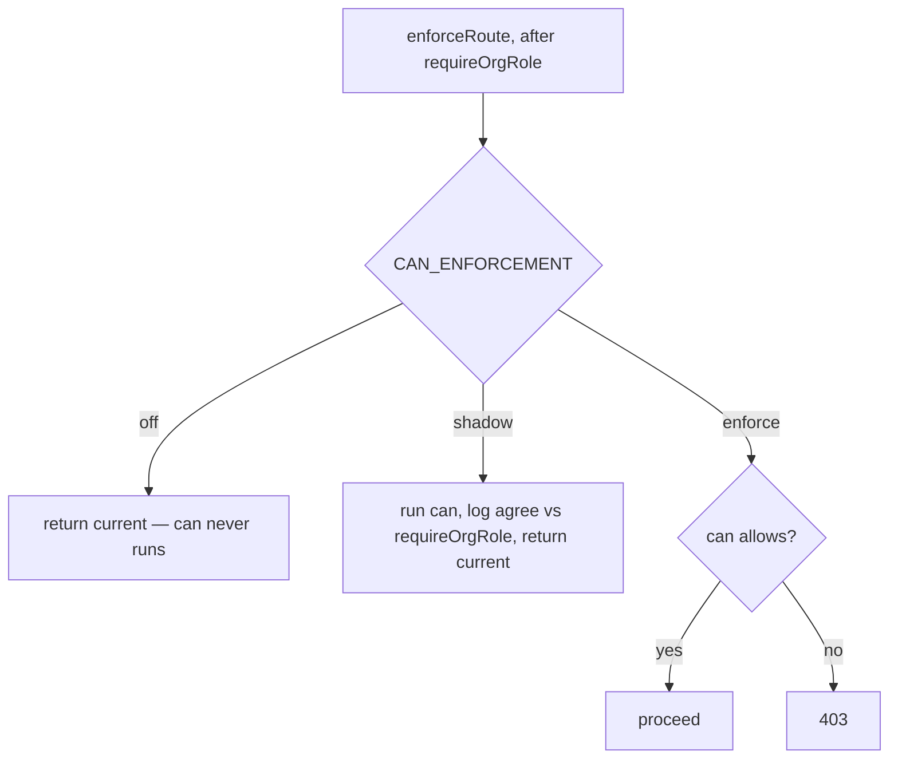

> **For AI agents:** This Markdown file is the canonical form of this entry. Use `Accept: text/markdown` or add `.md` to the URL to avoid HTML rendering.

# Roles & Permissions

Access governance for an organization. It answers two questions: *what does
each role allow* (the role×permission matrix, a read-only reference) and *who
holds which role* (assigning a member's organization-level role from the Members
page). It sits directly on top of the [Organization](../organization/en-US.md)
member directory and is the surface where an owner decides who can administer
the company.

## Business

Every multi-person organization needs to answer "who can do what." Without an
explicit governance surface, role decisions live in tribal knowledge or in the
database, invisible and unauditable. This feature makes the access model
**legible** (anyone can read the matrix) and the role assignment **operable and
audited** (owners change roles in the UI; every change is recorded).

The audience is small but high-stakes: **owners** and **admins**. An owner has
full control of the organization; an admin runs day-to-day administration but
cannot touch ownership or billing. Getting this wrong is expensive — too many
owners dilutes accountability, zero owners orphans the organization. The feature
encodes those guardrails so the dangerous mistakes are simply not reachable.

## Product

Two surfaces, both under **Organization**:

- **Permissions** (`/admin/organization/permissions`) — a read-only matrix of
  the six roles against the resource×action grants each role is declared to
  hold. It is honest about its own status: a banner states that authorization is
  currently enforced **by role name**, and that the fine-grained resource×action
  enforcement shown is the *declared model*, rolled out incrementally.
  Department-scoped roles are shown but flagged as defined-but-inert.
- **Members** (`/admin/organization/members`) — each member's organization role
  is an inline selector (OWNER / ADMIN / MEMBER) for viewers who can manage.
  Changing a role calls the role API and refreshes the list.

What you **can** do today: read the full role model; promote/demote a member's
ORG role; see role changes reflected immediately. What you **cannot** do (by
design, this version): create custom roles, edit the permission matrix, assign
department-scoped roles, or rely on per-resource enforcement beyond the role
name. Those are tracked as explicit tech debt with triggers.

Guardrails the UI mirrors from the API: the **OWNER** option is unavailable and
**OWNER rows are locked** unless the viewer is an owner (or super admin);
promoting to or demoting from OWNER asks for confirmation; the organization can
never be left without an owner.

## Architecture

- **Roles are an enum, not a table.** `MemberRole` =
  `OWNER | ADMIN | MEMBER | DEPARTMENT_HEAD | DEPARTMENT_MANAGER |
  DEPARTMENT_MEMBER`. A member's roles live in `MembershipRole` rows
  (`scopeType: ORG | DEPARTMENT`). V1 invariant: each member has exactly one
  ORG-scoped role.
- **The matrix is hardcoded, server-only.** `ROLE_PERMISSIONS`
  (`src/lib/permissions/role-permissions.ts`) maps each role to a list of
  `{ resource, action, scopeType? }` grants. The Permissions page serializes it
  on the server and passes a flat shape to the client — `ROLE_PERMISSIONS` is
  never imported into a client component.
- **Enforcement is coarse.** Route protection is `requireOrgRole(allowedRoles)`,
  which checks the member *holds* one of the allowed role names. The
  resource×action matrix and the `can()` function exist and are unit-tested but
  are **not yet wired into any production route** — the matrix is a declared
  model, not a live gate. The Permissions banner says so explicitly.
- **Role mutation** is `PATCH /api/org/members/[memberId]/role`. Because
  `OrganizationMember` / `MembershipRole` are **not** tenant-scoped (scoped by
  `organization_id` FK; RLS permissive), isolation is enforced manually:
  `assertMemberBelongsToOrg` returns 404 for a cross-org id. The endpoint also
  enforces the OWNER-only fine rule, the ≥1-active-owner invariant (409 for
  everyone, including super admin), a no-op short-circuit, and writes an audit
  log on every real change.



**Known race (accepted V1):** the owner count is read then the role is updated
in two steps; under high concurrency two simultaneous demotions could in theory
drop the org below one owner. Admin-initiated and rare — tracked as tech debt.

**Enforcement infrastructure (V2 — armed, not active).** `enforce()` (sync,
pure) wraps `can()` behind the tri-state `CAN_ENFORCEMENT` flag (default `off` |
`shadow` | `enforce`); `enforceRoute()` is the async route adapter that resolves
the actor lazily, so `off` is zero-cost (no `getActor`, no `can()`). All **25**
org-scoped call-sites of the 5 routed resources call `enforceRoute()` right after
`requireOrgRole`, with the `(resource, action[, scope])` pair from
`ENFORCEMENT_MAP` (`src/lib/permissions/enforcement-map.ts`). It is **off by
default — no runtime behavior change**; `requireOrgRole` remains the real gate.



**Observed, not yet enforcing (V2.3.5).** Shadow observation across all 25
call-sites returned **100% `agree:true`** — `can()` never disagrees with
`requireOrgRole`, because `ROLE_PERMISSIONS` mirrors the role-name gates (every
`allowedRoles` member holds the matching grant). So flipping to `enforce` is
**safe but inert** today; `can()` only changes behavior once the matrix can
diverge from the gates (the editor — V3). Run it with
`CAN_ENFORCEMENT=shadow npm run test:integration -- --disable-console-intercept`
(vitest swallows console on passing tests without the flag).

**Routed vs ghost resources.** Of the 11 model resources, **5** have
`requireOrgRole` routes (`org`, `org_hierarchy`, `members`, `departments`,
`locations`) — where `can()` would enforce. The other **6** (`org_billing`,
`org_settings`, `audit_log`, `integrations`, `blocks_schema`, `blocks_data`)
have no route: declared model only, badged "model — no surface" in the matrix.
`integrations` is gated by `requireSuperAdmin` (platform-level), out of scope for
org `can()`.

## Operations

**Assign or change a role:** go to `/admin/organization/members`, use the role
selector on the member's row. OWNER changes require you to be an owner and ask
for confirmation. A `409` toast means the change would leave the org without an
owner; a `403` means you lack permission for that change.

**Read the access model:** go to `/admin/organization/permissions`. The matrix
is reference-only; there is nothing to edit here in this version.

**Audit role changes:** every successful change writes an
[Audit Log](../../infrastructure/audit-log/en-US.md) row with
`action = "membership_role.assigned"`, `resourceType = "members"`,
`resourceId = <memberId>`, and metadata `{ from, to, targetProfileId,
actorKind }`. Query by action:

```sql
SELECT "createdAt", "actorProfileId", "resourceId", metadata
FROM audit_logs
WHERE action = 'membership_role.assigned'
ORDER BY "createdAt" DESC;
```

**Health check:** `npm run smoke:roles-permissions` validates the matrix route
responds, the `ROLE_PERMISSIONS` matrix is well-formed, and the owner-count /
cross-org isolation helpers behave on seeded data.

## Glossary

- **Role**: A named bundle of access (`OWNER`, `ADMIN`, `MEMBER`, and three department-scoped variants), modeled as the `MemberRole` enum.
- **ORG-scoped role**: A role that applies to the whole organization (`scopeType = ORG`); V1 gives each member exactly one.
- **Department-scoped role**: A role bound to a department via `scopeId` (`scopeType = DEPARTMENT`); defined in the model but not yet used as a gate.
- **Membership**: An `OrganizationMember` row linking a profile to an organization; carries the member's roles.
- **Coarse gating**: Authorization by role name (`requireOrgRole`), as opposed to fine-grained resource×action checks.
- **Permission matrix**: The hardcoded `ROLE_PERMISSIONS` map of role → resource×action grants; the declared access model.
- **super admin**: A platform-level actor (`isSuperAdmin`) that bypasses org permission checks but never the ≥1-owner invariant.
- **≥1-owner invariant**: The rule that an organization must always keep at least one active owner.
- **`CAN_ENFORCEMENT`**: Tri-state flag (`off`/`shadow`/`enforce`) gating the `can()` enforcement layer; default `off`.
- **Shadow mode**: `can()` runs alongside `requireOrgRole` and logs agreement/divergence (`[can-shadow]`) without ever changing the result.
- **Ghost resource**: A resource declared in `ROLE_PERMISSIONS` with no `requireOrgRole` route to enforce against; model-only ("model — no surface").

## Changelog

- **2026-06-01** — v1.0. Initial release: read-only permission matrix, inline ORG-role editing on the Members page, `PATCH /api/org/members/[memberId]/role` with OWNER-only fine rule, ≥1-owner invariant, manual org isolation, and audit logging. Enforcement is coarse (by role name); the matrix is a declared model.
- **2026-06-02** — v1.1 (V2 closeout). Added the `can()` enforcement infrastructure: `ENFORCEMENT_MAP` contract (27 call-sites → resource×action), `enforce()`/`enforceRoute()` behind the `CAN_ENFORCEMENT` flag (default off), and shadow adoption across all 25 routed call-sites. Full shadow observation: 100% `agree:true`. Matrix UI now badges the 6 ghost resources "model — no surface". Enforcement remains **armed but inactive** — the flip + matrix editor are V3.
