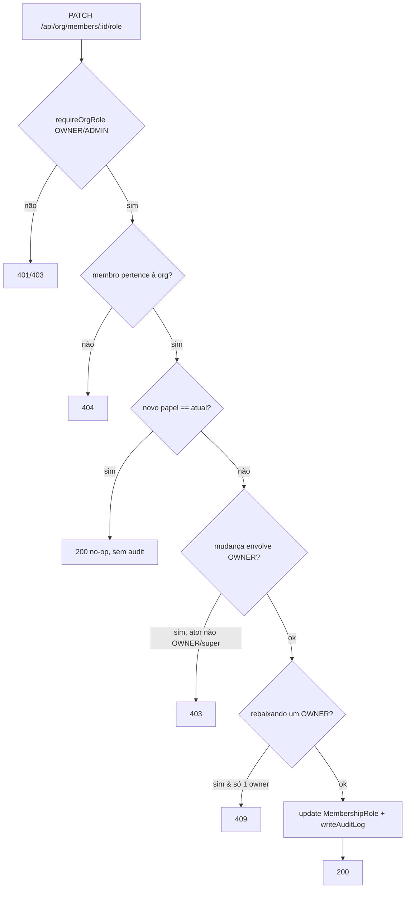
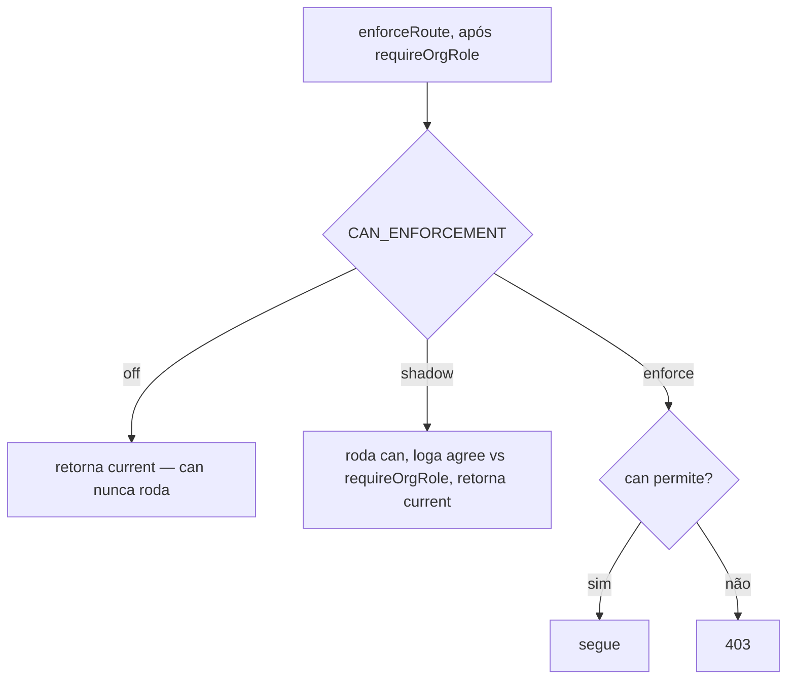

> **Para agentes de IA:** Este arquivo Markdown é a forma canônica desta entrada. Use `Accept: text/markdown` ou adicione `.md` à URL para evitar a renderização em HTML.

# Papéis e Permissões

Governança de acesso de uma organização. Responde a duas perguntas: *o que cada
papel permite* (a matriz papel×permissão, uma referência read-only) e *quem tem
qual papel* (atribuir o papel de organização de um membro na página de Membros).
Fica diretamente sobre o diretório de membros de
[Organization](../organization/pt-BR.md) e é a superfície onde um owner decide
quem pode administrar a empresa.

## Business

Toda organização com mais de uma pessoa precisa responder "quem pode o quê". Sem
uma superfície explícita de governança, as decisões de papel vivem em
conhecimento tribal ou no banco — invisíveis e não-auditáveis. Esta feature
torna o modelo de acesso **legível** (qualquer um lê a matriz) e a atribuição de
papel **operável e auditada** (owners trocam papéis na UI; toda mudança é
registrada).

O público é pequeno mas crítico: **owners** e **admins**. Um owner tem controle
total da organização; um admin toca a administração do dia a dia mas não mexe em
ownership nem em billing. Errar aqui é caro — owners demais diluem
responsabilidade, zero owners deixam a organização órfã. A feature codifica essas
travas para que os erros perigosos simplesmente não sejam alcançáveis.

## Product

Duas superfícies, ambas sob **Organization**:

- **Permissions** (`/admin/organization/permissions`) — uma matriz read-only dos
  seis papéis contra os grants recurso×ação que cada papel declara ter. É honesta
  sobre o próprio status: um banner deixa claro que a autorização hoje é aplicada
  **por nome de papel**, e que o enforcement fino recurso×ação mostrado é o
  *modelo declarado*, liberado de forma incremental. Papéis com escopo de
  departamento aparecem, mas marcados como definidos-porém-inertes.
- **Members** (`/admin/organization/members`) — o papel de organização de cada
  membro é um seletor inline (OWNER / ADMIN / MEMBER) para quem pode gerenciar.
  Trocar o papel chama a API de papel e atualiza a lista.

O que dá pra fazer hoje: ler o modelo completo de papéis; promover/rebaixar o
papel ORG de um membro; ver a mudança refletida na hora. O que **não** dá (por
design, nesta versão): criar papéis customizados, editar a matriz de permissões,
atribuir papéis com escopo de departamento, ou contar com enforcement
por-recurso além do nome do papel. Esses pontos estão rastreados como tech debt
com triggers explícitos.

Travas que a UI espelha da API: a opção **OWNER** fica indisponível e as
**linhas de OWNER ficam travadas** a menos que o viewer seja owner (ou super
admin); promover para ou rebaixar de OWNER pede confirmação; a organização nunca
pode ficar sem um owner.

## Architecture

- **Papéis são um enum, não uma tabela.** `MemberRole` =
  `OWNER | ADMIN | MEMBER | DEPARTMENT_HEAD | DEPARTMENT_MANAGER |
  DEPARTMENT_MEMBER`. Os papéis de um membro vivem em linhas `MembershipRole`
  (`scopeType: ORG | DEPARTMENT`). Invariante V1: cada membro tem exatamente um
  papel com escopo ORG.
- **A matriz é hardcoded, server-only.** `ROLE_PERMISSIONS`
  (`src/lib/permissions/role-permissions.ts`) mapeia cada papel a uma lista de
  grants `{ resource, action, scopeType? }`. A página Permissions serializa isso
  no server e passa uma estrutura plana ao client — `ROLE_PERMISSIONS` nunca é
  importado num client component.
- **O enforcement é coarse.** A proteção de rota é
  `requireOrgRole(allowedRoles)`, que verifica se o membro *detém* um dos nomes
  de papel permitidos. A matriz recurso×ação e a função `can()` existem e têm
  testes unitários, mas **ainda não estão ligadas a nenhuma rota de produção** —
  a matriz é um modelo declarado, não um gate vivo. O banner de Permissions diz
  isso explicitamente.
- **A mutação de papel** é `PATCH /api/org/members/[memberId]/role`. Como
  `OrganizationMember` / `MembershipRole` **não** são tenant-scoped (escopo por
  FK `organization_id`; RLS permissive), o isolamento é manual:
  `assertMemberBelongsToOrg` retorna 404 para um id de outra org. O endpoint
  também aplica a regra fina OWNER-only, a invariante ≥1 owner ativo (409 para
  todos, inclusive super admin), um short-circuit de no-op, e grava um audit log
  em toda mudança real.



**Race conhecida (aceita no V1):** a contagem de owners é lida e o papel é
atualizado em dois passos; sob alta concorrência, duas reduções simultâneas
poderiam, em tese, derrubar a org abaixo de um owner. Iniciada por admin e rara
— rastreada como tech debt.

**Infra de enforcement (V2 — armada, não ativa).** `enforce()` (sync, pura)
envolve o `can()` atrás da flag tri-estado `CAN_ENFORCEMENT` (default `off` |
`shadow` | `enforce`); `enforceRoute()` é o adaptador async de rota que resolve o
ator de forma lazy, então `off` tem custo zero (sem `getActor`, sem `can()`). Os
**25** call-sites org-scoped dos 5 recursos roteados chamam `enforceRoute()` logo
após o `requireOrgRole`, com o par `(resource, action[, scope])` vindo do
`ENFORCEMENT_MAP` (`src/lib/permissions/enforcement-map.ts`). É **off por default
— sem mudança de comportamento**; o `requireOrgRole` continua sendo o gate real.



**Observado, ainda não enforçando (V2.3.5).** A observação shadow nos 25
call-sites deu **100% `agree:true`** — o `can()` nunca discorda do
`requireOrgRole`, porque `ROLE_PERMISSIONS` espelha os gates por nome de papel
(todo membro em `allowedRoles` tem o grant). Logo, flipar pra `enforce` é
**seguro porém inerte** hoje; o `can()` só muda comportamento quando a matriz
puder divergir dos gates (o editor — V3). Rode com
`CAN_ENFORCEMENT=shadow npm run test:integration -- --disable-console-intercept`
(o vitest engole console em testes que passam sem a flag).

**Roteados vs fantasma.** Dos 11 recursos do modelo, **5** têm rota
`requireOrgRole` (`org`, `org_hierarchy`, `members`, `departments`, `locations`)
— onde o `can()` enforçaria. Os outros **6** (`org_billing`, `org_settings`,
`audit_log`, `integrations`, `blocks_schema`, `blocks_data`) não têm rota: modelo
declarado só, com badge "modelo — sem superfície" na matriz. `integrations` é
gateado por `requireSuperAdmin` (nível plataforma), fora do escopo do `can()` org.

## Operations

**Atribuir ou trocar papel:** vá em `/admin/organization/members` e use o seletor
de papel na linha do membro. Mudanças de OWNER exigem que você seja owner e pedem
confirmação. Um toast `409` significa que a mudança deixaria a org sem owner; um
`403` significa que você não tem permissão para aquela mudança.

**Ler o modelo de acesso:** vá em `/admin/organization/permissions`. A matriz é
só referência; não há nada para editar aqui nesta versão.

**Auditar mudanças de papel:** toda mudança bem-sucedida grava uma linha no
[Audit Log](../../infrastructure/audit-log/pt-BR.md) com
`action = "membership_role.assigned"`, `resourceType = "members"`,
`resourceId = <memberId>`, e metadata `{ from, to, targetProfileId, actorKind }`.
Consulte por ação:

```sql
SELECT "createdAt", "actorProfileId", "resourceId", metadata
FROM audit_logs
WHERE action = 'membership_role.assigned'
ORDER BY "createdAt" DESC;
```

**Health check:** `npm run smoke:roles-permissions` valida que a rota da matriz
responde, que a matriz `ROLE_PERMISSIONS` está bem-formada, e que os helpers de
contagem de owner / isolamento cross-org se comportam em dados semeados.

## Glossary

- **Papel (Role)**: Um conjunto nomeado de acesso (`OWNER`, `ADMIN`, `MEMBER` e três variantes com escopo de departamento), modelado como o enum `MemberRole`.
- **Papel com escopo ORG**: Um papel que se aplica à organização inteira (`scopeType = ORG`); no V1 cada membro tem exatamente um.
- **Papel com escopo de departamento**: Um papel ligado a um departamento via `scopeId` (`scopeType = DEPARTMENT`); definido no modelo mas ainda não usado como gate.
- **Membership**: Uma linha `OrganizationMember` ligando um profile a uma organização; carrega os papéis do membro.
- **Coarse gating**: Autorização por nome de papel (`requireOrgRole`), em oposição a checagens finas de recurso×ação.
- **Matriz de permissões**: O mapa hardcoded `ROLE_PERMISSIONS` de papel → grants recurso×ação; o modelo de acesso declarado.
- **super admin**: Um ator de nível plataforma (`isSuperAdmin`) que bypassa as checagens de permissão da org, mas nunca a invariante de ≥1 owner.
- **Invariante ≥1 owner**: A regra de que uma organização precisa sempre manter ao menos um owner ativo.
- **`CAN_ENFORCEMENT`**: Flag tri-estado (`off`/`shadow`/`enforce`) que gateia a camada de enforcement do `can()`; default `off`.
- **Shadow mode**: O `can()` roda ao lado do `requireOrgRole` e loga concordância/divergência (`[can-shadow]`) sem nunca alterar o resultado.
- **Recurso fantasma**: Recurso declarado em `ROLE_PERMISSIONS` sem rota `requireOrgRole` onde enforçar; só modelo ("modelo — sem superfície").

## Changelog

- **2026-06-01** — v1.0. Release inicial: matriz de permissões read-only, edição inline do papel ORG na página de Membros, `PATCH /api/org/members/[memberId]/role` com regra fina OWNER-only, invariante ≥1 owner, isolamento manual por org, e audit logging. O enforcement é coarse (por nome de papel); a matriz é um modelo declarado.
