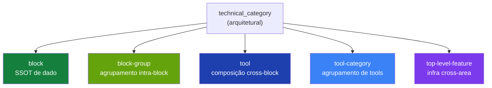

> For AI agents: this entry documents R1 (tools foundation) — the reconciliation of the real (pre-existing) tools infrastructure with the discriminator schema established in R0.2. Read before touching `src/lib/tools/manifest.ts`, `src/lib/tools/categories/`, or proposing tool/category-related changes.

# R1 — Tools Foundation Reconciliation

R1 reconciles the existing tools infrastructure — the `Tool` interface, `ToolCategoryManifest`, and the categories registry — with the discriminator schema established in R0.2. R0.2 introduced a provisional `EntityManifest` theoretically. Investigation revealed the real producer (`Tool`) had existed since before the refactor (commit `3c3c4f6` — "rename Solutions to Tools"). R1 adds the discriminator to the canonical, deletes the provisional as dead code, and formalizes `tool-category` as the 5th canonical architectural category.

## Business

R1 is not mechanical — it is discovery. R0.2 introduced a minimalist `ToolManifest` assuming greenfield. The reality in code had a rich `Tool` (10 functional fields) and `ToolCategoryManifest` (aggregator) already in production, feeding `/admin/tools/*` and the chat orchestrator. Reconciling now avoids two debts: (a) building a competing parallel in R3–R5 when reclassifying campaigns, subscriptions, marketplace; (b) leaving `tool-category` (a real architectural layer, distinct from Solution) without a canonical name.

For HERD's clients, invisible. For the team and agents, R1 closes the gap between "what is documented as existing" and "what actually exists in code".

## Product

No UI change. No runtime behavior change. The 5 categories (Finances, Legal, Marketing, Sales, Operations, totaling 13 tools — finances 3, legal 2, marketing 3, sales 4, operations 1, plus utilities) remain exactly as they were. The catalog generated by `buildToolActionCatalog()` for the orchestrator stays identical. `kind` is additive.

## Architecture

### What existed before R1

`src/lib/tools/manifest.ts` defined (since 2026-04, commit `3c3c4f6`):

- `Tool` — 10 fields: `name`, `displayName`, `description`, `icon`, `color`, `status`, `blocks` (BlockConnection[]), `agentKeys?`, `actions` (ToolAction[]), `hasSubRoutes`, `paths`.
- `ToolCategoryManifest` — tools aggregator with metadata: `name`, `displayName`, `description`, `icon`, `color`, `domain`, `tools: Tool[]`, `capabilities`, `sortOrder`.
- `BlockConnection`, `ToolAction`, `ToolStatus` — auxiliary types.

`src/lib/tools/categories/` held 5 category manifests (`finances`, `legal`, `marketing`, `operations`, `sales`).

`src/lib/tools/registry.ts` exported `toolCategoryRegistry` indexed by category name, plus helpers (`getAllTools()`, `getToolByName()`, `buildToolActionCatalog()`, `validateToolCategoryDependencies()`).

### What was wrong

In parallel, `src/lib/blocks/manifest.ts` (R0.2) had a 6-field provisional `ToolManifest` and a 6-field provisional `FeatureManifest`. Both with no real callers. The `EntityManifest` discriminated union referenced them. The `technical_category` enum in `schemas/feature.zod.ts` listed 11 values (4 architectural canonicals + 7 thematics) without `tool-category`.

### Reconciliation applied (commit 1, hash `e096d1a`)

The real Tool gains `kind: "tool"` discriminator. The real ToolCategoryManifest gains `kind: "tool_category"` discriminator. The 13 tools across the 5 categories migrated mechanically (each literal receives `kind: "tool"` as first field).

Provisional ToolManifest and FeatureManifest deleted from `src/lib/blocks/manifest.ts` (dead code; zero callers verified).

`EntityManifest` in `src/lib/blocks/manifest.ts` now imports the canonicals from `@/lib/tools/manifest`:

```typescript
import type { Tool, ToolCategoryManifest } from "@/lib/tools/manifest";

export type EntityManifest = BlockManifest | Tool | ToolCategoryManifest;
```

Schema enum bumped 11 → 12: adds `"tool-category"` as the 5th canonical architectural category.

### The 5 canonical architectural categories

Previously 4. Now 5:



Critical distinction: **Category ≠ Solution**.

- **Category**: structural grouping by business area. Permanent. Already exists (5 implemented).
- **Solution**: curated tool bundle for a specific outcome. Commercial, sellable. Deferred — `level: solution` reserved, no entries today.

### Decision: shape preservation over theoretical minimalism

Same decision as R0.2 applied to Tool. The original spec (provisional from R0.2) proposed a 6-field minimalist `ToolManifest`. The real Tool has 10. The 4 extra fields (`icon`, `color`, `status`, `agentKeys?`, `hasSubRoutes`) are consumed by:

- Sidebar (`icon`, `color`, `status`)
- Chat orchestrator (`agentKeys` for routing)
- Routing (`hasSubRoutes` for layout generation)

Simplifying would break runtime. Provisional out; canonical stays.

### Decision: tools embedded in categories, not separate registry

Tools live inside `ToolCategoryManifest.tools: Tool[]` (embedded). There is no separate `toolRegistry: Record<string, Tool>` analogous to `blockRegistry`. Helpers in `src/lib/tools/registry.ts` (`getAllTools()`, `getToolByName()`) flatten the embedded array on demand. This shape reflects the reality that tools always belong to a category (strict 1:N).

## Operations

Five instructions for agents working on post-R1 surfaces:

1. **When adding a new tool**, create the `Tool` literal inside `ToolCategoryManifest.tools` of the appropriate category in `src/lib/tools/categories/{category}.category.ts`. Include `kind: "tool"` as the first field. If the tool is a new business nature without an existing category, **pause and report** — adding a 6th category is a lasting architectural decision.

2. **When adding a new category**, create `{name}.category.ts` in `src/lib/tools/categories/`, export the `ToolCategoryManifest` with `kind: "tool_category"` as the first field, register it in `src/lib/tools/registry.ts`. Add icon mapping in `category-meta.ts`. Justify in the PR why the existing 5 don't cover the need.

3. **When reclassifying block → tool in R3–R5** (campaigns, subscriptions offering, marketplace), follow the etapa spec: create the `Tool` literal with the 10 canonical fields, insert it in the appropriate category, delete the corresponding BlockManifest, move paths per the table in `_meta/handbook`. Use type guards (`isToolManifest` still exists? — verify; provisional was removed, may need updated type guard in R3).

4. **Don't conflate `tool-category` with the runtime routing `category`**. They are aligned concepts (same name) but:
   - `tool-category` (5th technical_category): architectural layer documented in the Handbook.
   - Category of `.agents/tools/{category}/AGENT.md`: operational grouping for Claude Code agents.
   They coincide by design (Finances/Legal/Marketing/Sales/Operations).

5. **Don't conflate `tool-category` with `solution`**. Solution is deferred and has distinct commercial semantics (sellable bundle). When Solution returns, it becomes a separate layer (level: `solution`), not a replacement for Category.

## Glossary

- **Tool**: canonical interface for an individual tool at `src/lib/tools/manifest.ts`. 10 fields + `kind: "tool"`. Lives embedded in ToolCategoryManifest.tools.
- **ToolCategoryManifest**: canonical interface for grouping tools by business area. `kind: "tool_category"`. Registry: `src/lib/tools/registry.ts`.
- **BlockConnection**: descriptor `{blockName, usage, purpose}` in Tool.blocks. Indicates how a tool consumes data from a block.
- **ToolAction**: action exposed by a tool to the chat orchestrator. May orchestrate block actions (`blockActions`) or have its own endpoint (`endpoint`).
- **buildToolActionCatalog**: helper in `registry.ts` that materializes the action catalog for the orchestrator system prompt, flattening categories → tools → actions.

## Changelog

- **2026-05-02 (R1 closes)** — Tools foundation reconciliation (commit 1: schema, hash `e096d1a`; commit 2: handbook, this entry). Tool gains `kind: "tool"`. ToolCategoryManifest gains `kind: "tool_category"`. Provisional ToolManifest + FeatureManifest deleted from `src/lib/blocks/manifest.ts`. Schema enum `technical_category` bumped 11 → 12 (adds `"tool-category"`). 24 `feature.yml` total (was 23). Next: R1.5 (re-investigation of re-classifications planned for R3–R8).
