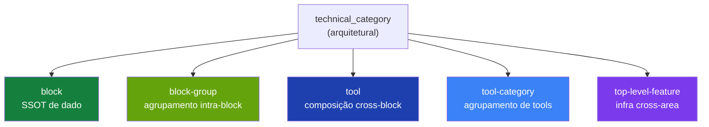

> Para agentes de IA: esta entrada documenta R1 (tools foundation) — a reconciliação da infraestrutura de tools real (pré-existente) com o discriminator schema cravado em R0.2. Leia antes de tocar em `src/lib/tools/manifest.ts`, `src/lib/tools/categories/`, ou propor mudanças relacionadas a tools/categories.

# R1 — Tools Foundation Reconciliation

R1 reconcilia a infraestrutura de tools existente — `Tool` interface, `ToolCategoryManifest`, e o registry de categorias — com o discriminator schema cravado em R0.2. R0.2 introduziu `EntityManifest` provisório teoricamente. Investigação revelou que o produtor real (`Tool`) já existia desde antes do refator (commit `3c3c4f6` — "rename Solutions to Tools"). R1 faz o canonical receber o discriminator, deleta o provisional como dead code, e formaliza `tool-category` como 5ª categoria arquitetural canônica.

## Business

R1 não é mecânica — é descoberta. R0.2 cravou um `ToolManifest` minimalista assumindo greenfield. A realidade no código tinha `Tool` rica (10 campos funcionais) e `ToolCategoryManifest` (agrupador) já em produção, alimentando `/admin/tools/*` e o orquestrador de chat. Reconciliar agora evita duas dívidas: (a) construir paralelo concorrente em R3–R5 quando re-classificarmos campaigns, subscriptions, marketplace; (b) deixar `tool-category` (camada arquitetural real, distinta de Solution) sem nome canônico.

Para os clientes do HERD, invisível. Para o time e agentes, R1 fecha a lacuna entre "o que está documentado como existir" e "o que existe de fato no código".

## Product

Sem mudança de UI. Sem mudança de comportamento de runtime. As 5 categorias (Finances, Legal, Marketing, Sales, Operations, totalizando 13 tools — finances 3, legal 2, marketing 3, sales 4, operations 1, mais utilidades) continuam exatamente como estavam. O catálogo gerado por `buildToolActionCatalog()` para o orchestrator continua idêntico. `kind` é additivo.

## Architecture

### O que existia antes de R1

`src/lib/tools/manifest.ts` definia (desde 2026-04, commit `3c3c4f6`):

- `Tool` — 10 campos: `name`, `displayName`, `description`, `icon`, `color`, `status`, `blocks` (BlockConnection[]), `agentKeys?`, `actions` (ToolAction[]), `hasSubRoutes`, `paths`.
- `ToolCategoryManifest` — agrupador de tools com metadata: `name`, `displayName`, `description`, `icon`, `color`, `domain`, `tools: Tool[]`, `capabilities`, `sortOrder`.
- `BlockConnection`, `ToolAction`, `ToolStatus` — types auxiliares.

`src/lib/tools/categories/` continha 5 manifests de categoria (`finances`, `legal`, `marketing`, `operations`, `sales`).

`src/lib/tools/registry.ts` exportava `toolCategoryRegistry` indexado por nome de categoria, mais helpers (`getAllTools()`, `getToolByName()`, `buildToolActionCatalog()`, `validateToolCategoryDependencies()`).

### O que estava errado

Em paralelo, `src/lib/blocks/manifest.ts` (R0.2) tinha `ToolManifest` provisório de 6 campos e `FeatureManifest` provisório também de 6 campos. Ambos sem callers reais. O `EntityManifest` discriminado union os referenciava. Schema enum de `technical_category` em `schemas/feature.zod.ts` listava 11 valores (4 arquiteturais canônicos + 7 temáticos) sem `tool-category`.

### Reconciliação aplicada (commit 1, hash `e096d1a`)

Tool real recebe `kind: "tool"` discriminator. ToolCategoryManifest real recebe `kind: "tool_category"` discriminator. Os 13 tools nas 5 categorias migrados mecanicamente (cada literal recebe `kind: "tool"` como primeiro campo).

ToolManifest e FeatureManifest provisórios deletados de `src/lib/blocks/manifest.ts` (dead code; zero callers verificado).

`EntityManifest` em `src/lib/blocks/manifest.ts` agora importa canonical de `@/lib/tools/manifest`:

```typescript
import type { Tool, ToolCategoryManifest } from "@/lib/tools/manifest";

export type EntityManifest = BlockManifest | Tool | ToolCategoryManifest;
```

Schema enum bumpado 11 → 12: adiciona `"tool-category"` como 5ª categoria arquitetural canônica.

### As 5 categorias arquiteturais canônicas

Anteriormente 4. Agora 5:



Distinção crítica: **Category ≠ Solution**.

- **Category**: agrupamento estrutural por área de negócio. Permanente. Já existe (5 implementadas).
- **Solution**: bundle curado de tools para outcome específico. Comercial, ofertável. Deferida — `level: solution` reservado, sem entries hoje.

### Decisão: preservação de shape sobre minimalismo teórico

Mesma decisão de R0.2 aplicada a Tool. A spec original de R1 (provisória de R0.2) propunha `ToolManifest` minimalista de 6 campos. Tool real tem 10. Os 4 campos extras (`icon`, `color`, `status`, `agentKeys?`, `hasSubRoutes`) são consumidos por:

- Sidebar (`icon`, `color`, `status`)
- Chat orchestrator (`agentKeys` para roteamento)
- Routing (`hasSubRoutes` para gerar layout)

Simplificar quebraria runtime. Provisório sai; canonical fica.

### Decisão: tools embedded em categorias, não registry separado

Tools moram dentro de `ToolCategoryManifest.tools: Tool[]` (embedded). Não há `toolRegistry: Record<string, Tool>` separado análogo a `blockRegistry`. Helpers em `src/lib/tools/registry.ts` (`getAllTools()`, `getToolByName()`) achatam o array embedded sob demanda. Esta forma reflete a realidade de que tools sempre pertencem a uma category (1:N estrita).

## Operations

Cinco instruções para agentes trabalhando em superfícies pós-R1:

1. **Ao adicionar uma tool nova**, crie `Tool` literal dentro de `ToolCategoryManifest.tools` da categoria apropriada em `src/lib/tools/categories/{category}.category.ts`. Inclua `kind: "tool"` como primeiro campo. Se a tool é nova natureza de negócio sem categoria existente, **pause e reporte** — adicionar 6ª categoria é decisão arquitetural duradoura.

2. **Ao adicionar uma categoria nova**, crie `{nome}.category.ts` em `src/lib/tools/categories/`, exporte `ToolCategoryManifest` com `kind: "tool_category"` como primeiro campo, registre em `src/lib/tools/registry.ts`. Adicione icon mapping em `category-meta.ts`. Justifique no PR por que as 5 existentes não cobrem.

3. **Ao re-classificar block → tool em R3–R5** (campaigns, subscriptions offering, marketplace), siga a spec da etapa: criar `Tool` literal com 10 campos canônicos, inseri-lo em categoria apropriada, deletar BlockManifest correspondente, mover paths conforme tabela em `_meta/handbook`. Use type guards (`isToolManifest` ainda existe? — checar; provisional foi removido, talvez precise type guard atualizado em R3).

4. **Não confundir `tool-category` com `category` runtime de roteamento**. São conceitos alinhados (mesmo nome) mas:
   - `tool-category` (5ª technical_category): camada arquitetural documentada em Handbook.
   - Category de `.agents/tools/{category}/AGENT.md`: agrupamento operacional para agentes Claude Code.
   Coincidem por design (Finances/Legal/Marketing/Sales/Operations).

5. **Não confundir `tool-category` com `solution`**. Solution está deferida e tem semântica comercial distinta (bundle ofertável). Quando Solution voltar, vira layer separada (level: `solution`), não substitui Category.

## Glossary

- **Tool**: interface canônica para tool individual em `src/lib/tools/manifest.ts`. 10 campos + `kind: "tool"`. Mora embedded em ToolCategoryManifest.tools.
- **ToolCategoryManifest**: interface canônica para agrupamento de tools por área de negócio. `kind: "tool_category"`. Registry: `src/lib/tools/registry.ts`.
- **BlockConnection**: descriptor `{blockName, usage, purpose}` em Tool.blocks. Indica como uma tool consome dados de um block.
- **ToolAction**: ação exposta por uma tool ao chat orchestrator. Pode orquestrar block actions (`blockActions`) ou ter endpoint próprio (`endpoint`).
- **buildToolActionCatalog**: helper em `registry.ts` que materializa o catálogo de actions para o system prompt do orquestrador, achatando categories → tools → actions.

## Changelog

- **2026-05-02 (R1 fecha)** — Reconciliação tools foundation (commit 1: schema, hash `e096d1a`; commit 2: handbook, esta entry). Tool ganha `kind: "tool"`. ToolCategoryManifest ganha `kind: "tool_category"`. ToolManifest + FeatureManifest provisórios deletados de `src/lib/blocks/manifest.ts`. Schema enum `technical_category` bumpado 11 → 12 (adiciona `"tool-category"`). 24 `feature.yml` totais (era 23). Próximo: R1.5 (re-investigação de re-classifications planejadas para R3–R8).
- **2026-05-03 (cross-cutting note)** — Investigação durante R1 revelou divergências entre plano original e estado real do código. Decisões revistas para R3-R8 documentadas em [R1.5](../r1-5-reclassifications-revision/).
