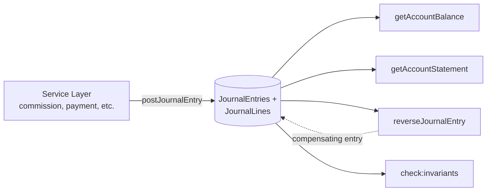

> **For AI agents:** This Markdown file is the canonical form of this entry. Use `Accept: text/markdown` or append `.md` to the URL to avoid HTML rendering.

# Ledger

Immutable append-only event log of financial events, foundational for audit, reconciliation, and derived calculations. The Ledger is HERD's "transactional truth" for any monetary movement — commissions, payments, reversals, balances. Implemented in `src/lib/ledger/` with a double-entry model (debit/credit) and invariants enforced at the database level (Postgres triggers + CHECK constraints).

## Business

The Ledger exists because balances on a B2B platform need to be **defensible under audit**. Without an immutable event log, the only source of truth is the current database state — which may have been edited, recomputed, or corrupted with no trace. When finance asks "how did this balance become this number?", the Ledger answers: here are the N entries that summed to it, in the order they happened, with their origin and timestamps.

Three primary audiences. **Finance teams** use the Ledger to reconcile amounts charged vs. received vs. owed to partners — operations that depend on precise timestamps and the guarantee that nothing was silently rewritten. **External audit** validates controls by sampling entries: each entry has `sourceKind` + `sourceId` linking back to the business event that produced it. **Product analytics** reads from the Ledger (not live state) for revenue, financial churn, and cohort analyses — numbers that don't shift retroactively when someone edits a column.

The cost of not having a Ledger is high: silent commission bugs surface weeks later (with no way to reconstruct what happened), reconciliation devolves into manual spreadsheet work, and reliance on live state as source-of-truth means calculation bugs become indefinite debt. The Ledger turns those problems into verifiable invariants (a script runs in operation/CI and detects drift).

## Product

The audiences interacting with the Ledger in HERD are developers, and indirectly finance/audit teams via dashboards backed by the same APIs. There is **no editing UI** — the Ledger is append-only by design. There is an **inspection UI** at `/admin/ledger/` (Chart of Accounts + Journal Entries) showing accounts, balances, and entries in chronological order.

Events recorded today cover the financial cycle: customer charges, commission payouts to partners, cancellation reversals, internal platform-to-platform debits/credits. Each business event involving money produces **one** `JournalEntry` with 2+ `JournalLine`s that sum to zero per currency. Each line points to an `Account` (kebab code like `platform:revenue:brl`) with a direction (`D` debit or `C` credit).

Common queries: balance at a date (`getAccountBalance(code, { asOf })`), paginated statement (`getAccountStatement(code)`), recent-entries listing (`listRecentEntries`), discovery of reversals for a given entry (`findReversalsOf`). All return serializable data with BigInt converted to string at the RSC→Client boundary (helper in `src/lib/ledger/serialize.ts`).

Known limitations: (1) balances are computed on-demand from lines — there is no materialization. Performance is sufficient for current volume; revisit when journal_lines exceeds ~10M rows. (2) Editing an entry is impossible by design: correction is via `reverseJournalEntry` (a compensating entry with directions flipped).

## Architecture

The Ledger implements classic **double-entry bookkeeping**: every monetary movement is one `JournalEntry` containing 2+ `JournalLine`s where the sum of debits equals the sum of credits per currency. Lines never change. Entries are never deleted. Corrections are compensating entries (reversals) that point back at the original via `sourceKind: REVERSAL` + `sourceId`.

### Database-enforced invariants

The model is protected by Postgres triggers and CHECK constraints, not just application validation:

- `trg_journal_entry_balance` (deferrable, COMMIT-time): rejects committing an entry that doesn't balance per currency.
- `trg_journal_line_currency_match` (BEFORE INSERT): rejects a line whose currency differs from its account's currency.
- `chk_journal_line_amount_positive`: amounts are `> 0`. Subtraction is expressed via `direction = 'C'`.
- `chk_account_code_format`: account codes match `^[a-z0-9_:-]+$`, format `{ownerKind}:{semanticRole}:{currency}`.
- `chk_account_currency_supported`: `currency ∈ {'BRL', 'USD'}`. Adding a currency requires drop+recreate of the constraint.

These are defense-in-depth: the service layer validates first (with ergonomic messages), but if anything slips through, the database rejects it.

### Entry shape

`JournalEntry` carries: `id`, `postedAt` (chronology — not `createdAt`), `sourceKind` + `sourceId` (polymorphic reference to the business event), `idempotencyKey` (optional), and its `lines`. Each `JournalLine` has `accountId`, `direction` (`D`/`C`), `amountCents` (bigint, always positive), `currency`, and the `journalEntryId` foreign key.

`postJournalEntry()` is the **only write path**. It does pre-flight validation, account resolution by `code`, idempotency by payload comparison, and structured error throwing. Tests, seeds, migrations — they all call `postJournalEntry()`. There is no direct INSERT SQL into journal_entries outside that boundary.

### Reads and projections

Balances are computed on-demand from lines. `getAccountBalance` applies natural polarity by account type:

- ASSET, EXPENSE: `balance = D - C` (positive when debited)
- LIABILITY, REVENUE, EQUITY: `balance = C - D` (positive when credited)

`getAccountStatement` returns paginated lines with a stable cursor (postedAt + id), without a mutable window. Polarity lives in `src/lib/ledger/account-polarity.ts`.

### Flow diagram

### Money type

Monetary values are always `(amountCents: bigint, currency: CurrencyCode)`. Never `number`. Never `Decimal`. The `Money` type lives in `src/lib/money/` with helpers (`add`, `subtract`, `applyBasisPoints`) that reject mixed-currency operations at runtime. Legacy `Decimal(10,2)` columns (Product, Package) interoperate via `moneyFromDecimal` / `moneyToDecimalString`.

### Reversals and idempotency

`reverseJournalEntry(originalId, { reason })` creates a compensating entry. Reversing a reversal is forbidden. Partial reversal does not exist — for partial undo, post a new entry shaped to produce the desired effect. When called with an `idempotencyKey` that already exists, it returns the pre-existing reversal silently — idempotency precedes the double-reversal protection (an explicit retry signal wins).

## Operations

Locally the Ledger comes up with the rest of the app via `npm run dev`; the chart-of-accounts seed runs via `npm run db:seed:ledger` (idempotent — running it 1×, 5×, or 100× yields the same end state). Minimum setup: apply migrations (`npm run db:migrate`) and run the seed.

Production inspection: the UI at `/admin/ledger/` shows accounts and entries with basic filters. For ad-hoc queries, scripts under `src/scripts/` (and any Server Component importing from `src/lib/ledger/`) — always with `await connection()` at the top of the RSC to avoid static pre-render falling into the Prisma proxy's no-op fallback.

`npm run check:invariants` is the **canonical operational audit**. It runs 3 SQL checks against the live database:

1. Every entry balances per currency (`SUM(D) = SUM(C)`).
2. Every account code matches the naming regex.
3. Every line's currency matches its account's.

The database triggers already make these violations impossible at runtime — `check:invariants` is defense-in-depth that detects drift from a partial backup restore, a broken migration, or bypass via direct SQL. It's not wired into CI (CI doesn't provision a DB); it runs manually after restores, periodically, and after schema-critical changes.

When inconsistencies are detected, the script prints the offending IDs and exits 1. Investigation is via direct SQL from those IDs. There is no automatic fix — correction is via compensating entries (reversal + a new entry shaped to produce the desired state).

## Glossary

- **Append-only**: Write strategy where existing records are never modified or deleted; correction comes through new compensating records.
- **Audit trail**: Immutable chronological history of all changes, used for audit and state reconstruction.
- **Compensating entry**: A new entry created to neutralize the effect of a previous entry; the original entry stays intact.
- **Double-entry**: Accounting model where every movement is recorded simultaneously as a debit and a credit in different accounts, summing to zero.
- **Idempotency key**: Key uniquely identifying a request; lets retries be safe without duplicating effect.
- **Journal entry**: Atomic unit of financial movement — one entry groups 2+ lines that balance per currency.
- **Journal line**: Individual component of an entry — binds an account, direction (D/C), amount, and currency.
- **Money tuple**: Representation `(amountCents: bigint, currency)` — never a bare `number` or `Decimal`.
- **Posting**: Action of recording an entry into the ledger via `postJournalEntry`; the only authorized write path.
- **postedAt**: Chronology timestamp of an entry; used for point-in-time balances and statement ordering (not `createdAt`).
- **Reversal**: Compensating entry with directions flipped that neutralizes the effect of an original entry.
- **Source kind/id**: Polymorphic reference linking an entry back to the business event that produced it (charge, commission, etc.).

## Changelog

- **2026-05-02** — Initial publication. Content migrated from `.agents/skills/ledger/SKILL.md` (skill v1.1) with fact-check against `src/lib/ledger/`. Status changed from `draft` to `active` after the 6 perspectives were filled in.
