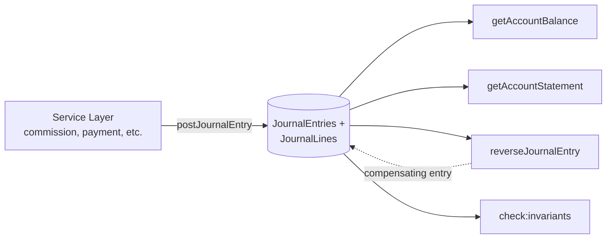

> **Para agentes de IA:** Este arquivo Markdown é a forma canônica desta entry. Use `Accept: text/markdown` ou adicione `.md` à URL para evitar renderização HTML.

# Ledger

Sistema de registro imutável de eventos financeiros append-only, base para auditoria, conciliação e cálculos derivados. É a "verdade transacional" do ComeçaAI para qualquer movimento monetário — comissões, pagamentos, reversões, saldos. Implementado em `src/lib/ledger/` com modelo double-entry (débito/crédito) e invariantes enforced no nível do banco (Postgres triggers + CHECK constraints).

## Business

O Ledger existe porque saldos de uma plataforma B2B precisam ser **defensáveis sob auditoria**. Sem um log de eventos imutável, a única fonte de verdade é o estado atual do banco — que pode ter sido editado, recalculado ou corrompido sem deixar rastro. Quando finance pergunta "como esse saldo virou esse valor?", o ledger responde: aqui estão as N entries que somaram pra esse total, na ordem em que aconteceram, com origem e timestamps.

Os públicos primários são três. **Time financeiro** usa o ledger para conciliar valores cobrados vs. valores recebidos vs. valores devidos a parceiros — operações que dependem de timestamps precisos e da garantia de que nada foi silenciosamente reescrito. **Auditoria externa** valida controles via amostragem de entries: cada entry tem `sourceKind` + `sourceId` que liga ao evento de negócio que a originou. **Analytics de produto** lê do ledger (não do estado live) para métricas de revenue, churn financeiro e cohort analysis — números que não mudam retroativamente quando alguém edita um campo no banco.

O custo de não ter o ledger é alto: erros silenciosos em comissões só aparecem semanas depois (sem forma de reconstruir o que aconteceu), reconciliação vira trabalho manual de planilha, e dependência do estado live como source-of-truth significa que bugs de cálculo viram dívida indefinida. O ledger transforma esses problemas em invariantes verificáveis (um script roda em CI/operação e detecta drift).

## Product

Quem interage com o Ledger no ComeçaAI são desenvolvedores, e indiretamente equipes de finance/audit via dashboards alimentados pelas mesmas APIs. Não há UI de "edição" — o Ledger é append-only por design. Há uma UI de **inspeção** em `/admin/ledger/` (Plano de Contas + Journal Entries) que mostra accounts, saldos e entries em ordem cronológica.

Eventos gravados hoje cobrem o ciclo financeiro: cobrança de cliente, repasse de comissão a parceiro, estorno por cancelamento, débito/crédito entre contas internas da plataforma. Cada evento de negócio que envolve dinheiro produz **um** `JournalEntry` com 2+ `JournalLine`s que somam zero por moeda. Cada line aponta para um `Account` (código kebab tipo `platform:revenue:brl`) com direção (`D` débito ou `C` crédito).

Queries comuns: saldo de conta numa data (`getAccountBalance(code, { asOf })`), extrato paginado (`getAccountStatement(code)`), listagem de entries recentes (`listRecentEntries`), descoberta de reversões de uma entry específica (`findReversalsOf`). Todas retornam dados serializáveis com BigInt convertido a string nas fronteiras RSC→Client (helper em `src/lib/ledger/serialize.ts`).

Limitações conhecidas: (1) saldos são computados on-demand das lines — não há materialização. Performance é suficiente para o volume atual; revisitar quando journal_lines passar de ~10M rows. (2) Edits de entries são impossíveis por design: correção é via `reverseJournalEntry` (compensating entry com direções invertidas).

## Architecture

O Ledger implementa **double-entry bookkeeping** clássico: cada movimento monetário é uma `JournalEntry` contendo 2+ `JournalLine`s, onde a soma dos débitos iguala a soma dos créditos por moeda. Lines nunca mudam. Entries nunca são deletadas. Correções são compensating entries (reversões) que apontam para o original via `sourceKind: REVERSAL` + `sourceId`.

### Invariantes garantidos em banco

O modelo está protegido por triggers e CHECK constraints no Postgres, não apenas validação de aplicação:

- `trg_journal_entry_balance` (deferrable, COMMIT-time): impede commit de entry desbalanceada por moeda.
- `trg_journal_line_currency_match` (BEFORE INSERT): impede line cuja currency difere da currency da account.
- `chk_journal_line_amount_positive`: amounts são `> 0`. Subtração se expressa via `direction = 'C'`.
- `chk_account_code_format`: account codes seguem regex `^[a-z0-9_:-]+$`, formato `{ownerKind}:{semanticRole}:{currency}`.
- `chk_account_currency_supported`: `currency ∈ {'BRL', 'USD'}`. Adicionar moeda exige drop+recreate da constraint.

Esses controles são defesa-em-profundidade: a service layer valida primeiro (com mensagens ergonômicas), mas se algo escapar, o banco rejeita.

### Estrutura de uma entry

`JournalEntry` carrega: `id`, `postedAt` (chronology — não `createdAt`), `sourceKind` + `sourceId` (referência polimórfica ao evento de negócio), `idempotencyKey` (opcional), e suas `lines`. Cada `JournalLine` tem `accountId`, `direction` (`D`/`C`), `amountCents` (bigint, sempre positivo), `currency`, e o `journalEntryId` foreign key.

`postJournalEntry()` é o **único caminho de escrita**. Faz pre-flight validation, resolução de account por `code`, idempotência por payload comparison, e structured error throwing. Tests, seeds, migrations — todos chamam `postJournalEntry()`. Não há SQL direto de INSERT em journal_entries fora desse boundary.

### Reads e projeções

Saldos são computados das lines on-demand. `getAccountBalance` aplica polaridade natural por tipo de conta:

- ASSET, EXPENSE: `balance = D - C` (positivo quando debitado)
- LIABILITY, REVENUE, EQUITY: `balance = C - D` (positivo quando creditado)

`getAccountStatement` retorna lines paginadas com cursor estável (postedAt + id), sem janela mutável. Polaridade vive em `src/lib/ledger/account-polarity.ts`.

### Diagrama de fluxo

### Money type

Valores monetários são sempre `(amountCents: bigint, currency: CurrencyCode)`. Nunca `number`. Nunca `Decimal`. O `Money` type vive em `src/lib/money/` com helpers (`add`, `subtract`, `applyBasisPoints`) que rejeitam mixed-currency em runtime. Colunas legadas `Decimal(10,2)` (Product, Package) interoperam via `moneyFromDecimal` / `moneyToDecimalString`.

### Reversals e idempotency

`reverseJournalEntry(originalId, { reason })` cria entry compensatória. Reversal de reversal é proibido. Reversal parcial não existe — para undo parcial, post-se nova entry com efeito desejado. Quando chamado com `idempotencyKey` que já existe, retorna a reversão pré-existente silenciosamente — idempotency precede a proteção contra dupla reversão (sinal explícito de retry vence).

## Operations

Localmente o Ledger sobe junto com o resto do app via `npm run dev`; o seed do plano de contas roda via `npm run db:seed:ledger` (idempotente — pode rodar 1×, 5×, 100× e o estado final é o mesmo). Setup mínimo: aplicar migrations (`npm run db:migrate`) e rodar o seed.

Inspeção em produção: a UI em `/admin/ledger/` mostra accounts e entries com filtros básicos. Para queries ad-hoc, scripts em `src/scripts/` (e qualquer Server Component que importe do `src/lib/ledger/`) — sempre com `await connection()` no topo do RSC para evitar pre-render estático que cairia no fallback no-op da Prisma proxy.

`npm run check:invariants` é o **audit operacional canônico**. Roda 3 checks SQL contra o banco vivo:

1. Toda entry balanceia por moeda (`SUM(D) = SUM(C)`).
2. Todo account code bate o regex de naming.
3. Toda line tem currency igual à da account.

Os triggers de banco já garantem que essas violações são impossíveis em runtime — `check:invariants` é defesa-em-profundidade para detectar drift de backup parcial, migration quebrada, ou bypass via SQL direto. Não está wired no CI (CI não provisiona DB); roda manualmente após restore, periodicamente, e após mudanças schema-críticas.

Inconsistências detectadas: o script imprime os IDs ofensivos e exit 1. Investigação manual via SQL direto a partir desses IDs. Não há fix automático — correção é via compensating entries (reversal + nova entry shaped pra produzir o estado desejado).

## Glossary

- **Append-only**: Estratégia de escrita onde registros existentes nunca são modificados ou deletados; correção via novo registro compensatório.
- **Audit trail**: Histórico cronológico imutável de todas as mudanças, usado para auditoria e reconstrução de estado.
- **Compensating entry**: Entry nova criada para anular o efeito de uma entry anterior; preserva a entry original intacta.
- **Double-entry**: Modelo contábil onde todo movimento é registrado simultaneamente como débito e crédito em contas diferentes, somando zero.
- **Idempotency key**: Chave que identifica unicamente uma requisição; permite retry seguro sem efeito duplicado.
- **Journal entry**: Unidade atômica de movimento financeiro — uma entry agrupa 2+ lines que balanceiam por moeda.
- **Journal line**: Componente individual de uma entry — vincula uma account, direção (D/C), amount e currency.
- **Money tuple**: Representação `(amountCents: bigint, currency)` — nunca `number` ou `Decimal` solto.
- **Posting**: Ação de gravar uma entry no ledger via `postJournalEntry`; único write path autorizado.
- **postedAt**: Timestamp de chronology da entry; usado para saldos point-in-time e ordenação de extrato (não `createdAt`).
- **Reversal**: Compensating entry com direções invertidas que neutraliza o efeito de uma entry original.
- **Source kind/id**: Referência polimórfica que liga a entry ao evento de negócio que a originou (cobrança, comissão, etc.).

## Changelog

- **2026-05-02** — Publicação inicial. Documentação migrada de `.agents/skills/ledger/SKILL.md` (skill v1.1) com fact-check contra `src/lib/ledger/`. Status alterado de `draft` para `active` após preenchimento das 6 perspectives.
