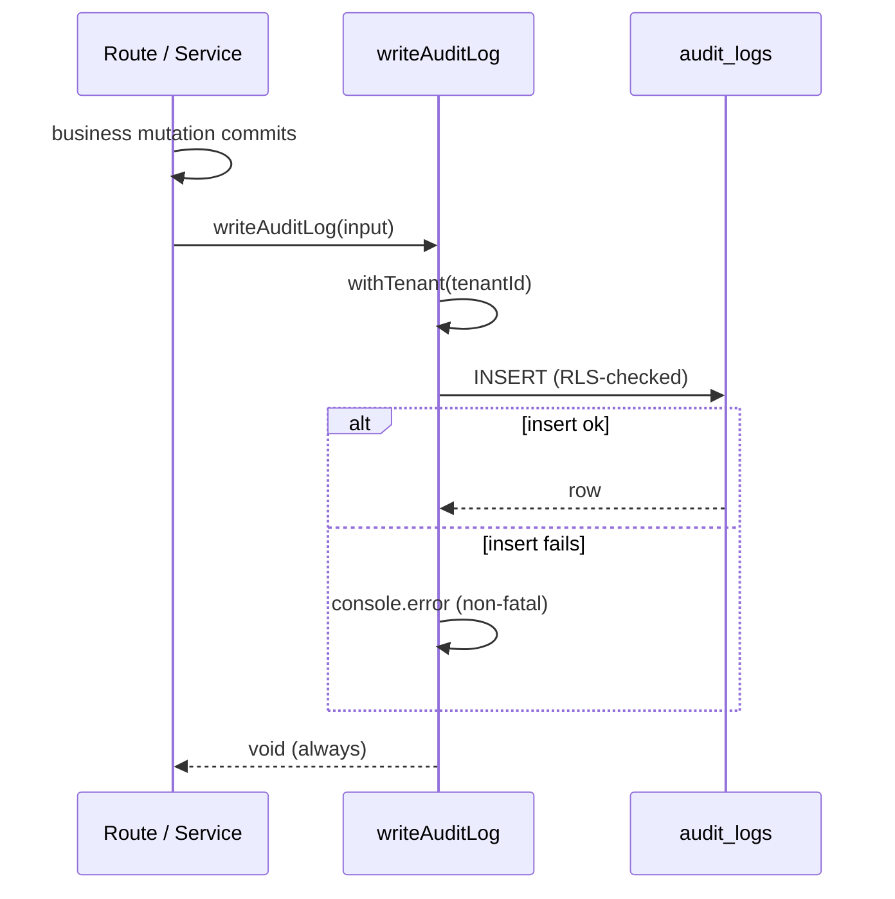

> **For AI agents:** This Markdown file is the canonical form of this entry. Use `Accept: text/markdown` or append `.md` to the URL to avoid HTML rendering.

# Audit Log

The audit log is ComeçaAI's record of **who did what, to which resource, and when**, scoped strictly to one tenant. When an owner invites a member, renames a department, or deletes a location, a row lands in `audit_logs` capturing the actor, the action, the affected resource, and a small bag of useful metadata.

It is **observability for accountability**, not for system health: the question it answers is "who changed this?", not "is the service up?". Writes are best-effort — a failed audit insert is logged and swallowed so the underlying business action still succeeds.

## Business

The bottleneck this solves is **accountability across a shared tenant**. As soon as more than one person can mutate an organization's data — invite members, restructure departments, move locations — "who did this and when?" becomes a real question with compliance, debugging, and trust implications. Without a trail, the only answers are guesses from application logs that were never designed to be queried by resource.

With an audit log, every instrumented mutation leaves a durable, queryable fact. An admin can reconstruct the sequence of changes to a department; an investigation can attribute an unexpected deletion to an actor; a future compliance review (LGPD/GDPR) has a foundation to build on.

The deliberate trade-off in V1 is **coverage over completeness**: six high-value mutation points are instrumented, not every write in the system. The actor is always the profile that *executed* the action (for an invitation accept, that is the invited person, not the inviter). Read operations are not logged.

## Product

Producers call a single helper:

```ts
await writeAuditLog({
  tenantId,            // the SAME tenant as the action's context
  actorProfileId,      // the profile that executed the action (nullable)
  action,              // "{resource}.{verb}" — e.g. "department.created"
  resourceType,        // "department" | "location" | "invitation" | ...
  resourceId,          // the affected row's id (generic string)
  metadata,            // small JSON — useful, never sensitive
});
```

Action strings follow `{resource}.{verb}` lowercase notation. The V1 instrumented set:

| Action | Where | Actor |
|---|---|---|
| `invitation.created` | invitation service | inviter |
| `invitation.accepted` | invitation service (both idempotent + main paths) | invited person |
| `invitation.revoked` | revoke route (outside the transaction) | revoker |
| `department.created` / `.updated` / `.deleted` | department routes | session user |
| `department.member_changed` | members route (added / removed) | session user |
| `location.created` / `.updated` / `.deleted` | location routes | session user |

Metadata is **minimum-useful, never sensitive**: names, slugs, the list of changed field keys, role labels — never passwords, hashes, or full tokens.

## Architecture

`AuditLog` is a strict tenant-scoped table modeled on `BillingEvent`:

- `tenant_id NOT NULL` (FK to `Organization`, `onDelete: Cascade`).
- `actor_profile_id` nullable (FK to `NetworkProfile`, `onDelete: SetNull`) — a deleted actor leaves the trail intact, just anonymized.
- `resource_id String` — generic, so any resource type can be referenced without a typed FK.
- `metadata Json` default `{}`.
- `created_at` timestamptz, plus indices on tenant, `(resource_type, resource_id)`, action, created_at, and actor.

`AuditLog` is registered in `TENANT_SCOPED_MODELS`, so the Prisma tenancy Extension injects `tenant_id` and sets the `app.tenant_id` GUC on every write.

**Row Level Security — strict molde.** A single policy enforces isolation, with no permissive `herd_app_full_access` escape hatch:

```sql
CREATE POLICY "audit_logs_tenant_isolation" ON "audit_logs"
  USING ("tenant_id" = current_app_tenant_id()::uuid)
  WITH CHECK ("tenant_id" = current_app_tenant_id()::uuid);
```

The `WITH CHECK` is explicit (a safe superset of the BillingEvent reference, which relies on `USING` doubling as the write check) because the table is write-heavy — cross-tenant INSERTs are rejected at the database layer, not just by the ORM.

**Best-effort write contract.** The helper opens its **own** `withTenant` (re-entrant, safe regardless of caller context) and wraps the insert in a try/catch that logs and swallows failures:



The audit write happens **after** the business action commits (for invitation accept, outside the `$transaction`), so a failed audit never rolls back real work, and a failed real action never produces a misleading audit row.

**Tenant correctness invariant.** Every instrumented call passes the *same* tenant expression as its enclosing `withTenant` (`session.user.activeOrgId` in routes; `organizationId` / `invitation.organizationId` in the invitation service). Passing a divergent tenant would write the audit row under the wrong tenant — the most important thing to get right when adding a new point.

## Operations

Inspecting the trail via SQL (under the right tenant GUC, or as the owner role):

```sql
-- Recent activity for a tenant
SELECT created_at, action, resource_type, resource_id, actor_profile_id, metadata
FROM audit_logs
WHERE tenant_id = '<org-uuid>'
ORDER BY created_at DESC
LIMIT 100;

-- History of a single resource
SELECT created_at, action, actor_profile_id, metadata
FROM audit_logs
WHERE resource_type = 'department' AND resource_id = '<dept-uuid>'
ORDER BY created_at ASC;
```

**Adding a new instrumentation point** is a three-step procedure: (1) identify the mutation and confirm it runs under a known tenant context; (2) call `writeAuditLog` *after* the mutation commits, passing the same tenant expression as the surrounding `withTenant`; (3) choose an `{resource}.{verb}` action string and a minimum-useful, non-sensitive metadata bag. Do **not** invent new mutation points just to audit them, and never let the audit write throw into the business path.

**What is intentionally not covered in V1:** role and settings mutations, read operations, and any admin UI for browsing the log. Org-chart edits are covered transitively — the chart is read-only and derived from departments, whose mutations are already audited.

## Glossary

- **Audit Log**: A tenant-scoped, immutable record that a specific actor performed a specific action on a specific resource at a specific time.
- **Actor**: The profile that *executed* the action. For an invitation accept, the invited person — not the inviter. Nullable; a deleted actor sets the column to NULL.
- **Action**: A `{resource}.{verb}` lowercase string identifying what happened, e.g. `location.deleted`.
- **Resource**: The affected entity, identified by `resource_type` + a generic `resource_id` string.
- **Best-effort write**: An audit insert whose failure is logged and swallowed, so it can never break or roll back the business action it describes.
- **Strict tenant isolation**: An RLS policy with only `tenant_isolation` (no permissive `herd_app_full_access`), rejecting cross-tenant reads and writes at the database layer.

## Changelog

- **2026-05-29** — Audit Log V1 shipped (Sub-etapa 25, PR #88, merge `fdc7a75`). `AuditLog` table with strict RLS, `writeAuditLog` helper, and six instrumented mutation points across invitations, departments, and locations.
