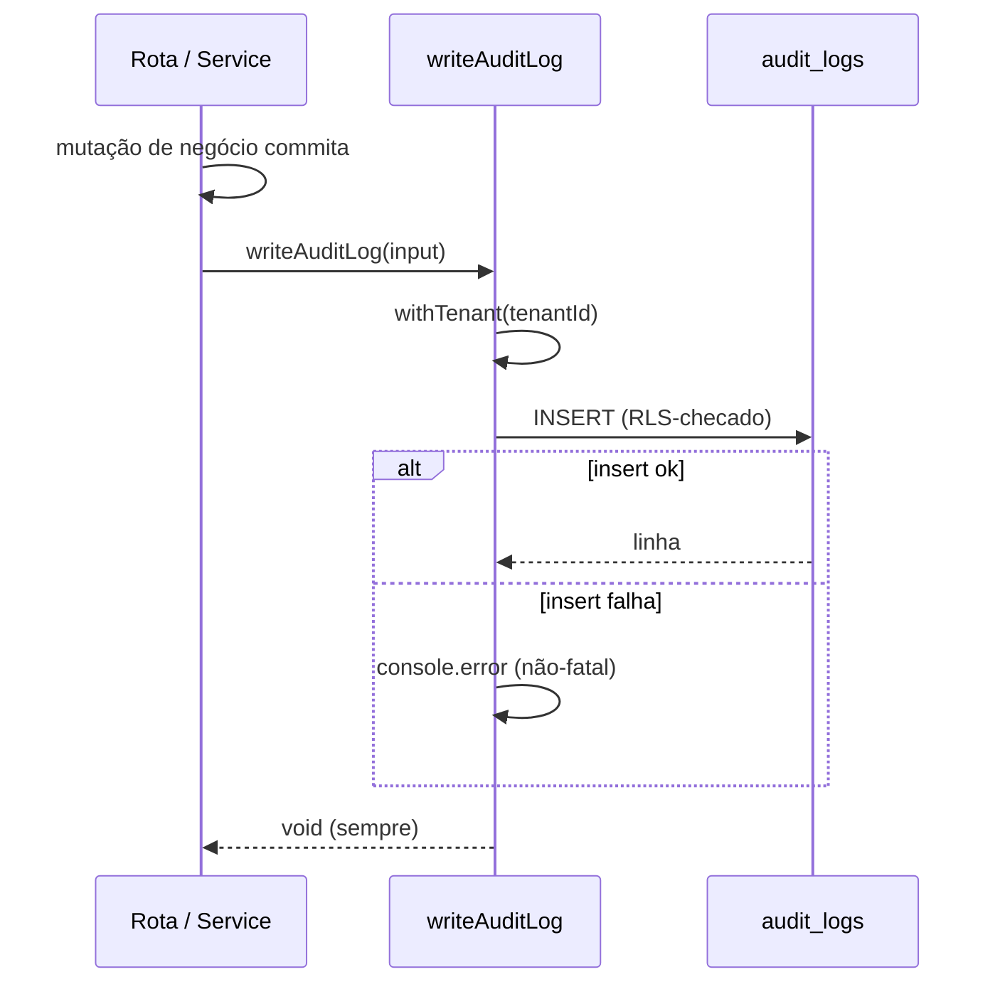

> **Para agentes de IA:** Este arquivo Markdown é a forma canônica desta entrada. Use `Accept: text/markdown` ou anexe `.md` à URL para evitar renderização HTML.

# Log de Auditoria

O log de auditoria é o registro da ComeçaAI de **quem fez o quê, em qual recurso e quando**, escopado estritamente a um tenant. Quando um owner convida um membro, renomeia um departamento ou apaga uma location, uma linha aterrissa em `audit_logs` capturando o ator, a ação, o recurso afetado e um pequeno conjunto de metadados úteis.

É **observabilidade para accountability**, não para saúde do sistema: a pergunta que responde é "quem mudou isto?", não "o serviço está no ar?". As escritas são best-effort — uma falha no insert de auditoria é logada e engolida, de modo que a ação de negócio subjacente ainda assim conclui.

## Business

O gargalo que isto resolve é **accountability dentro de um tenant compartilhado**. Assim que mais de uma pessoa pode mutar os dados de uma organização — convidar membros, reestruturar departamentos, mover locations — "quem fez isto e quando?" vira uma pergunta real com implicações de compliance, debugging e confiança. Sem uma trilha, as únicas respostas são palpites a partir de logs de aplicação que nunca foram desenhados para serem consultados por recurso.

Com um log de auditoria, cada mutação instrumentada deixa um fato durável e consultável. Um admin consegue reconstruir a sequência de mudanças de um departamento; uma investigação consegue atribuir uma deleção inesperada a um ator; uma futura revisão de compliance (LGPD/GDPR) tem uma fundação para construir em cima.

O trade-off deliberado na V1 é **cobertura sobre completude**: seis pontos de mutação de alto valor são instrumentados, não toda escrita do sistema. O ator é sempre o profile que *executou* a ação (no accept de um convite, é a pessoa convidada, não quem convidou). Operações de leitura não são logadas.

## Product

Os produtores chamam um único helper:

```ts
await writeAuditLog({
  tenantId,            // o MESMO tenant do contexto da ação
  actorProfileId,      // o profile que executou a ação (nullable)
  action,              // "{recurso}.{verbo}" — ex. "department.created"
  resourceType,        // "department" | "location" | "invitation" | ...
  resourceId,          // o id da linha afetada (string genérica)
  metadata,            // JSON pequeno — útil, nunca sensível
});
```

As action strings seguem a notação `{recurso}.{verbo}` em lowercase. O conjunto instrumentado na V1:

| Ação | Onde | Ator |
|---|---|---|
| `invitation.created` | invitation service | quem convidou |
| `invitation.accepted` | invitation service (caminho idempotente + principal) | pessoa convidada |
| `invitation.revoked` | rota de revoke (fora da transação) | quem revogou |
| `department.created` / `.updated` / `.deleted` | rotas de department | usuário da sessão |
| `department.member_changed` | rota de members (added / removed) | usuário da sessão |
| `location.created` / `.updated` / `.deleted` | rotas de location | usuário da sessão |

Metadata é **mínimo-útil, nunca sensível**: nomes, slugs, a lista de chaves de campos alterados, labels de role — nunca senhas, hashes ou tokens completos.

## Architecture

`AuditLog` é uma tabela tenant-scoped estrita, modelada sobre `BillingEvent`:

- `tenant_id NOT NULL` (FK para `Organization`, `onDelete: Cascade`).
- `actor_profile_id` nullable (FK para `NetworkProfile`, `onDelete: SetNull`) — um ator deletado deixa a trilha intacta, apenas anonimizada.
- `resource_id String` — genérico, para que qualquer tipo de recurso possa ser referenciado sem uma FK tipada.
- `metadata Json` default `{}`.
- `created_at` timestamptz, mais índices em tenant, `(resource_type, resource_id)`, action, created_at e actor.

`AuditLog` está registrado em `TENANT_SCOPED_MODELS`, então a Extension de tenancy do Prisma injeta `tenant_id` e seta a GUC `app.tenant_id` em toda escrita.

**Row Level Security — molde estrito.** Uma única policy impõe o isolamento, sem escape hatch permissivo `herd_app_full_access`:

```sql
CREATE POLICY "audit_logs_tenant_isolation" ON "audit_logs"
  USING ("tenant_id" = current_app_tenant_id()::uuid)
  WITH CHECK ("tenant_id" = current_app_tenant_id()::uuid);
```

O `WITH CHECK` é explícito (um superset seguro da referência BillingEvent, que confia no `USING` dobrando como check de escrita) porque a tabela é write-heavy — INSERTs cross-tenant são rejeitados na camada do banco, não só pelo ORM.

**Contrato de escrita best-effort.** O helper abre o seu **próprio** `withTenant` (re-entrante, seguro independente do contexto do caller) e envolve o insert num try/catch que loga e engole falhas:



A escrita de auditoria acontece **depois** que a ação de negócio commita (no accept de convite, fora do `$transaction`), então uma auditoria que falha nunca dá rollback no trabalho real, e uma ação real que falha nunca produz uma linha de auditoria enganosa.

**Invariante de correção de tenant.** Toda chamada instrumentada passa a *mesma* expressão de tenant do seu `withTenant` envolvente (`session.user.activeOrgId` nas rotas; `organizationId` / `invitation.organizationId` no invitation service). Passar um tenant divergente gravaria a linha de auditoria no tenant errado — a coisa mais importante a acertar ao adicionar um novo ponto.

## Operations

Inspecionando a trilha via SQL (sob a GUC de tenant correta, ou como o role owner):

```sql
-- Atividade recente de um tenant
SELECT created_at, action, resource_type, resource_id, actor_profile_id, metadata
FROM audit_logs
WHERE tenant_id = '<org-uuid>'
ORDER BY created_at DESC
LIMIT 100;

-- Histórico de um único recurso
SELECT created_at, action, actor_profile_id, metadata
FROM audit_logs
WHERE resource_type = 'department' AND resource_id = '<dept-uuid>'
ORDER BY created_at ASC;
```

**Adicionar um novo ponto de instrumentação** é um procedimento de três passos: (1) identificar a mutação e confirmar que ela roda sob um contexto de tenant conhecido; (2) chamar `writeAuditLog` *depois* que a mutação commita, passando a mesma expressão de tenant do `withTenant` ao redor; (3) escolher uma action string `{recurso}.{verbo}` e um metadata mínimo-útil e não-sensível. **Não** invente pontos de mutação novos só para auditá-los, e nunca deixe a escrita de auditoria lançar exceção no caminho de negócio.

**O que está intencionalmente fora da V1:** mutações de role e settings, operações de leitura, e qualquer UI admin para navegar o log. Edições de org-chart são cobertas transitivamente — o chart é read-only e derivado de departments, cujas mutações já são auditadas.

## Glossary

- **Audit Log**: Um registro tenant-scoped e imutável de que um ator específico executou uma ação específica em um recurso específico em um momento específico.
- **Actor**: O profile que *executou* a ação. No accept de um convite, a pessoa convidada — não quem convidou. Nullable; um ator deletado seta a coluna para NULL.
- **Action**: Uma string `{recurso}.{verbo}` em lowercase identificando o que aconteceu, ex. `location.deleted`.
- **Resource**: A entidade afetada, identificada por `resource_type` + uma string genérica `resource_id`.
- **Best-effort write**: Um insert de auditoria cuja falha é logada e engolida, de modo que nunca pode quebrar ou dar rollback na ação de negócio que descreve.
- **Strict tenant isolation**: Uma policy de RLS com apenas `tenant_isolation` (sem `herd_app_full_access` permissivo), rejeitando leituras e escritas cross-tenant na camada do banco.

## Changelog

- **2026-05-29** — Audit Log V1 entregue (Sub-etapa 25, PR #88, merge `fdc7a75`). Tabela `AuditLog` com RLS estrita, helper `writeAuditLog`, e seis pontos de mutação instrumentados em invitations, departments e locations.
