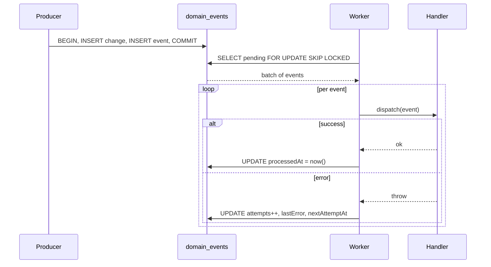

> **For AI agents:** This Markdown file is the canonical form of this entry. Use `Accept: text/markdown` or append `.md` to the URL to avoid HTML rendering.

# Domain Events

The domain events system is HERD's mechanism for communicating across bounded contexts asynchronously. A producer in one context records that something happened — a transaction was paid, a commission was computed, a user signed up — and any number of consumers in other contexts can react to that fact later, without the producer needing to know they exist.

Events are emitted **inside the same transaction** that produced the underlying state change. The event row exists if and only if the change exists — no event without the change, no change without the event. A separate worker picks pending events and dispatches them to handlers.

## Business

The bottleneck this solves is **coupling between contexts**. Without an event log, when "transaction paid" should also "compute commission, send receipt, update analytics, notify partner", the transaction-paying code grows to call all four. Each new consumer is a synchronous edit to the producer, each failure path is a chain that breaks the whole flow, and the producer's test surface multiplies with every consumer.

With domain events, the producer emits one fact and forgets. Consumers subscribe by registering a handler. New consumers don't touch the producer; failed consumers don't break the producer; testing is per-handler instead of per-fan-out.

The cost is asynchrony — consumers see facts after the producer commits, not in lockstep. For HERD's domains (financial, user lifecycle, notifications) that delay is acceptable; the decoupling is worth it.

## Product

Producers call `emitDomainEvent({ aggregateType, aggregateId, eventType, payload }, tx)` inside a transaction. Consumers register a handler in `HANDLER_REGISTRY` keyed by `eventType`. The worker (`npm run worker:domain-events`) is the bridge.

Event types follow `{aggregate}.{verb}` lowercase notation: `transaction.paid`, `commission.computed`, `account.balance-recomputed`. Verbs may include hyphens for compound forms.

Idempotency is opt-in via an `idempotencyKey`. When a key already exists, an exact match (same aggregate + type + payload) returns the existing event silently; a mismatch throws `IdempotencyConflictError`. Without a key, every call is a new event.

Phase 1 (the current state) ships the infrastructure with an empty handler registry. Phase 2 begins emitting events from real producers and registering handlers.

## Architecture

The pattern is the **transactional outbox**: synchronous write of the event in the producer's transaction, asynchronous delivery by a worker.



Workers coordinate via `SELECT ... FOR UPDATE SKIP LOCKED` so multiple workers running concurrently never claim the same event. Handlers run outside the picking lock — long-running handlers don't block other workers.

Events are immutable post-emission: `aggregateType`, `aggregateId`, `eventType`, `payload`, `idempotencyKey`, `occurredAt`, `createdAt` never change. Only worker-controlled fields (`attempts`, `lastError`, `nextAttemptAt`, `processedAt`) mutate. Mutating event content would break the audit trail.

Retry policy is bounded: 5 attempts with exponential backoff `[1m, 5m, 30m, 2h]`. After exhaustion, `nextAttemptAt = NULL` and auto-retry stops. Manual intervention is the path forward — investigate `lastError`, fix the bug, then either reset the row or leave it permanently exhausted.

Handlers must be **idempotent**. Workers may retry, may overlap, and processing may resume from unknown state after a crash. The framework cannot enforce idempotency — it is the handler author's responsibility (upsert instead of create, check-before-send for external calls).

## Operations

Run the worker locally:

```bash
npm run worker:domain-events
# optional: --limit=N to cap batch size (default 100)
```

The worker is a standalone CLI, not a long-running daemon. Cadence is the responsibility of an external scheduler (cron, Railway scheduled jobs). Reasoning: deploy targets favor batch jobs, the model is simpler to reason about, and crashes are bounded to one batch.

Inspecting state via SQL:

```sql
-- Pending events
SELECT id, eventType, attempts, nextAttemptAt
FROM domain_events
WHERE processedAt IS NULL AND nextAttemptAt <= now()
ORDER BY occurredAt ASC LIMIT 50;

-- Exhausted events (auto-retry stopped)
SELECT id, eventType, attempts, lastError
FROM domain_events
WHERE processedAt IS NULL AND nextAttemptAt IS NULL;
```

Recovering an exhausted event after the bug is fixed:

```sql
UPDATE domain_events SET attempts = 0, nextAttemptAt = now() WHERE id = '...';
```

Adding a handler is a two-step procedure: implement the handler in `src/lib/{domain}/handle-{event-type}.ts`, then import and register it in `src/lib/domain-events/handler-registry.ts` keyed by event type. Dynamic plugin loading is not supported.

If an event arrives for an unregistered `eventType`, the worker marks it processed with `lastError = "No handler registered..."` rather than retrying forever. Missing handlers may be legitimate (legacy data, dropped consumer) and burning worker capacity on them is wasteful. To retry once a handler exists, manually reset the row.

## Glossary

- **Domain Event**: An immutable record that something significant happened in a bounded context. Past-tense fact, not a command.
- **Outbox**: The `domain_events` table that holds events between emission and delivery. Transactional with the producer's state change.
- **Handler**: A function that reacts to an event of a given `eventType`. Registered statically. Must be idempotent.
- **Aggregate**: The domain entity an event is about. Identified by `aggregateType` + `aggregateId` (UUID).
- **Idempotency Key**: Optional unique key on emission. Repeated emit with the same key returns the existing event if payload matches, throws if it diverges.
- **Worker**: The CLI process (`npm run worker:domain-events`) that picks pending events and dispatches them to handlers.
- **Exhaustion**: State after 5 failed attempts. `nextAttemptAt = NULL`, auto-retry stops, manual intervention required.

## Changelog

- **2026-05-02** — Migrated from `.agents/skills/domain-events/SKILL.md` to the Handbook. Six perspectives populated. Skill file kept as backward-compatible shim.
- **2026-04-30** — Initial outbox infrastructure shipped (Phase 1, etapa 1.8). Empty handler registry; producers begin emitting in Phase 2.
