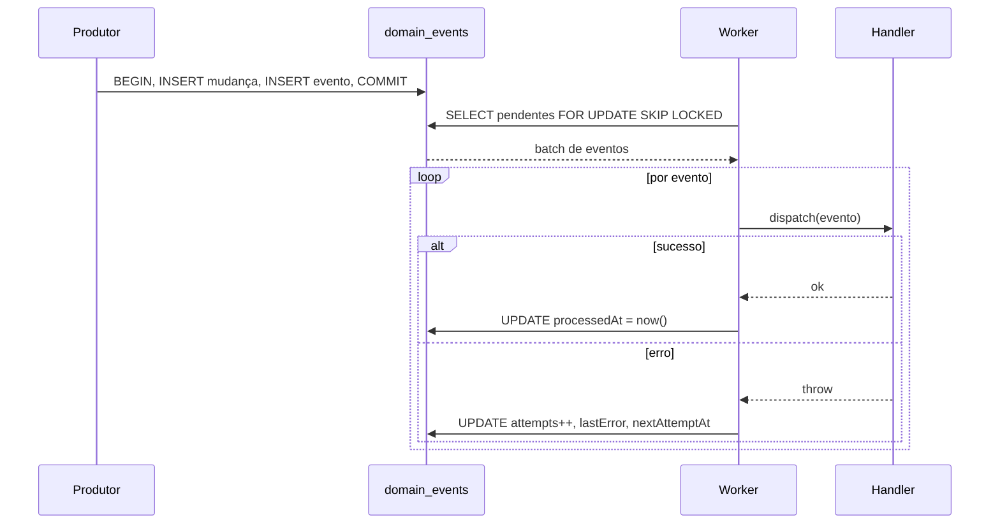

> **Para agentes de IA:** Este arquivo Markdown é a forma canônica desta entry. Use `Accept: text/markdown` ou adicione `.md` à URL para evitar renderização HTML.

# Eventos de Domínio

O sistema de eventos de domínio é o mecanismo do ComeçaAI para comunicação assíncrona entre bounded contexts. Um produtor em um contexto registra que algo aconteceu — uma transação foi paga, uma comissão foi calculada, um usuário se cadastrou — e qualquer número de consumidores em outros contextos pode reagir a esse fato depois, sem que o produtor precise conhecê-los.

Eventos são emitidos **dentro da mesma transação** que produziu a mudança de estado subjacente. A linha do evento existe se e somente se a mudança existe — sem evento sem mudança, sem mudança sem evento. Um worker separado pega eventos pendentes e despacha para handlers.

## Business

O gargalo que isto resolve é **acoplamento entre contextos**. Sem um log de eventos, quando "transaction paid" deve também "calcular comissão, enviar recibo, atualizar analytics, notificar parceiro", o código que paga transações cresce para chamar os quatro. Cada novo consumidor é uma edição síncrona no produtor, cada caminho de falha é uma cadeia que quebra o fluxo inteiro, e a superfície de testes do produtor multiplica com cada consumidor.

Com domain events, o produtor emite um fato e esquece. Consumidores se inscrevem registrando um handler. Novos consumidores não tocam o produtor; consumidores com falha não quebram o produtor; testes são por handler em vez de por fan-out.

O custo é assincronia — consumidores veem fatos depois do produtor commitar, não em lockstep. Para os domínios do ComeçaAI (financeiro, ciclo de vida de usuário, notificações) esse delay é aceitável; o decoupling vale a pena.

## Product

Produtores chamam `emitDomainEvent({ aggregateType, aggregateId, eventType, payload }, tx)` dentro de uma transação. Consumidores registram um handler em `HANDLER_REGISTRY` com chave `eventType`. O worker (`npm run worker:domain-events`) é a ponte.

Tipos de evento seguem notação `{aggregate}.{verb}` em minúsculas: `transaction.paid`, `commission.computed`, `account.balance-recomputed`. Verbos podem ter hífens em formas compostas.

Idempotência é opt-in via `idempotencyKey`. Quando uma chave já existe, match exato (mesmo aggregate + type + payload) retorna o evento existente silenciosamente; mismatch lança `IdempotencyConflictError`. Sem chave, cada chamada é um novo evento.

Phase 1 (estado atual) entrega a infra com handler registry vazio. Phase 2 começa a emitir eventos de produtores reais e registrar handlers.

## Architecture

O pattern é o **outbox transacional**: escrita síncrona do evento na transação do produtor, entrega assíncrona pelo worker.



Workers coordenam via `SELECT ... FOR UPDATE SKIP LOCKED` então múltiplos workers concorrentes nunca pegam o mesmo evento. Handlers rodam fora do lock de picking — handlers longos não bloqueiam outros workers.

Eventos são imutáveis pós-emissão: `aggregateType`, `aggregateId`, `eventType`, `payload`, `idempotencyKey`, `occurredAt`, `createdAt` nunca mudam. Só campos controlados pelo worker (`attempts`, `lastError`, `nextAttemptAt`, `processedAt`) mutam. Mutar conteúdo de evento quebraria a trilha de auditoria.

Política de retry é bounded: 5 tentativas com backoff exponencial `[1m, 5m, 30m, 2h]`. Após exaustão, `nextAttemptAt = NULL` e auto-retry para. Intervenção manual é o caminho — investigar `lastError`, corrigir bug, depois resetar a linha ou deixar permanentemente exausta.

Handlers devem ser **idempotentes**. Workers podem fazer retry, podem sobrepor, e o processamento pode retomar de estado desconhecido após crash. O framework não consegue impor idempotência — é responsabilidade do autor do handler (upsert em vez de create, check-before-send para chamadas externas).

## Operations

Rodar o worker localmente:

```bash
npm run worker:domain-events
# opcional: --limit=N para limitar tamanho do batch (default 100)
```

O worker é um CLI standalone, não um daemon longo. A cadência é responsabilidade de um scheduler externo (cron, Railway scheduled jobs). Razão: alvos de deploy favorecem jobs batch, o modelo é mais simples de raciocinar, e crashes ficam limitados a um batch.

Inspecionar estado via SQL:

```sql
-- Eventos pendentes
SELECT id, eventType, attempts, nextAttemptAt
FROM domain_events
WHERE processedAt IS NULL AND nextAttemptAt <= now()
ORDER BY occurredAt ASC LIMIT 50;

-- Eventos exauridos (auto-retry parou)
SELECT id, eventType, attempts, lastError
FROM domain_events
WHERE processedAt IS NULL AND nextAttemptAt IS NULL;
```

Recuperar um evento exaurido após corrigir o bug:

```sql
UPDATE domain_events SET attempts = 0, nextAttemptAt = now() WHERE id = '...';
```

Adicionar um handler é procedimento de dois passos: implementar o handler em `src/lib/{domain}/handle-{event-type}.ts`, então importar e registrar em `src/lib/domain-events/handler-registry.ts` com chave do event type. Carregamento dinâmico de plugins não é suportado.

Se um evento chega para um `eventType` não registrado, o worker marca como processado com `lastError = "No handler registered..."` em vez de retentar para sempre. Handlers ausentes podem ser legítimos (dado legacy, consumidor descontinuado) e queimar capacidade neles é desperdício. Para retentar quando um handler existir, resetar a linha manualmente.

## Glossary

- **Domain Event**: Registro imutável de algo significativo que aconteceu em um bounded context. Fato no passado, não comando.
- **Outbox**: A tabela `domain_events` que guarda eventos entre emissão e entrega. Transacional com a mudança de estado do produtor.
- **Handler**: Função que reage a um evento de um dado `eventType`. Registrada estaticamente. Deve ser idempotente.
- **Aggregate**: Entidade de domínio sobre a qual um evento é. Identificada por `aggregateType` + `aggregateId` (UUID).
- **Idempotency Key**: Chave única opcional na emissão. Emit repetido com a mesma chave retorna o evento existente se payload match, lança se divergir.
- **Worker**: Processo CLI (`npm run worker:domain-events`) que pega eventos pendentes e despacha para handlers.
- **Exhaustion**: Estado após 5 tentativas falhas. `nextAttemptAt = NULL`, auto-retry para, intervenção manual necessária.

## Changelog

- **2026-05-02** — Migrado de `.agents/skills/domain-events/SKILL.md` para o Handbook. Seis perspectives preenchidas. Arquivo da skill mantido como shim de compat.
- **2026-04-30** — Infraestrutura inicial do outbox entregue (Phase 1, etapa 1.8). Handler registry vazio; produtores começam a emitir em Phase 2.
